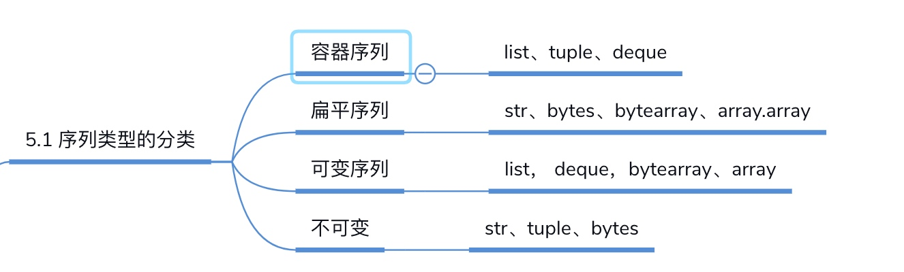

# 自定义序列类

#### 序列协议
* 

#### add
```python
a += (3, 4)
a += [3, 4]
通过魔法函数__iadd__来实现，内部通过extends实现
a = [1, 2]
c = a + [3, 4]
print(c)

a += (3, 4)
a.extend(range(3))//迭代相加每个元素
a.append((1, 2)) //直接加上整个元组
a.append([1, 2]) //直接加上整个列表
print(a)
```

#### 可切片的对象
* 