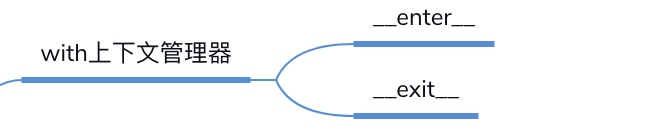

# 静态方法&类方法&对象方法

#### demo
```python
class Date:
    def __init__(self, year, month, day):
        self.year = year
        self.month = month
        self.day = day

    def tomorrow(self):
        self.day += 1

    @staticmethod
    def parse_from_string(data_str):
        year, month, day = tuple(data_str.split('-'))
        return Date(int(year), int(month), int(day))

    @staticmethod
    def valid_str(date_str):
        year, month, day = tuple(date_str.split('-'))
        if int(year) > 0 and (int(month) > 0 and int(month) <=12) and (int(day) > 0 and int(day) <=31):
            return True
        else:
            return False

    @classmethod
    def from_string(cls, date_str):
        year, month, day = tuple(date_str.split('-'))
        return cls(int(year), int(month), int(day))

    def __str__(self):
        return "{year}/{month}/{day}".format(year=self.year, month=self.month, day=self.day)

if __name__ == '__main__':
    new_day = Date(2018, 12, 31)
    new_day.tomorrow()
    print(new_day)

    date_str = '2018-12-31'
    year, month, day = tuple(date_str.split('-'))
    new_day = Date(int(year), int(month), int(day))
    print (new_day)

    new_day = Date.parse_from_string(date_str)
    print (new_day)

    new_day = Date.from_string(date_str)
    print (new_day)
    
    print(Date.valid_str("2018-12-32"))
```

#### 私有属性
* 双下划线将私有变量进行变形
* 通过反射机制也可以拿到这个数值

```python
from method import Date

class User:
    def __init__(self, birthday):
        self.__birthday = birthday
    def get_age(self):
        return 2019 - self.__birthday.year


if __name__ == '__main__':
    user = User(Date(2018, 10, 1))
    print(user.get_age())
```

#### dict和dir查询属性·
```python
from method import Date

class Person:
    name = 'user'

class Student(Person):
    def __init__(self, school_name):
        self.school_name = school_name

if __name__ == '__main__':
    user = Student('IMooc')
    print(user.__dict__)
    user.__dict__["school_addr"] = "Beijing"
    print(user.school_addr)
    print(Person.__dict__)
    print(user.name)
    a = [1, 2]
    print(dir(a))
```
* dict获取属性

#### 上下文管理器协议
* 

```python
class Sample:
    def __enter__(self):
        #获取资源
        print('enter')
        return self

    def __exit__(self, exc_type, exc_val, exc_tb):
        #释放资源
        print("exit")

    def do_something(self):
        print("doing something")

with Sample() as sample:
    sample.do_something()
```

#### contextlib协议
```python
import contextlib

@contextlib.contextmanager
def file_open(file_name):
    print ("file open")
    yield {}
    print ("file end")

with file_open("bobby.txt") as f_opened:
    print ("file processing")
```