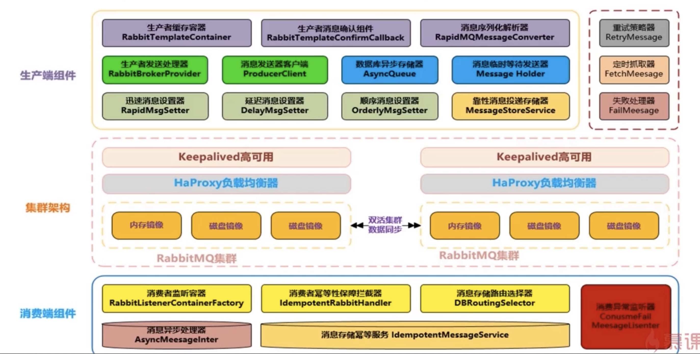
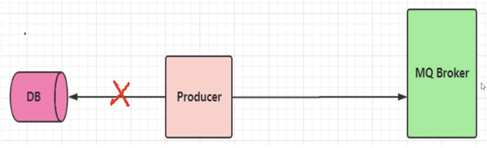
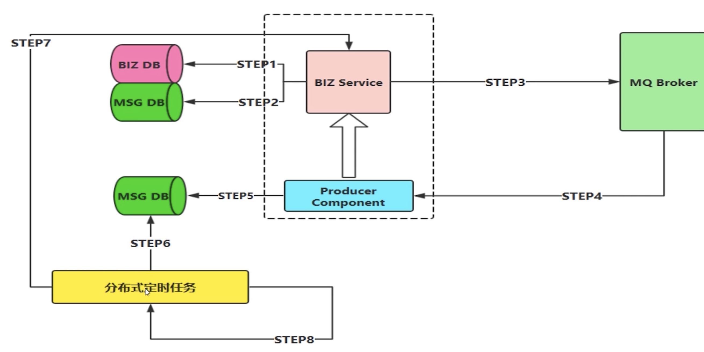
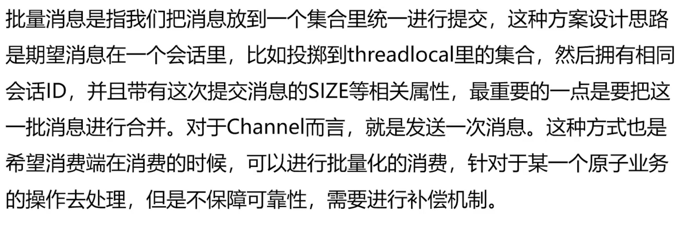
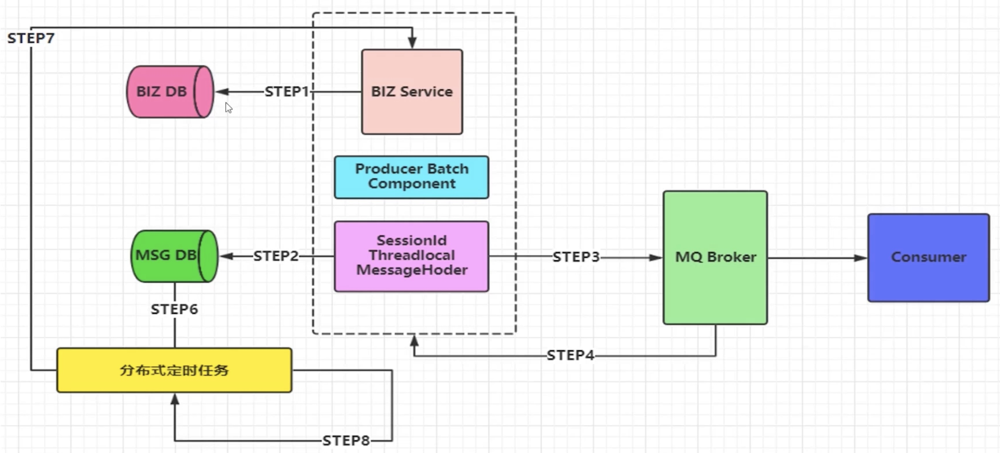
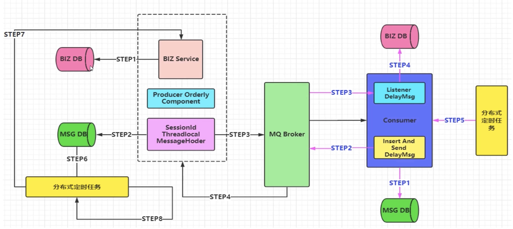
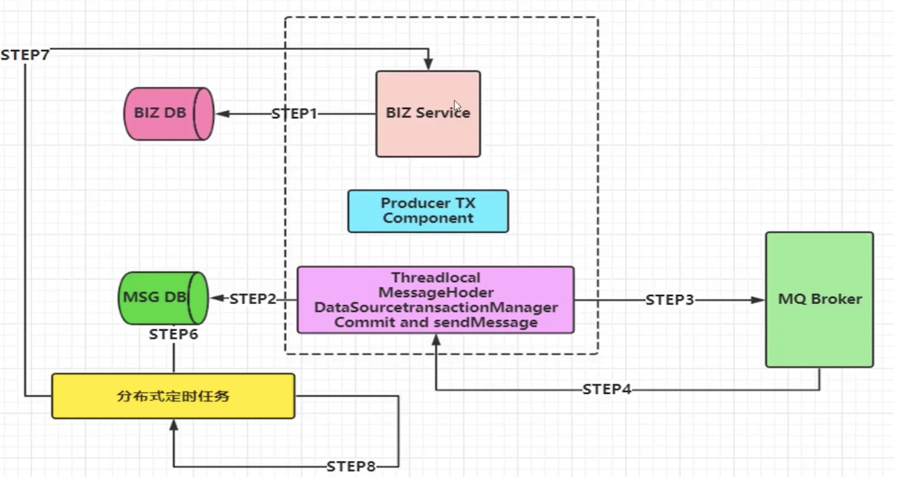
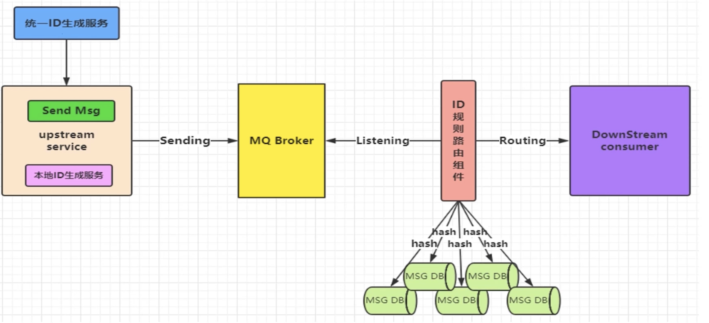

# MQ组件实现思路和架构设计方案

#### 架构图

#### MQ组件实现功能点
* 支持消息高性能的序列化转换、异步化发送消息
* 支持消息生产实例与消费实例的链接池化缓存化提升性能
* 支持可靠性投递消息，保障消息的 100%不丢失
* 支持消费端的幂等操作，避免消费端重复消费的问题
* 支持迅速消息发送模式,在一些日志收集/统计分析等需求下可以保证高性能，超高吞吐量
* 支持延迟消息模式，消息可以延迟发送，指定延迟时间，用于某些延迟检查、服务限流坜景
* 支持事务消息，且 100%保暲可靠性投递，在金融行业单笔大金额操作时会有此类需求
* 支持顺序消息，保证消息送达消费端的前后顺序，例如下订单等复合性操作支持消息补偿,重试,以及快速定位异常/失败消息
* 支持集群消息负载均衡，保障消息落到具体 ST 集群的负載均衡
* 支持消息路由策略，指定某些消息路由到指定的 SET 集群

#### 迅速消息发送
* 迅速消息是指消息不进行落库存储，不做可靠性的保障
* 在一些非核心消息、日志数据、或者统计分析等场景下比较合适
* 迅速消息的优点就是性能最高，吞吐量最大

#### 确认消息发送

#### 批量消息发送

#### 延迟消息发送
* 延迟消息相对简单，就是我们在 Message 封装的时候添加 delay Time 属性即可，使得我们的消息可以进行延迟发送，根据具体的业务场景也可以很好的使用得到
* 应用场景
* 电商平台买到的商品签收后，不点击确认支付，那么系统自动会在 7 天（一定时间）去进行支付操作。
* 还有一些自动超时作废的场景,你的优惠券/红包有使用时间限制，也可以用延迟消息机制

#### 顺序消息
* 发送的顺序消息，必须保障消息投递到同一个队列，且这个消费者只能有一个独占模式）
* 然后需要统一提交（可能是合并成一个大消息，也可能是拆分为多个消息），并且所有消息的会话 ID 一致
* 添加消息属性：顺序标记的序号、和本次顺序消息的 SIZE 属性，进行落库操作
* 并行进行发送给自身的延退消息（注意带上关键属性：会话 ID、SIZE）进行后续处理消费
* 当收到延迟消息后，根据会话ID、SIZE抽取数据库数据进行处理即可
* 定时轮训补偿机制，对于异常情况
* 备注：比如生产端消息没有完全投追成功、或者消费端落库异常导致消费端落库后缺少消息条目的情況）

####  事务消息
* txSelect
* 我们采用类似可靠性投递的机制，也就是补偿机制
* 但是我们的数据源必须是同一个，也就是业务操作 DB1 数据库和消息记录 DB2 数据库使用同一个数据源。

#### 消息幂等性

##### 出现重复消费的情况
* 可靠性消息投递机制
* MQ Broker服务与消费端传输消息的过程中的网络抖动
* 消费端故障或异常

##### 