# RabbitMQ和AMQP协议
* 导航
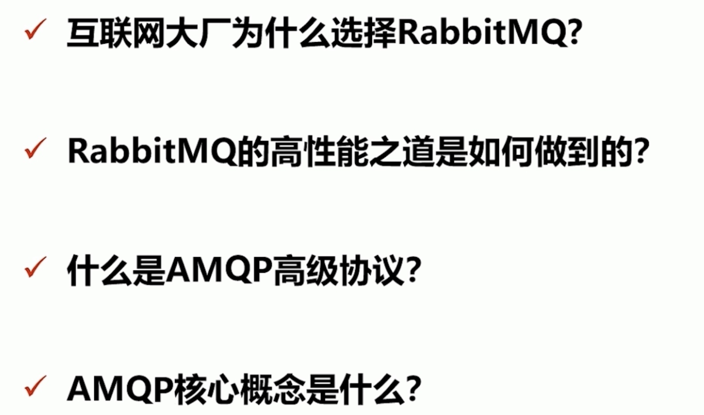
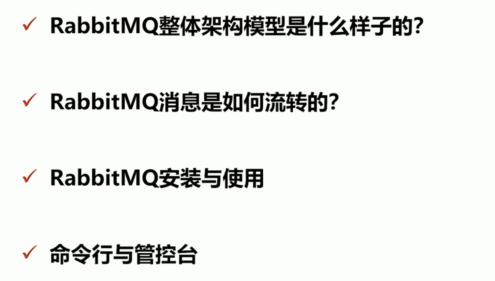
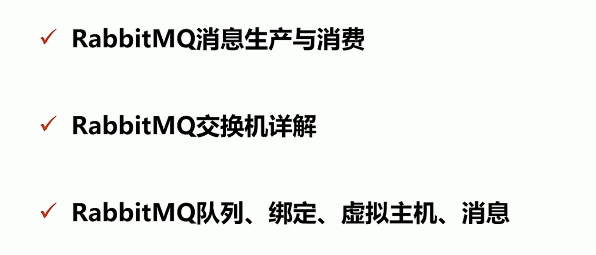

#### 初始
* 优点
* 集群模式丰富，表达式配置，HA 模式，镜像队列模型 √保证数据不丟失的前提做到高可靠性、可用性

#### 高性能原因
* Erlang 语言最初在于交换机领域的架构模式，这样使得 Rabbitmq 在 Broker 之间进行数据交互的性能是非常优秀的
* Erlang 的优点：Erlang 有着和原生 Socket-样的延迟

#### AMQP
* 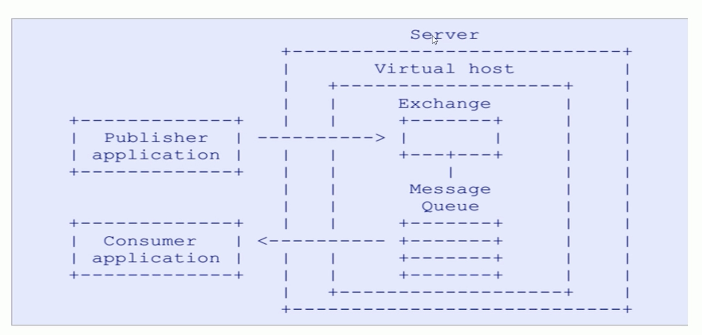
* Server：又称 Broker，接受客户端的连接，实现 AMQP 实体服务
* Connection：连接，应用程序与 Broker 的网络连接
* Channel：网络信道，几乎所有的操作都在 Channels 中进行，Channel 是进行消息读写的通道。客户端可建立多个 hannel，每个 Channel 代表一个会话任务。
* Message：消息、服务器和应用程序之间传送的数据，由 Properties 和 Body 组成。Properties 可以对消息进行修饰，比如消息的优先级延迟等高级特性；Body 则就是消息体内容。
* Virtual host：虚拟地址，用于进行逻辑隔离，最上层的消息路由。一个Virtual Host里面可以有若干个Exchange和Queue，同一个 Virtual Host 里面不能有相同名称的 Exchange 或 Queue
* Exchange 交换机，接收消息，根据路由键转发消息到绑定的队列
* Binding: Exchange 和 Queue 之间的虚拟连接，binding 中可以包含 routing key
* Routing Key 路由规则，虚拟机可用它来确定如何路由一个特定消息
* Queue：也称为 Message Queue，消息队列，保存消息并将它们转发给消费者

#### 整体架构
* 
* 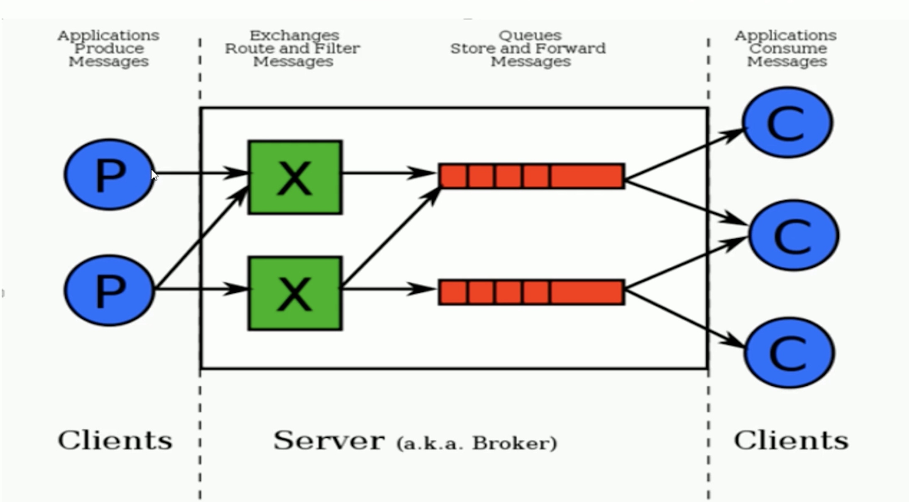
* 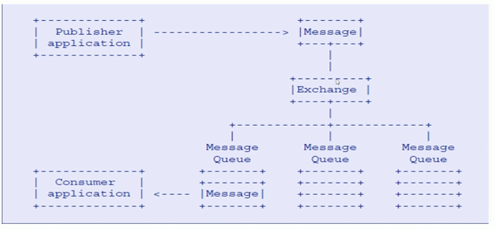
* 生产者无需关系消息投递到哪个队列，消费者无须知道消息从哪个exchange来
* 

#### 安装rabbitmq
* 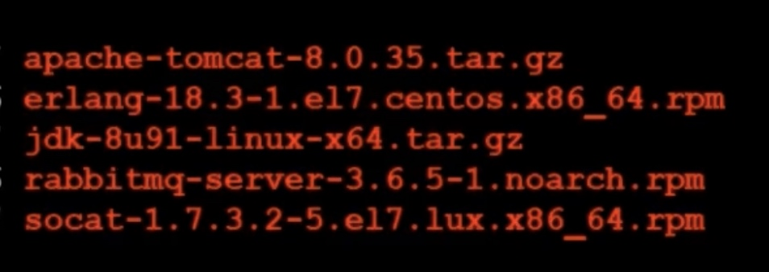

#### 命令行
* 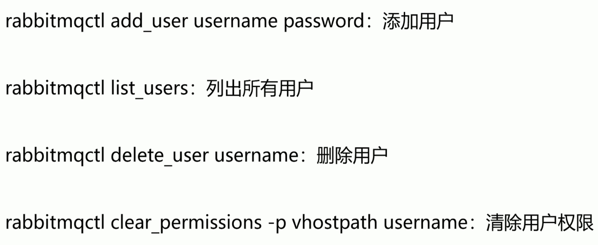
* rabbitmqctl list user permissions username：列出用户权限
* rabbitmqctl change_ password username newpassword：修改密码
* rabbitmqctl set permissions-p vhostpath username ".*" ".*" ".*" 设置用户权限
* Rabbitmqctl add vhost vhostpath：创建虚拟主机 
* rabbitmgctl list vhosts：列出所有虚拟主机
* rabbitmqctl list permissions- o vhostpath：列出虚拟主机上所有权限
* rabbitmqctl delete_ vhost vhostpath：删除虚拟主机
* rabbitmqctl reset
* Rabbitmactl join cluster <clusternode> [--ram][--disc]：组成集群命令
* rabbitmqctl cluster_status
* rabbitmactl change cluster node type disc ram
* rabbitmactl forget cluster node [-offline] 忘记节点（摘除节点)
* 

#### import&export
* 批量导出配置文件

#### 生产者和消费者
* 消费端一定要创建consumer,声明消费队列
* 没有指定exchange,就会使用默认的路由规则

#### Exchange交换机
* 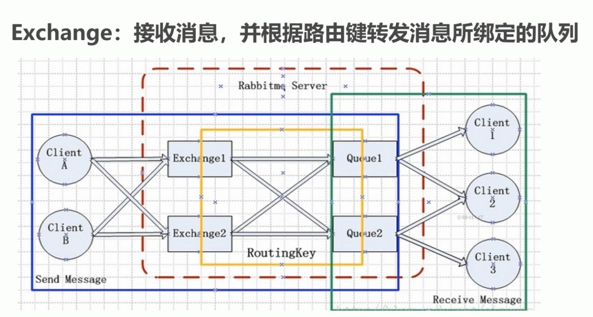
* 蓝色表示SendMessage
* 绿色表示RecvMessage
* 黄色表示routing-key

##### 交换机属性
* Name：交换机名称
* Type：交换机类型 direct、topic、fanout、headers 
* Durability 是否需要持久化，true 为持久
* Auto Delete：当最后一个绑定到 Exchange 上的队列删除后，自动删除该 Exchange 
* Internal：当前 Exchange 是否用于 Rabbit MQP 内部使用，默认为 False
* Arguments：扩展参数，用于扩展 AMQP 协议自制定化使用

##### Direct Exchange
* 所有发送到 Direct Exchange 的消息被转发到 Routekey 中指定的 Queue
* 注意：Directa 模式可以使用 Rabbitmq 自带的 Exchange: default Exchange，所以不需要将 Exchange 进行任何绑定（binding）操作，消息传递时，Routekey 必须完全匹配才会被队列接收，否则该消息会被抛弃
* 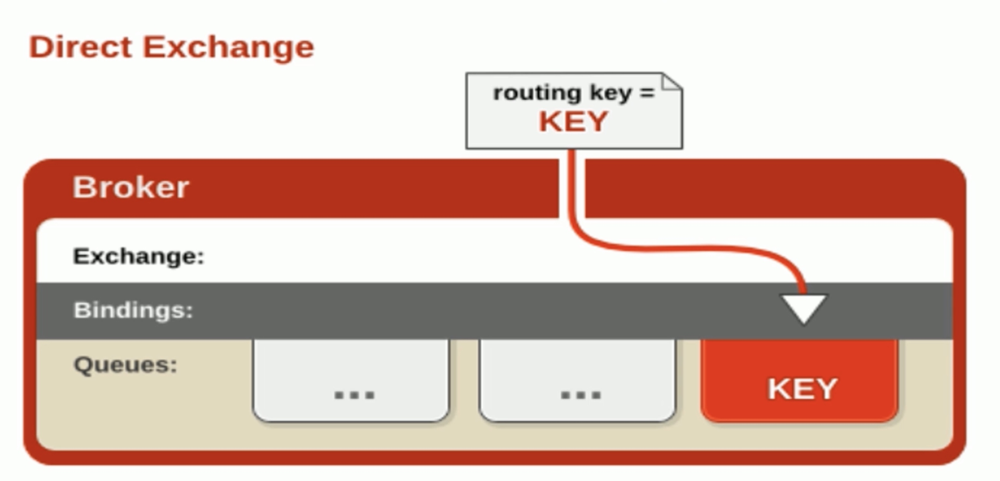
* 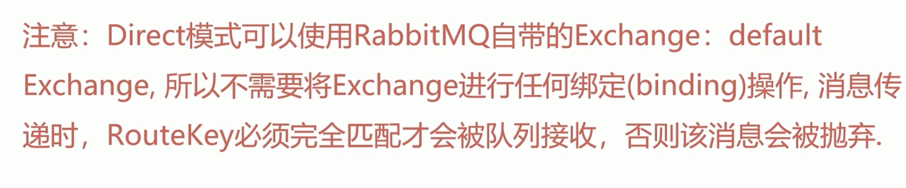

##### Topic Exchange
* 所有发送到 Topic Exchangee 的消息被转发到所有关心 Route Keyi 中指定 Topic 的 Queue 上
* Exchange 将 Routekey 和某 Topic 进行模糊匹配，此时队列需要绑定一个 Topic
* 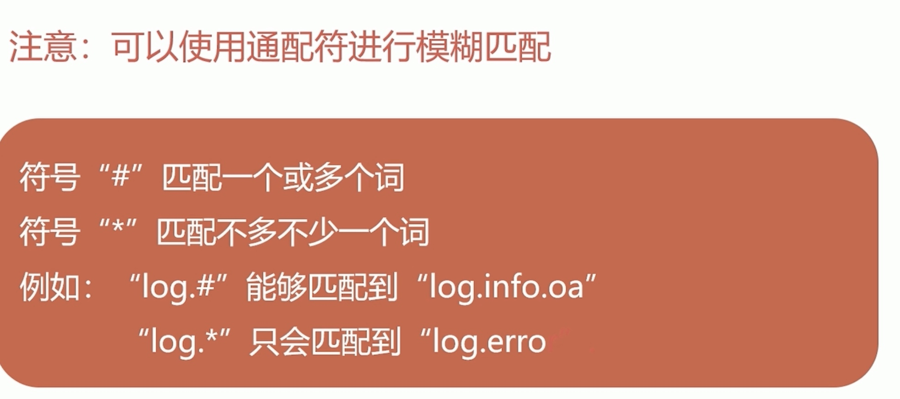
* 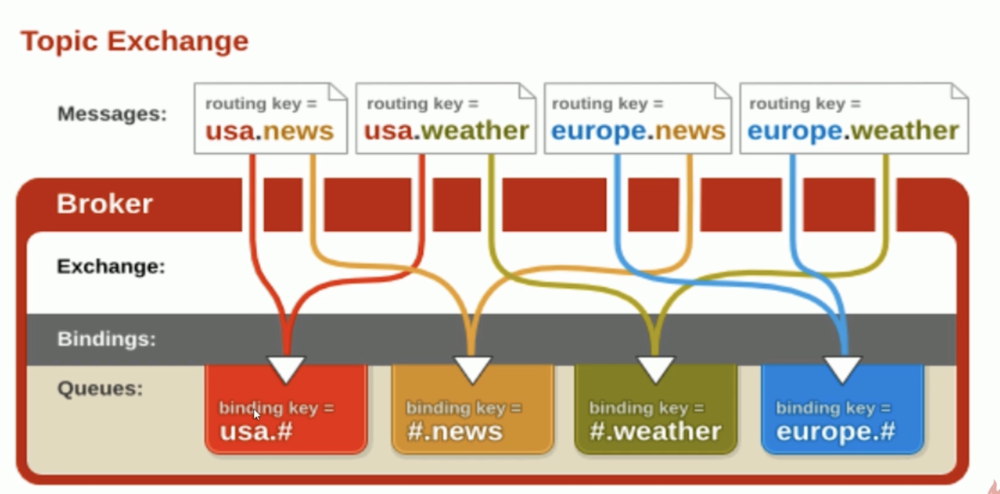

#### Fanout Exchange
* 不处理路由键，只需要简单的将队列绑定到交换机上
* 发送到交换机的消息都会被转发到与该交换机绑定的所有队列上
* Fanout 交换机转发消息是最快的
* 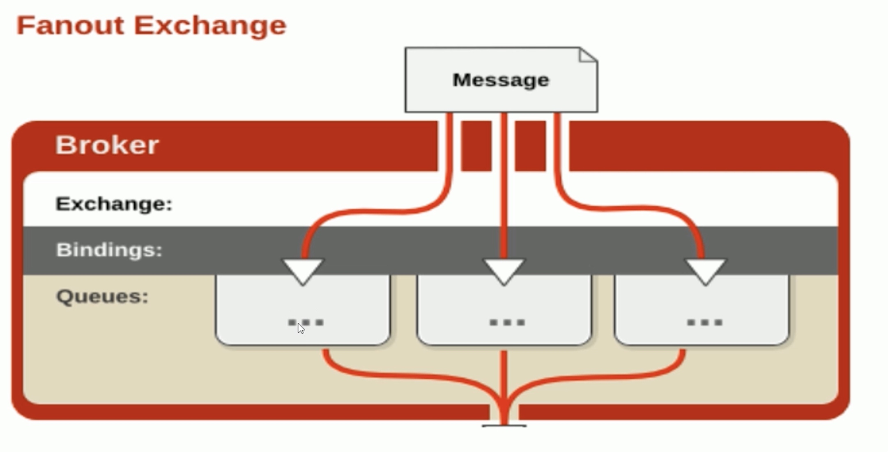

#### Binding
* Exchange？和 Exchange、Queue 之间的连接关系 
* Binding 中可以包含 Routing keyi 或者参数

#### Queue
* 消息队列，实际存储消息数据
* Durability：是否持久化，Durable：是，Transient：否
* Auto delete：如选 yes，代表当最后一个监听被移除之后
* 该 Queue 会自动被删除

#### Message
* 服务器和应用程序之间传送的数据
* 本质上就是一段数据，由 Properties 和 Payload (Body）组成
* 常用属性：delivery mode、headers（自定义属性
* Content type、content encoding、priority correlation id、reply to、expiration、message_id timestamp、type、user-id、app_id、cluster id
* correlation_id比较重要

####  Virtual host
* 虚拟地址，用于进行逻辑隔离，最上层的消息路由
* 一个 Virtual Host 里面可以有若干个 Exchange 和 Queue 
* 同一个 Virtual Host 里面不能有相同名称的 Exchange 或 Queue