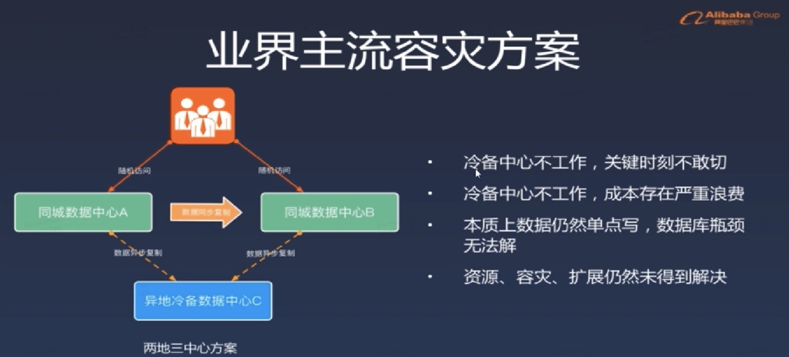
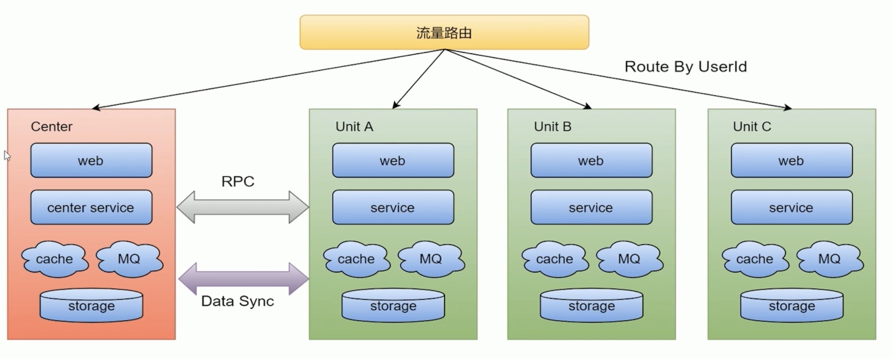
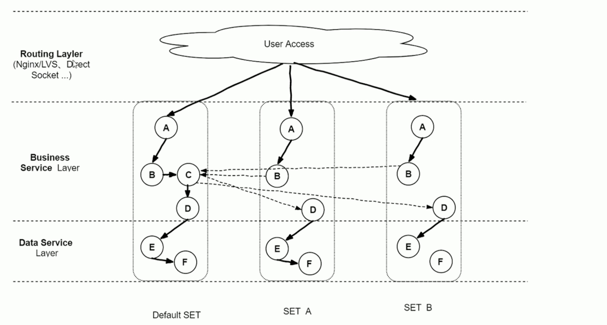
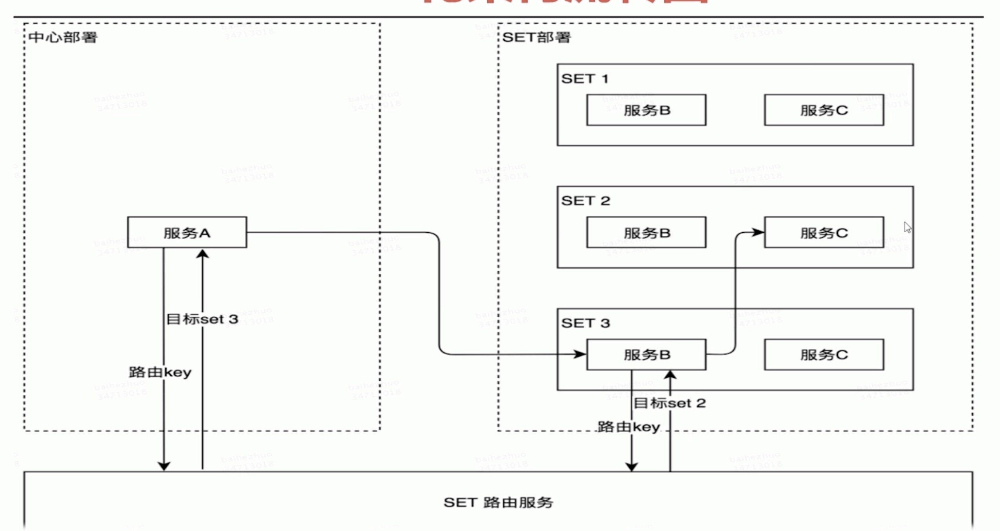
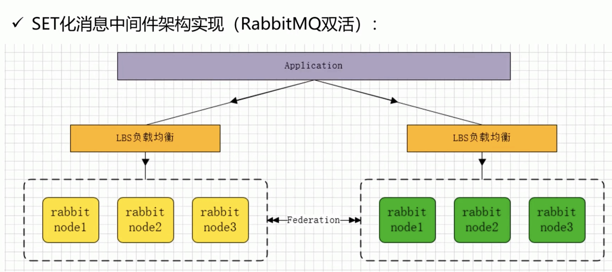

# SET架构

#### 单元集群
* 随着大型互联网公司业务的多元化发展，就拿滴滴、美团等大厂来讲，如滴滴打车、单车、外卖、酒店、旅行、金融等业务持续高速增长，单个大型分布式体系的集群，通过加机器+集群内部拆分（kv、mq、MYSQLS 等），虽然具备了一定的可扩展性。但是，随着业务量的进一步增长，整个集群规模逐渐变得巨大，从而一定会在某个点上达到瓶颈，无法满足扩展性需要，并且大集群内核心服务出现问题，会影响全网所有用户。

#### 大型分布式集群问题
* 容灾问题
* 核心服务（比如订单服务）挂掉，会影响全网所有用户导致整个业务不可用；
数据库主库集中在一个 IDC，主机房挂掉，会影响全网所有用户，整个业务无法快速切换和恢复
* 资源扩展问题
* 单 IDC 的资源（机器、网络带宽等）已经没法满足，扩展 IDC 时，存在跨机房访问时延问题（增加异地机房时，时延问题更加严重）；数据库主库单点，连接数有限，不能支持应用程序的持续扩展
* 大集群拆分问题
* 核心问题：分布式集群规模扩大后，会相应的带来资源扩展大集群拆分以及容灾问题。
所以出于对业务扩展性以及容灾需求的考虑，我们需要一套从底层架构彻底解决问题的方案，业界主流解决方案

##### 同城双活
* 业务层面上已经做到真正的双活（或者多活），分别承担部分流量存储层面比如定时任务、缓存、持久层、数据分析等都是主从架构，会有跨机房写
* 个数据中心故障，可以手动切换流量，部分组件可以自动切换

##### 两地三中心
* 使用灾备的思想，在同城“双活”的基础上，在异地部署一套灾备数据中心，每个中心都具有完备的数据处理能力，只有当主节点故障需要容灾的时候才会紧急启动备用数据中心
* 

#### SET优化方案目标
* 业务：解决业务遇到的扩展性和容灾等需求，支撑业务的高速发展
* 通用性：架构侧形成统一通用的解決方案，方便各业务线接入使用

#### SET化架构策略
* 

##### 流量路由
* 按照特殊的 key（通常为 userid）进行路由，判断某次请求该路由到中心集群还是单元化集群

##### 中心集群：
* 未进行单元化改造的服务（通常不在核心交易链路，比如供应链系统）称为中心集群，跟当前架构保持一致

##### 单元化集群
* 每个单元化集群只负责本单元内的流量处理，以实现流量拆分以及故障隔离
* 每个单元化集群前期只存储本单元产生的交易数据，后续会做双向数据同步，实现容灾切换需求

##### 中间件策略
* 中间件（RPC、KV、MQ 等）
* RPC：对于 SET 服务，调用封闭在 SET 内；对于非 SET 服务，沿用现有路由逻辑
* KV：支持分 SET 的数据生产和査询 MQ：支持分 SET 的消息生产和消费

##### 数据同步
* 全局数据（数据量小且变化不大，比如商家的菜品数据）部署在中心集群，其他单元化集群同步全局数据到本单元化内；未来演变为昇地多活架构时，各单元化集群数据需要进行双向同步来实现容灾需要

##### 能力
* 通过 SET 化架构的流量调度能力，将 SET 分别部署在不同地区的数据中心，实现跨地区容灾支持
* 利用前端位置信息采集和域名解析簽略，将流量路由到最近的 SET，提供最高效的本地化服务；
* 集装箱式扩展
* SET 的封装性支持更灵活的部署扩展性，比如 SET 一键创 建/下线,SET一键发布等
* 
* 

#### SET化架构原则
* 对业务透明原则
* SET 化架构的实现对业务代码透明，业务代码层面不需 要关心 SET 化规则，SET 的部署等问题
* 理论上，切分规则由业务层面按需定制 y 实现上，建议优先选最大的业务维度进行切分；
* 比如海量用户的 O20 业务，按用户位置信息进行切分。此外
* 接入层、逻辑层和数据层可以有独立的 SET 切分规则，有利于实现部署和运维成本的最优化。
* 部署规范原则
* 一个 SET 并不ー定只限制在一个机房，也可以跨机房或者
* 跨地区部署；为保证灵活性，单个 SET 内机器数不宜过多（如如不超过 1000 台物理机）

#### Rabbitmq-SET
* 
* 集群之间Federation
* rabbitmg-plugins enable rabbitmq federation
* rabbitmq-plugins enable rabbitmq federation management
* 使用 Rabbitmq 通信插件 Federation
* Federation 插件是一个在不需要 cluster，而 brokers之间传输消息的高性能插件。
* Federation 插件可以在 brokers 或者 cluster 之间传输消息，链接的双方可以使用不同的 users 和 virtual hosts、或者双方的 rabbitmq和 erlang 版本不一致，federation 插件使用 AMQP 协议通信，可以接受不连续的传输。

##### SET规则
* SET 化配置规则
* 第一，Federation Exchanges，可以看成 Downstream (82 节点）从 Upstream  (81 节点）主动拉取消息，但并不是拉取所有消息，必须是在 Downstream 上已经明确定义 Bindings 关系的 Exchange，也就是有实际的物理 Queue 来接收消息才会从 Upstream 拉取消息到 Downstream。使用 AMQP 协议实施代理间通信 , Downstream会将绑定关系组合在一起，绑定/解除绑定命令将发送到 Upstream 交换机
* 第二，经过配置后，Upstream 节点已经可以把消息直接通过 Federation Exchanges 路由给我们的 Downstream 节点，然后进行消费。
 也就是说可以实现消息的转发，接下来也可以在 Upstream 添加具体的队列去进行消费 Federation Exchanges 里的消息，我们一条消息分别发到了 2 个 Rabbitmq！集群并且消费，这样我们可以实现 SET 化的关键要素，就是集群间的消息同步了
* 第三，可以根据自己的业务规则去规划不同的集群去监听不同的消息队列，从而达到 SET 化的手段，保障了性能、可靠性、数据一致性。
* 
 