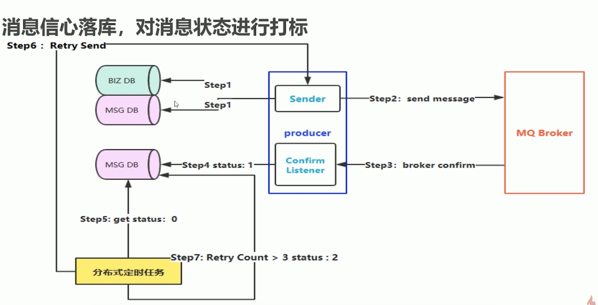
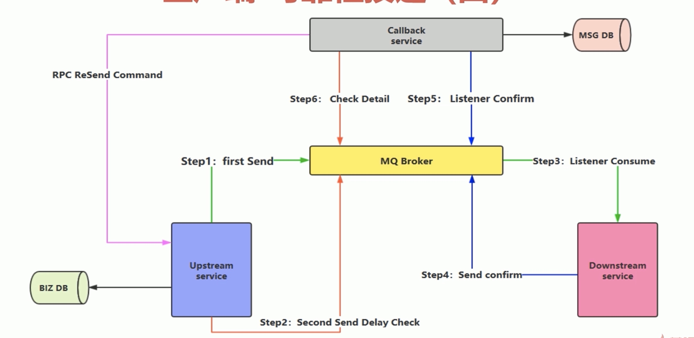
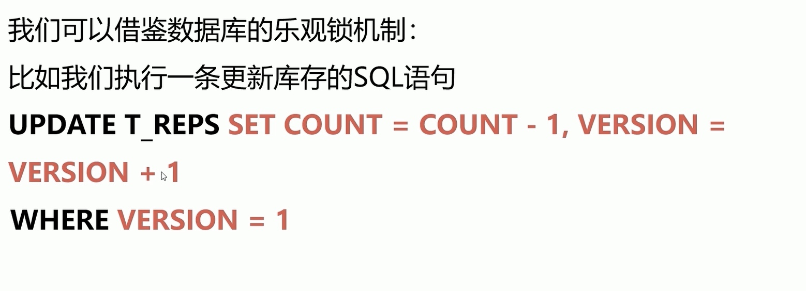
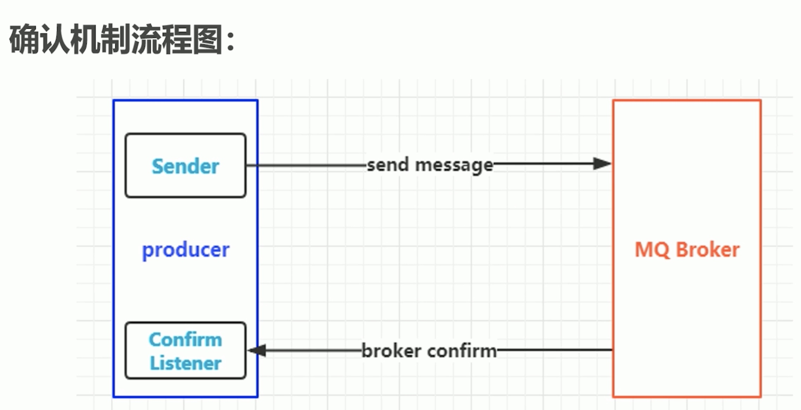
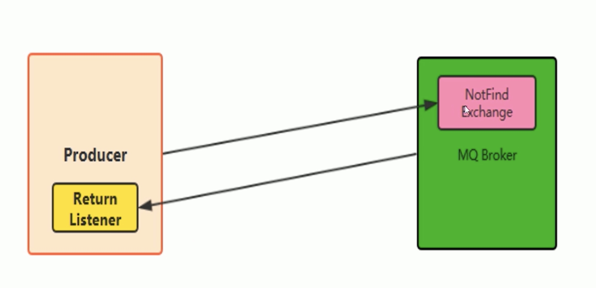
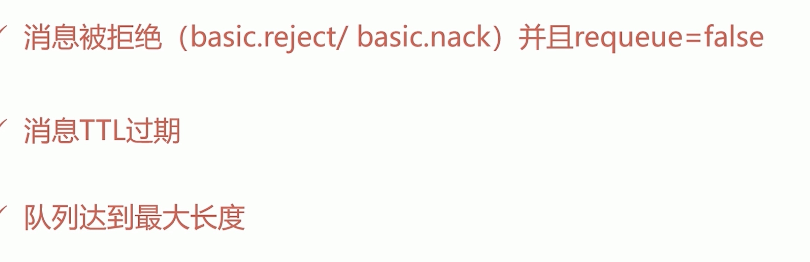

# 消息可靠性投递

#### 导航
* 消息如何保障 100%的投递成功？
* 幂等性概念详解
* 在海量订单产生的业务高峰期，如何避免消息的重复消费问题？
* Confirm 确认消息、Return 返回消息
* 自定义消费者
* 消息的 ACK 与重回队列
* 消息的限流
* TTL 消息

#### 消息有序性
* exclude
* 如果消息不能路由到queue，消息就会被丢弃

#### 可靠性投递
* 保障消息的成功发出
* 保障 MQ 节点的成功接收
* 发送端收到 MQ 节点（Broker）确认应答
* 完善的消息进行补偿机制

##### 消息落库，对消息状态进行打标


##### 业务消息落库


#### 幂等性
* 多次操作结果都是一样的
* 


##### 唯一ID+指纹码机制，利用数据库主键去重利用
* 唯一 ID+指纹码机制，利用数据库主键去重
* SELECT COUNT (1) FROM T ORDER WHERE D=唯一 ID+指纹码
* 好处：实现简单
* 坏处：高并发下有数据库写入的性能瓶颈
* 解决方案：跟进 ID 进行分库分表进行算法路由

##### Redise 的原子性去实现
* 使用 Redis 进行幂等，需要考虑的问题
* 第一：我们是否要进行数据落库，如果落库的话，关键解決的问题是数据库和缓存如何做到原子性？
* 第二：如果不进行落库，那么都存储到缓存中，如何设置定时同步的策略？

#### Confirm机制
* 消息的确认，是指生产者投递消息后，如果 Brokerl 收到消息，则会给我们生产者一个应答。
* 生产者进行接收应答，用来确定这条消息是否正常的发送到 Broker，这种方式也是消息的可靠性投递的核心保障！
* 
* 第一步：在 channel 上开启确认模式：Confirm
* 第二步：在 channel 上添加监听：NotifyConfirm(ack, nack chan uint64) 监听成功和失败的返回结果，根据具体的结果对消息进行重新发送、或记录日志等后续处理！
* 如果ACK和NACK都没有，利用定时任务抓去做中间状态进行补偿

#### Exchange
* 在客户端和服务端声明都可以
* 如果声明的时候路由key不一样，则会生成两个
* 

#### Return消息机制
* Return Listener 用于处理一些不可路由的消息
* 我们的消息生产者，通过指定一个 Exchange 和 Routingkey，把消息送达到某一个队列中去，然后我们的消费者监听队列，进行消费处理操作！
* 但是在某些情况下，如果我们在发送消息的时候，当前的 exchange不存在或者指定的路由 key 略由不到，这个时候如果我们需要监听这种不可达的消息，就要使用 Return Listener
* Mandatory：如果为 true，则监听器会接收到路由不可达的消息，然后进行后续处理，如果为 false，那么 brokers 端自动删除该消息
* 

#### 消费端限流
* Rabbit MQ 提供了一种 qos（服务质量保证）功能，即在非自动确认消息的前提下，如果一定数目的消息（通过基于 Consume 或者 channeli 设置 Qos 的值）未被确认前，不进行消费新的消息。

```
type basicQos struct {
  PrefetchSize  uint32 0不做限制
  PrefetchCount uint16 一次处理多少条消息
  Global        bool //channel true consumer false
}
```
* Prefetchsize: 0
* Prefetch Count：会告诉 Rabbitmq 不要同时给一个消费者推送多于 N 个消息，即一旦有 N 个消息还没有 ack，则该 consumer 将 block 掉，直到有消息 ack
* global: true\false 是否将上面设置应用于 channel简单点说，就是上面限制是 chann인l 级别的还是 consumer client级别
* autoAck设置为false

#### 消费端ACK和重回队列
* 消费端的手工 ACK 和 NACK， NACK保证消息重回队列
* 消费端进行消费的时候，如果由于业务异常我们可以进行日志的记
录，然后进行补偿
* 如果由于服务器宕机等严重问题，那我们就需要手工进行 ACK 保障消费端消费成功

##### 重回队列
* 消费端重回队列是为了对没有处理成功的消息，把消息重新会递给Broker
* 一般我们在实际应用中，都会关闭重回队列，也就是设置为 False

```
type basicNack struct {
  DeliveryTag uint64
  Multiple    bool
  Requeue     bool
}
type basicAck struct {
  DeliveryTag uint64
  Multiple    bool
}
Nack(tag uint64, multiple bool, requeue bool)
multiple 是否批量
requeue 是否重回队列
Ack(tag uint64, multiple bool)
```
#### TTL队列/消息
* TTL 是 Time To Live 的缩写，也就是生存时间
* Rabbitmq 支持消息的过期时间，在消息发送时可以进行指定
* Rabbitmq 支持队列的过期时间，从消息入队列开始计算，只要超过了队列的超时时间配置，那么消息会自动的清除
* 针对队列
* expiration针对单个消息

#### 死信队列
* 死信队列：DLX, Dead- Letter- Exchange
* 利用 DLX，当消息在一个队列中变成死信（dead message）之后
* 它能被重新 publish 到另一个 Exchange，这个 Exchange 就是 DLX
* 


##### 分类
* 消息被拒绝（basic. Reject/ basic. Nack）并且 requeue= false 消息 TTL 过期队列达到最大长度
* DLX 也是一个正常的 Exchange，和一般的 xchange 没有区別，它能在任何的队列上被指定，实际上就是设置某个队列的属性。
* 当这个队列中有死信时，Rabbitmq 就会自动的将这个消息重新发布到设置的 Exchange 上去，进而被路由到另一个队列
* 可以监听这个队列中消息做相应的处理，这个特性可以弥补 Rabbitmq 3.0 以前支持的 immediate 参数的功能。

##### 设置
* 首先需要设置死信队列的 exchange 和 queue，然后进行绑定
* Exchange: dlx. Exchange
* Queue dlxqueue v Routing Key: #
* arguments.Put("x-dead-letter-exchange", dlx.exchange")
* 这样消息在过期、requeue、队列在达到最大长度时，消息就可以直接路由到死信队列！

#### 总结
* 本章节主要和大家一起学习了 Rabbitmqp 的高级特性，首先介绍了互联网大厂在实际使用中是如何保障 100%的消息投递成功和幕等性的，以及对 Rabbitmqf 的确认消息、返回消息、ACK 与重回队列、消息的限流，以及对超时时间、死信队列的使用