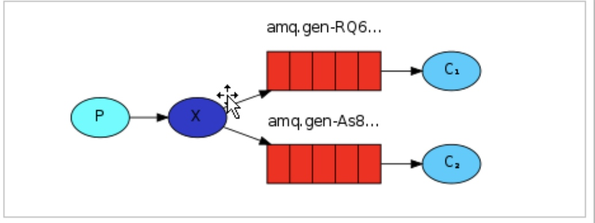

# 消费者消息

#### direct模式
* 1、消费者 1 和消费者 2 获取到的消息鬥容是不同的，同一个消息只能被一个消费者获取。
* 2、消费者 1 和消费者 2 获取到的消息的数量是相同的，一个是奇数一个是偶数。

#### work模式能者多劳
* Qos每次只发一条消息
* 消费者从队列中获取消息，服务端如何宍道消息已经被消呢？
* 模式 1: 自动确认只要消息从队列中获取，无论消费者获取到消息后是否成功消息，都认为是消息已经成功消费模式 
* 2: 手动确认消费者从队列中获取消息后，服务器会将该消息标记为不可用状态，等待消费者的反馈，如果消费者一直没有反馈，那么该消息将一直处于不可用状态
* 手动情况 

#### 订阅模式
* 
* 交换机只是转发，没有存储消息功能
* 消息发送到没有队列绑定的交换机时，消息将丢失，因为，交换机没有存储消息的力，消息只能存在在队列中。
* 同一个消息被多个消费者获取

#### 订阅模式实现商品的同步
* 可以的。
* 后台系统就是消息的生产者。前台系统和搜索系统是消息的消费者。
* 后台系统将消息发送到交换机中，前台系统和搜素系统都创建自己的队列，然后将队列绑定到交换机，即可实现。
* 消息，新增商品、修改商品、删除商品。
* 消费者有选择性的接收消息

#### 持久化
* 非持久化性能高于持久化