# 集群模式
* 首先是了解 Rabbitmq！集群架构模式
* 接下来从零开始构建一个高可靠的 Rabbitmq 集群
* 集群的配置文件与集群运维故障、失败转移讲解
* 高级插件的使用

#### 集群架构模式
* 主备模式：实现 Rabbitmqp 的高可用集群，一般在并发和数据量不高的情况下，这种模型非常的好用且简单。主备模式也称之为 Warren 模式
* 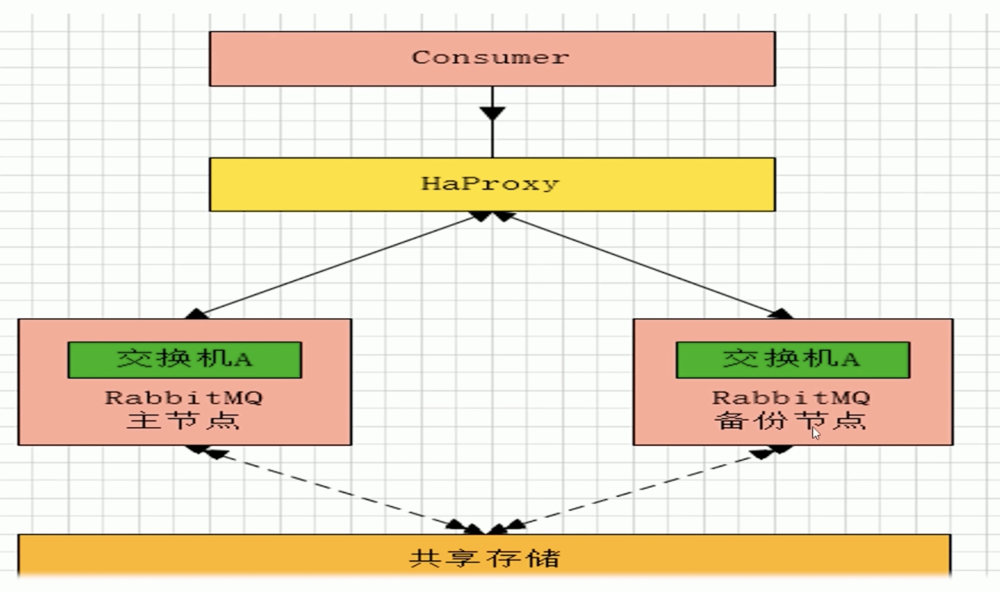

#### HAProxy
* 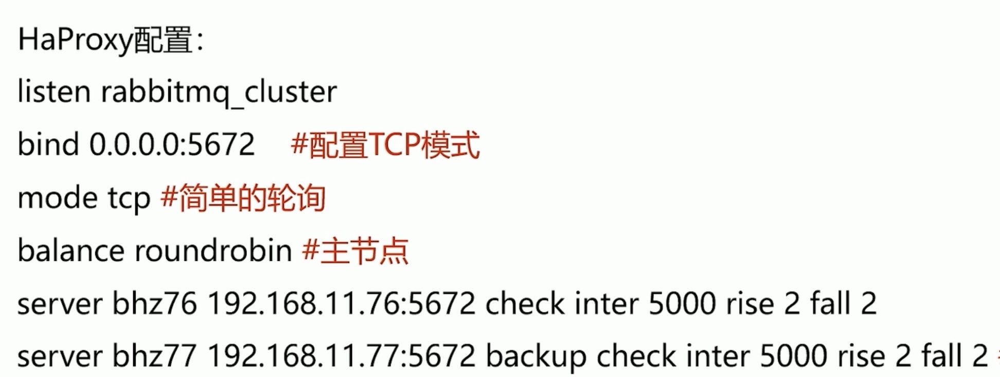
备注：rabbitmq 集群节点配置#inter 每隔五秒对 mq 集群做健康检查，2 次正确证明服务器可用，2 次失败证明服务器不可用，并且配置主备机

#### 远程模式
* 远程模式：远程模式可以实现双活的一种模式，简称 Shovel 模式，所谓 Shovel 就是我们可以把消息进行不同数据中心的复制工作，我们可以跨地域的让俩个 mq 集群互联
* 远程模式：远距离通信和复制，所谓 Shovel 就是我们可以把消息进行不同数据中心的复制工作，我们可以跨地域的让俩个 mq 集群互联。我们们下面看一下 Shovel 架构模型
* 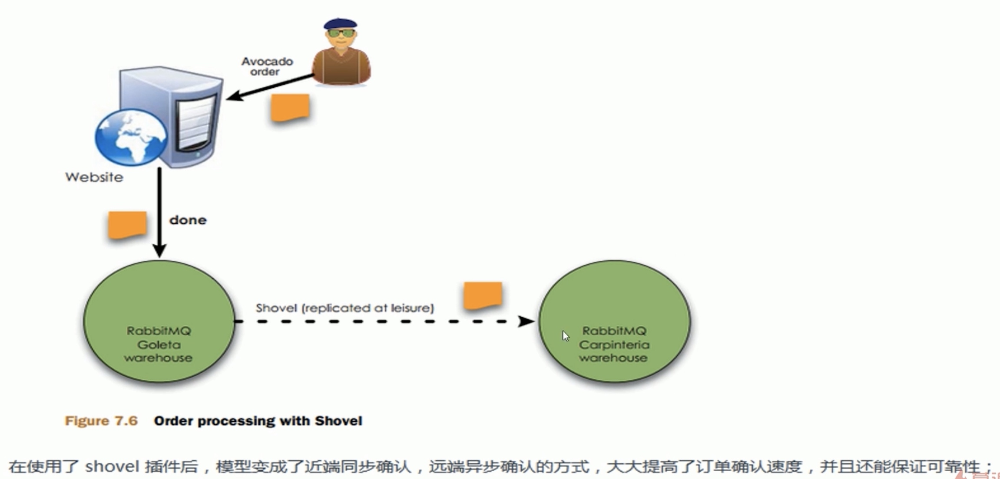
* 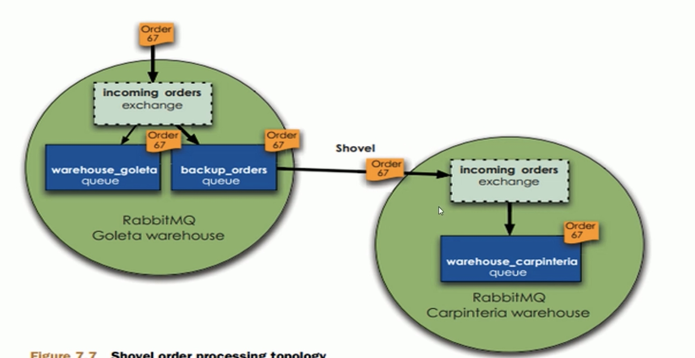
* rabbitmq-plugins enable amqp_client 
* rabbitmq-plugins enable rabbitma shovel 
* 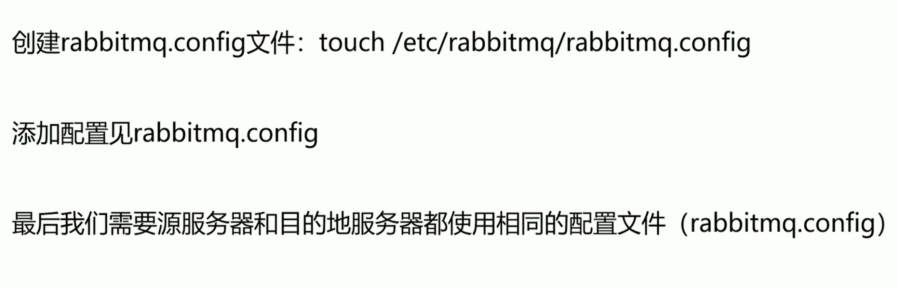

#### 镜像模式
* 镜像模式：集群模式非常经典的就是 Mirr 镜像模式，保证 100%数据不丢失，在实际工作中也是用的最多的。并且实现集群非常的简单，一般互联网大厂都会构建这种镜像集群模式
* mirror镜像队列，目的是为了保证 rabbitmq 数据的高可靠性解决方案，主要就是实现数据的同步，一般来讲是 2-3 个节点实现数据同步（对于 100%数据可靠性解决方案一般是 3 节点）集群架构如下
* 

#### 多活模式
* 多活模式：这种模式也是实现异地数据复制的主流模式，因为 Shovel 模式配置比较复杂，所以一般来说实现异地集群都是使用这种双活或者多活模型来取实现的。这种模型需要依赖 rabbitmg 的 federation 插件，可以实现持续的可靠的 AMQP 数据通信，多活模式在实际配置与应用非常的简单
* 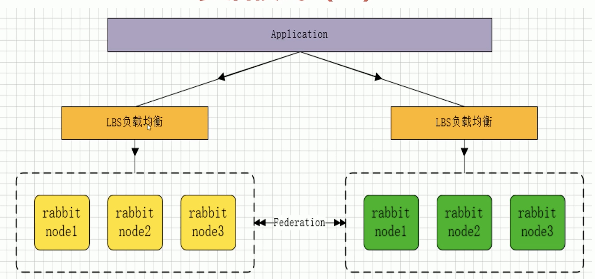
* Federation 插件是一个不需要构建 Cluster，而在 Brokers 之间传输消息的高性能插件，Federation 插件可以在 Brokers 或者 Cluster 之间传输消息，连接的双方可以使用不同的 users 和 virtual hosts，双方也可以使用版本不同的 Rabbitmq 和 Erlang。Federation 插件使用 AMQP 协议通讯，可以接受不连续的传输
* 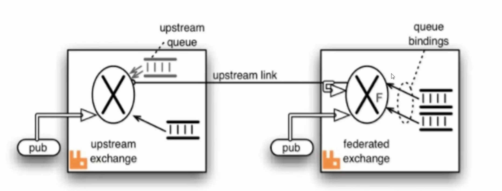
* Federation Exchanges，可以看成 Downstream 从 Upstream 主动拉取消息，但并不是拉取所有消息，必须是在 Downstream 上已经明确定义 Bindings 关系的 Exchange，也就是有实际的物理 Queue 来接收消息，才会从 Upstream 拉取消息到 Downstream。使用 AMQP 协议实施代理间通信，Downstream 会将绑定关系 组合在一起,绑定/解除绑定命令将发送到∪ pstream 交换机。因此，Federation Exchange 只接收具有订阅的消消

#### 镜像模式构建
* 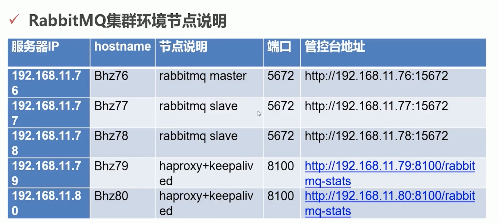

#### Haproxy
* Haproxy 借助于 OS 上几种常见的技术来实现性能的最大化 
* 单进程、事件驱动模型显著降低了上下文切换的开销及内存占用
* 在任何可用的情况下，单缓冲（(single buffering）机制能以不复制任何数据的方式完成读写操作，这会节约大量的 CPU 时钟周期及内存带宽
* 3 借助于 Linux2.6 (> =2.6.27.19) 上的 splice 系统调用，Haproxy 可以实现零复制转发（Zero- copy forwarding），在 Linux3.5 及以上的 OS 中还可以实现零复制启动（zero- starting)
* 4 内存分配器在固定大小的内存池中可实现即时内存分配，这能够显著减少创建个会话的时长
* 5 树型存储：侧重于使用作者多年前开发的弹性二叉树，实现了以 O (og (N）的低开销来保持计时器命令、保持运行队列命令及管理轮询及最少连接队列

#### KeepAlived
* Keepalived 软件主要是通过 VRRP 协议实现高可用功能的。VRRP 是 Virtual Router Redundancy Protocol（虚拟路由器元余协议）的缩写 VRRP 出现的目的就是为了解决静态路由单点故障问题的，它能够保证当个别节点宕机时，整个网络可以不间断地运行所以，Keepalived-方面具有配置管理∨VS 的功能，同时还具有对 LVS 下面节点进行健康检查的功能，另一方面也可实现系统网络服务的高可用功能

##### 功能
Keepalived 服务的三个重要功能
管理∨S 负载妁衡软件
实现 VS 集群节点的健康检査中
作为系统网络服务的高可用性（failover)

#### 集群配置文件
* Tcp_ listerners 设置 rabbimg 的监听端口，默认为【5672
* disk free limit 磁盘低水位线，若磁盘容量低于指定值则停止接收数据，默
* 认值为{ mem relative,1.0｝，即与内存相关联 1:1, 也可定制为多少 byte
* vm_memory high watermark，设置内存低水位线，若低于该水位线，则
* 开启流控机制，默认值是 0.4, 即内存总量的 40%
* Hipe_ compile 将部分 rabbimq 代码用 High Performance Erlang compiler 编译，可提升性能，该参数是实验性，若出现 erlang vm segfaults，应关掉
* force fine_ statlstlcs，该参数属于 rabbimg_ management，若为 true 则进行精细化的统计，但会影响性能
* 集群节点模式： Disk为磁盘模式存储/Ramn为内存模式存储

#### 集群恢复和故障转移
* 
* 
* 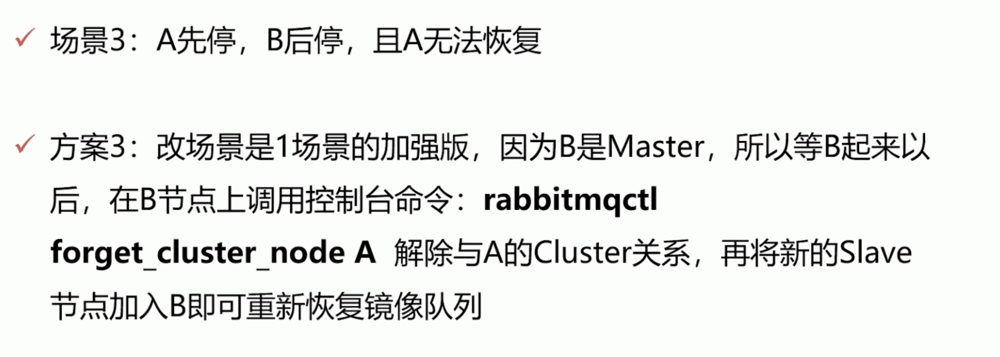
* 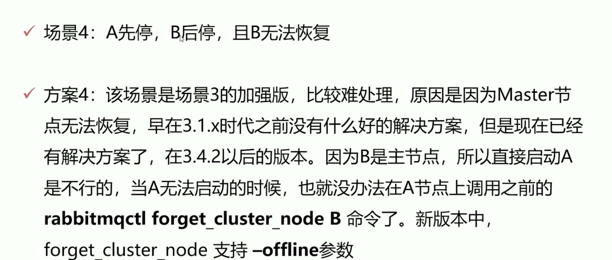
* 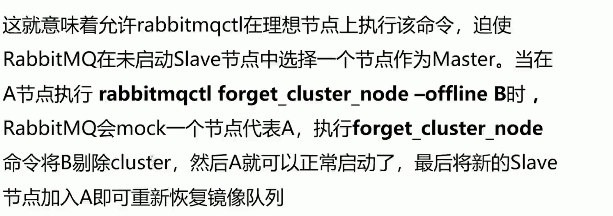
* 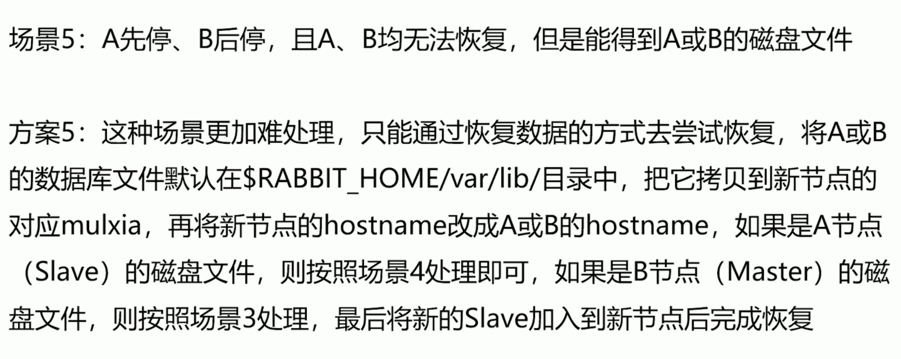

#### 延迟插件
* 延迟队列可以做什么事情？
* 比如消息的延迟推送、定时任务（消息）的执行。包括一些消息重试策略的配合使用，以及用于业务削峰限流降级的异步延迟消息机制，都是延迟队列的实际应用场景
* 