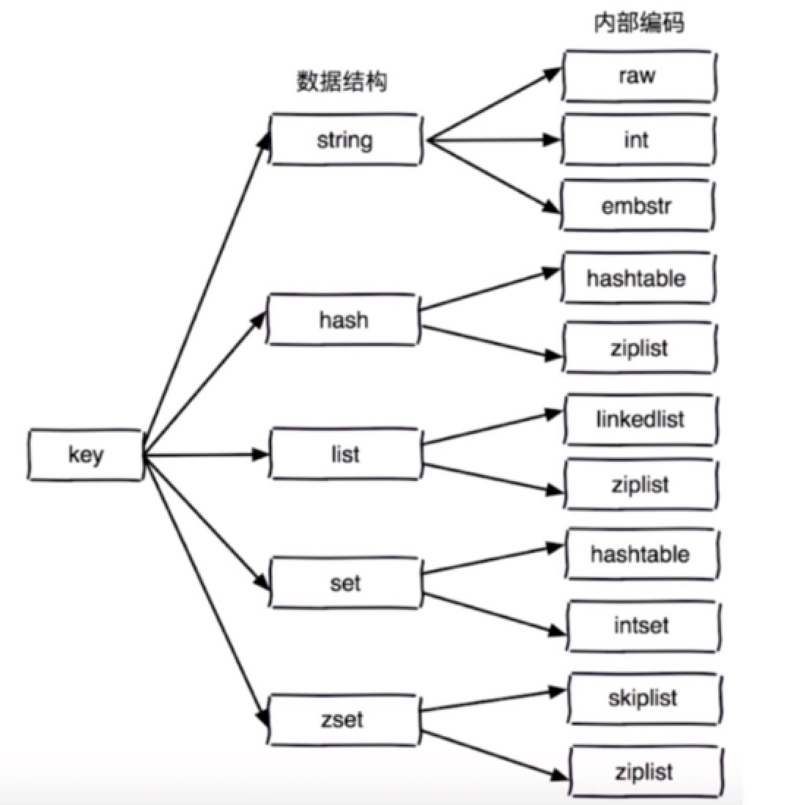
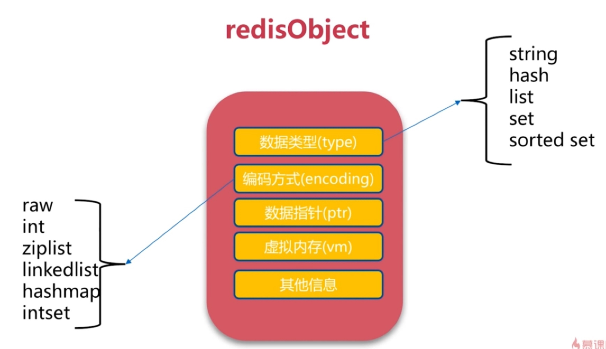
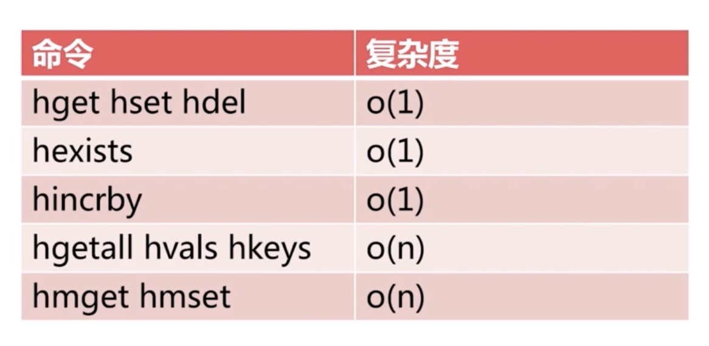
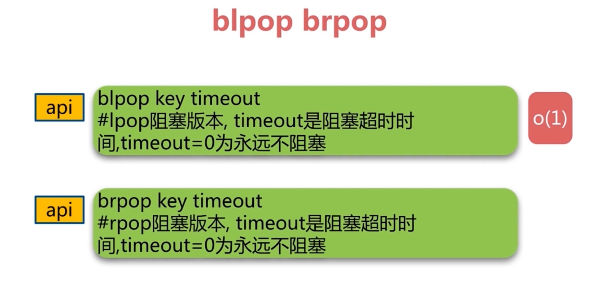
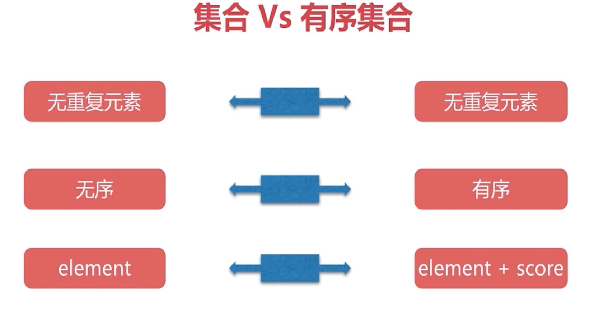
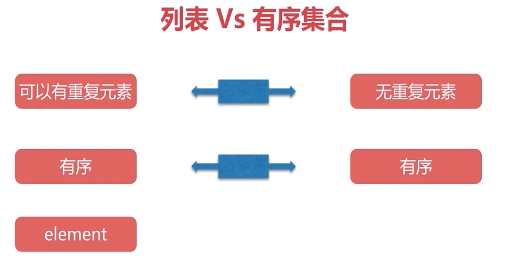

# API使用

#### 通用命令
* keys
* dbsize
* exists key
* del 
* expire key seconds
* type key

#### keys使用
* 热备从节点
* scan scan 0 match a* count 1000

#### expire&ttl&persist
* expire key seconds
* ttl key -1 表示不过期 -2 表示key不存在
* persist key

#### 数据结构和内部编码
* 
* 

#### 单线程为什么快
* 纯内存
* 非阻塞IO
* 避免线程切换和竞态消耗

#### 单线程注意事项
* 一次只运行一条命令
* 拒绝长慢命令
* keys flushall flushdb slow lua script multi/exec opreate big value
* fsync file descriptor
* close file descriptor

#### 字符串
* 缓存
* 分布式锁
* 计数器
* incr decr incrby decrby
* 网页访问量 incr user_id:pageview
* set key value 不管key是否存在都设置
* setnx key value 不存在才设置
* set key value xx 存在才设置
* mget k1 k2 k3
* mset k1 k2 k3
* getset 设置新值获取旧值
* append key value
* strlen 长度
* incrbyfloat
* getrange
* setrange

#### hash
* hset
* hset
* hdel
* hexists 是否存在
* hlen 获取field数量
* hmset key
* hmget key
* 页面访问 hincrby userinfo pageview count
* hgetall
* hvals
* hkeys
* string hash对比

| get | hget |
| :-: | :-: |
| set setnx | hset hsetnx |
| del | hdel |
| incr incrby decr decrby | hincrby |
| mset | hmset |
| mget | hmget |

* 设置用户属性方案对比

| 命令 | 优点 | 缺点 |
| :-: | :-: | :-: |
| string v1 | 编程简单 节约内存 | 序列化开销 设置属性要操作整个数据 |
| string v2 | 直观 可以部分更新 | 内存占用较大 key比较分散 |
| hash | 直观 节省空间 可以部分更新 | 编程复杂 ttl二级属性不好控制 |

* 总结
* 

#### list
* 有序
* 可以重复
* lpush list a b c  c->b->a
* rpush list a b c  a->b->c
* lrange list 0 3 遍历pos a->b->c
* linsert list after c d a->b->c->d
* linsert list before a -1 -1->a->b->c->d
* rpop list -1->a->b->c
* lpop list a->b->c
* lrem
* 
* lrem list2 -2 c 从右到左
* lrem list2 2 c 从左到右
* lrem list2 0 c 全部删除
* ltrim list2 0 5 保留指定范围内的元素
* ldel会阻塞redis, ltrim不会
* lindex list2 0 获取置顶索引的值
* llen 列表长度
* lset 设置指定索引值 
* blpop
* prpop 
* 
* 组合功能
* 

#### 集合
* 无序
* 无重复
* 集合间操作
* sadd
* srem
* scard userinfo 集合长度
* sismember userinfo name 集合成员是否存在
* srandmember userinfo 随机访问集合成员
* smembers userinfo 全部成员
* spop随机弹出成员
* sdiff
* sunion
* sinter
* 实战
* 

#### zset
* 
* 
* zadd key score ele O(logN)
* zrem key ele
* zscore key ele 返回分数
* zrank key ele 获取排名
* zrange key 0 -1 打印全部的ele
* zrange key 0 -1 withscores 打印全部的ele和scores
* zrangebyscore key min max 指定区间的ele
* zremrangebyrank 根据排名删除
* zremrangebyscore 根据分数范围删除
* zrevrnak
* zrevrange
* zrevrangebyscore
* zinterstore
* zunionstore
* 