# Redis内存优化

#### 分类
* 内存消耗
* 内存管理
* 内存优化

#### 内存消耗

#####内存使用统计
* 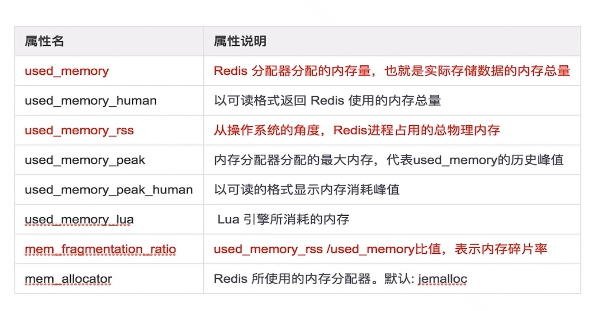

##### 内存消耗划分
* 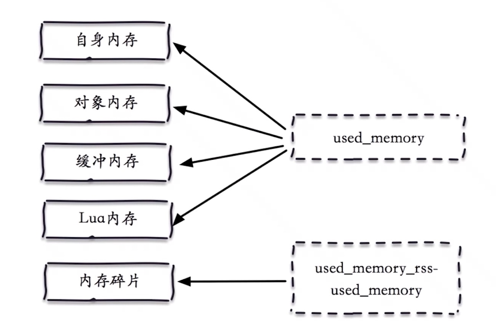
* 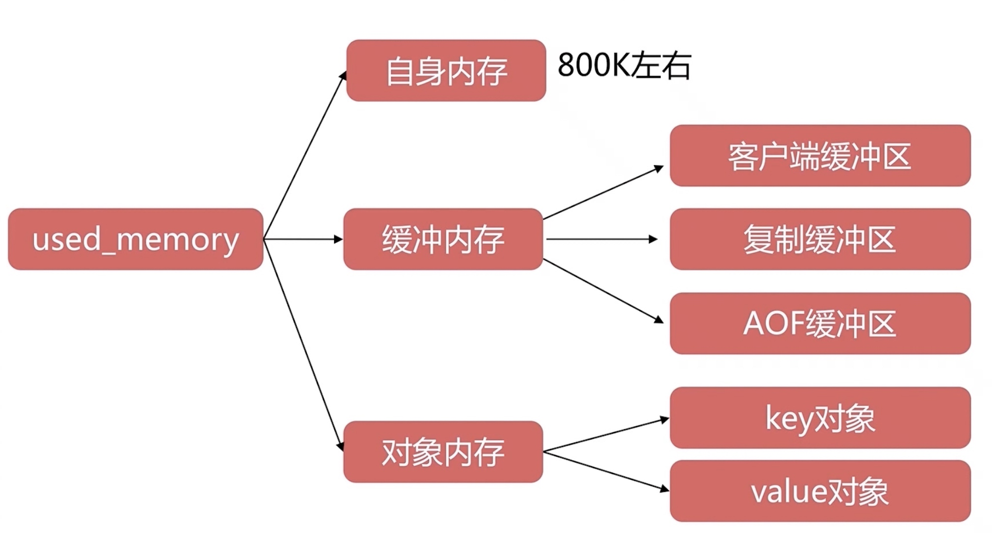

#### 客户端缓冲区
* 普通客户端
* slave客户端
* pubsub客户端

#### 输入缓冲区
* 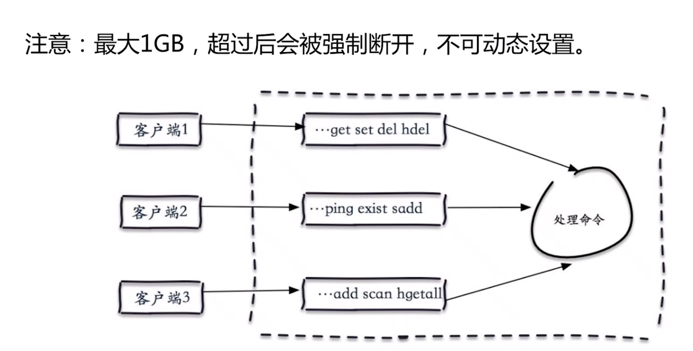

##### 输出缓冲区
* client-output-buffer-limit 
* class 缓冲区类型
* hard limit 超出会立即被关闭
* soft limit soft seconds 超出规定缓冲区多长时间会被关闭
* 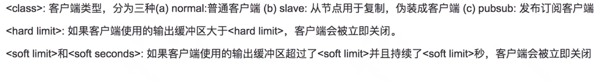

##### 普通客户端缓冲区
* 默认：client-output-buffer-limit normal 0 0 0 
* 默认：没有限制客户端缓冲
* 注意：防止大的命令或者 monitor。

##### slave客户端缓冲区
* 默认: client-output-buffer-limit slave 256 mb 64 mb 60 
* 阻塞：主从延迟较高，或者从节点过多
* 注意：主从网络，从节点不要超过 2 个

##### pubsub缓冲区
* 默认: client-output-buffer-limit pubsub 32 mb 8 mb 60 
* 阻塞：生产大于消费
* 注意：根据实际场景适当调试。
* client list
* info clients

##### 复制缓冲区
* 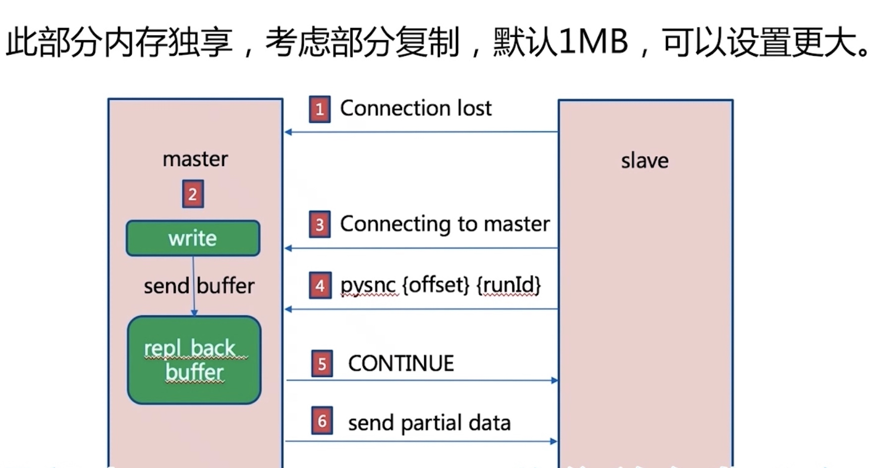

##### AOF缓冲区
* 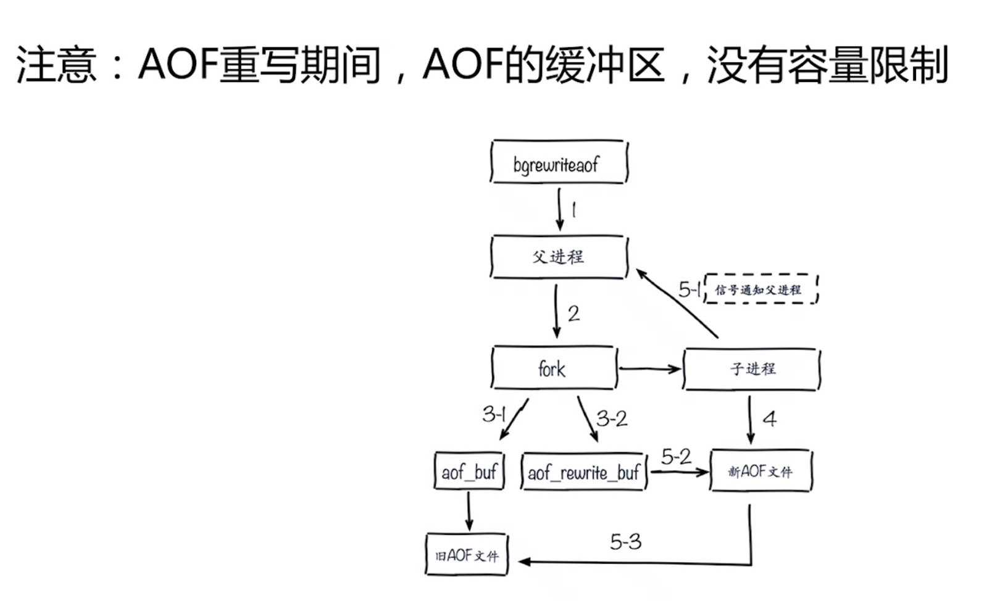

#### 对象内存
* Key：不要过长，量大不容忽视 redis3: embstr39 字节）
* value: ziplist、Intset=等优化方式。

#### 内存碎片
* jemalloc
* 优化方式
* 避免频繁更新操作：append、strange 等
* 安全重启，例如 Redis sentinela 和 redis clusters 等。

#### 子进程内存消耗
* 必然存在：fork (bgsave 和 bgrewriteaof）
* 优化方式
* 去掉 THP 特性：2.6.38 增加的特性。
* 观察写入量：copy-on-wite overcommit_memory=1

#### 内存管理
* 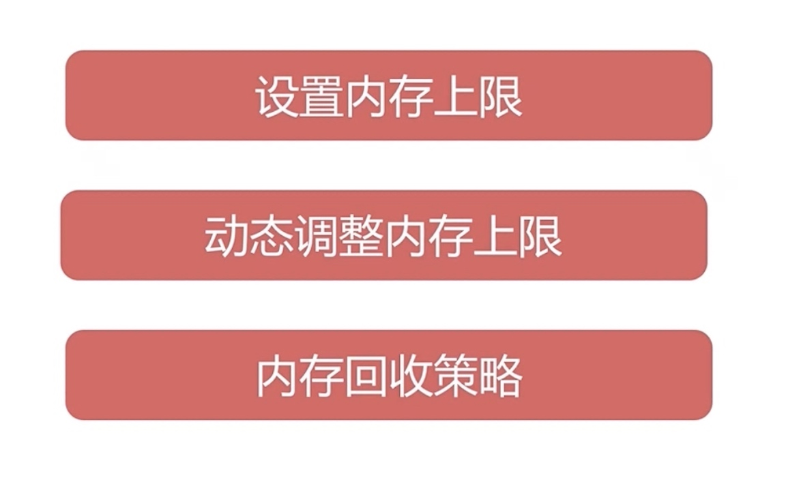
* 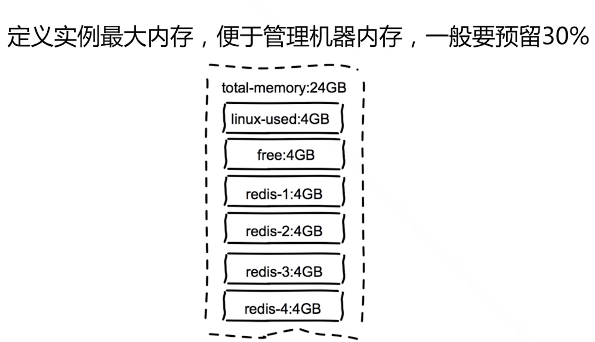
* config set maxmemory 
* config rewrite

#### 内存回收策略

##### 删除过期键值
* 惰性删除：访诃 key-> expired dict-> del key
* 定时删除：每秒运行 10 次，采样删除。
* 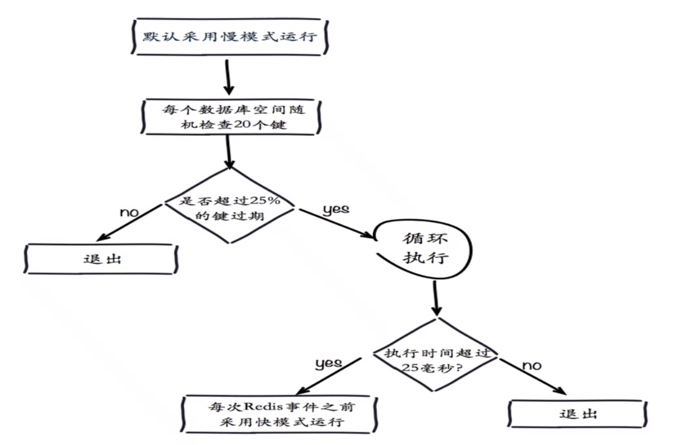

##### 内存溢出策略
* 超过 naxmemory 后触发相应策略，由 naxmemory- policy 控制。
* Noeviction：默认策略，不会删除任何数据，拒绝所有写入操作并返回端错误信息“(error) OOM command not allowed when used memory“此时 Redis 只响应读操作由 maxmemory- policy 控制。
* Volatile-ru：根据 LRU 算法删除设置了超时属性（expire）的键，直到腾出足够空间为止。如果没有可删除的键对象，回退到 noevictioni 策略
* Allkeys-ru：根据 LR∪算法删除犍，不管数据有没有设置超时属性，直到腾出足够空间为止
* Allkeys- random：随机删除所有键，直到腾出足够空间为止。
* Volatile- randon：随机删除过期键，直到腾出足够空间为止。
* volatile-ttl：根据键值对象的属性，删除最近将要过期数据。如果没有，回退到 noevlction 策略。

#### 内存优化
* 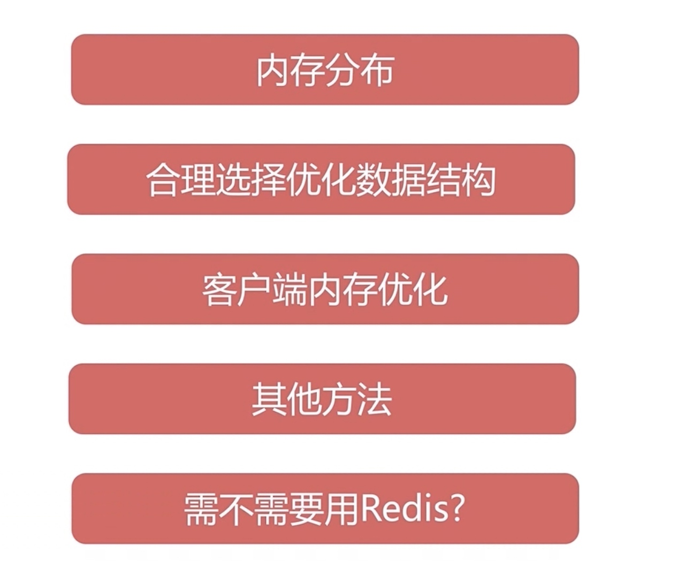

##### 合理选择数据结构
* 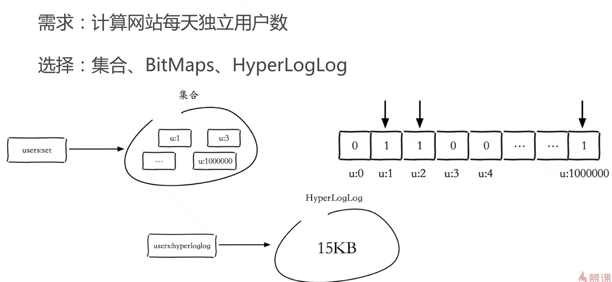
* 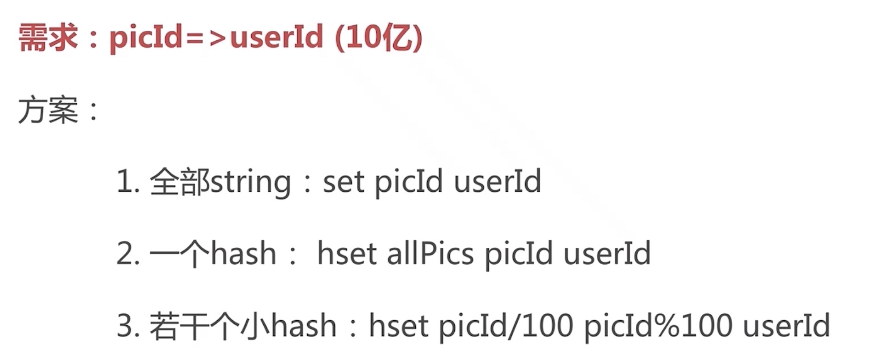
* 

##### ziplist
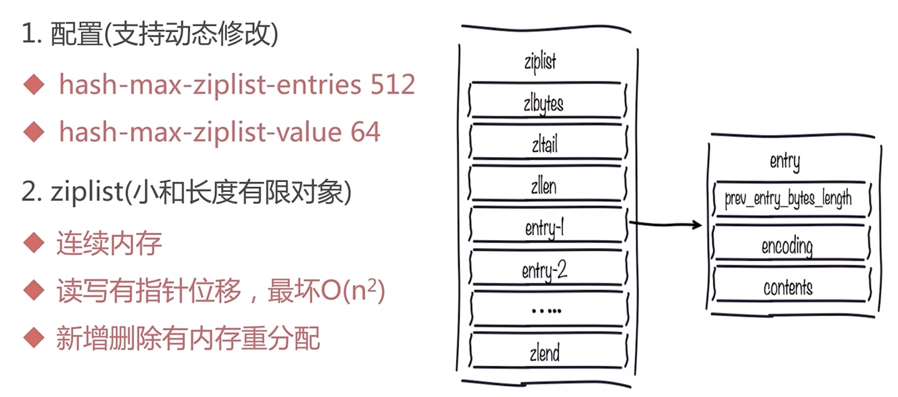

#### 内存暴增案例
* 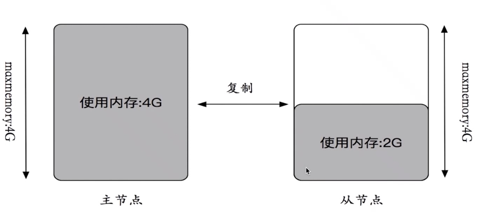
* 批量写入
* 主从不一致 dbsize dbsize
* redis-cli client list | grep -v "omem=0"
* 找到对应的业务方直接处理掉
* 预防
* 线上redis禁用monitor
* 适度限制缓冲区大小
* 理解monitor的原理
* cachecloud可以直接监控到

#### 其他方法
* 不要忽视key长度
* 序列化和压缩方法

#### 需不需要Redis
* 数据 大数据 冷数据
* 功能性 关系行 消息队列

#### 总结
* 内存是宝贵资源。
* 结合场景选择和优化数据结构。
* 序列化是有成本的。
* 不要忽视键长度。
