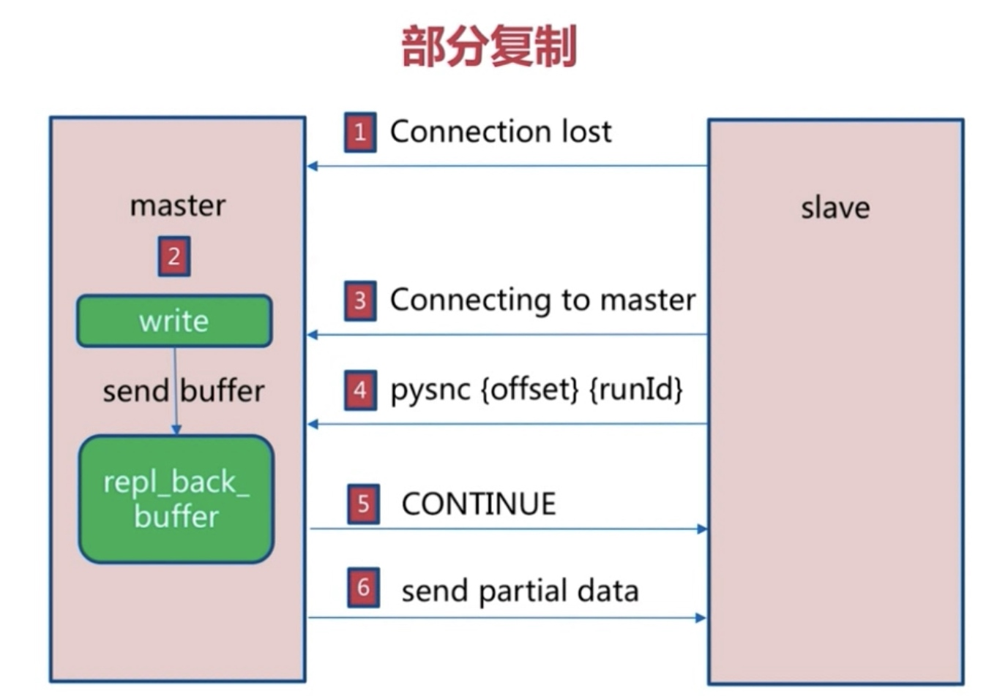

# Redis复制的原理和优化

#### 主从复制
* 单机
* 机器故障
* 容量瓶颈
* QPS瓶颈

#### 作用
* 数据副本
* 扩展读性能
* 数据流是单向

#### 配置
* slaveof host port
* slaveof no one 
* slave-read-only yes
* info replication
* flushall

#### 全量复制
* redis-cli  info server | grep run
* offset 偏移量
* 
* 开销
* bgsave
* RDB文件网络传输时间
* 从节点清空数据时间
* 加载RDB的时间
* 可能的AOF重写

#### 部分复制
* 

#### 故障处理
* salve故障
* master故障 slaveof no none 
* sentinel

#### 开发和运维的问题
* 读写分离
* 主从配置不一致
* 规避全量复制
* 规避复制风暴

#### 读写分离
* 复制数据延迟
* 读到过期数据
* 清除过期数据 懒惰 定期采样清理
* 从节点故障

#### 配置不一致
* maxmemory不一致
* 数据结构优化参数 hash-max-ziplist-entries 内存不一致

#### 规避全量复制
* 第一次全量复制
* 小主节点，低峰
* 节点运行ID不匹配
* 主节点重启 运行ID变化
* 故障转移
* 复制积压缓冲区不足
* 网络中断 部分复制无法满足
* 增大复制缓冲区配置rel_backlog_size 网络增强

#### 规避复制风暴
* 主节点重启，多从节点复制
* 更换复制拓扑
* 单机器复制风暴
* 
* 