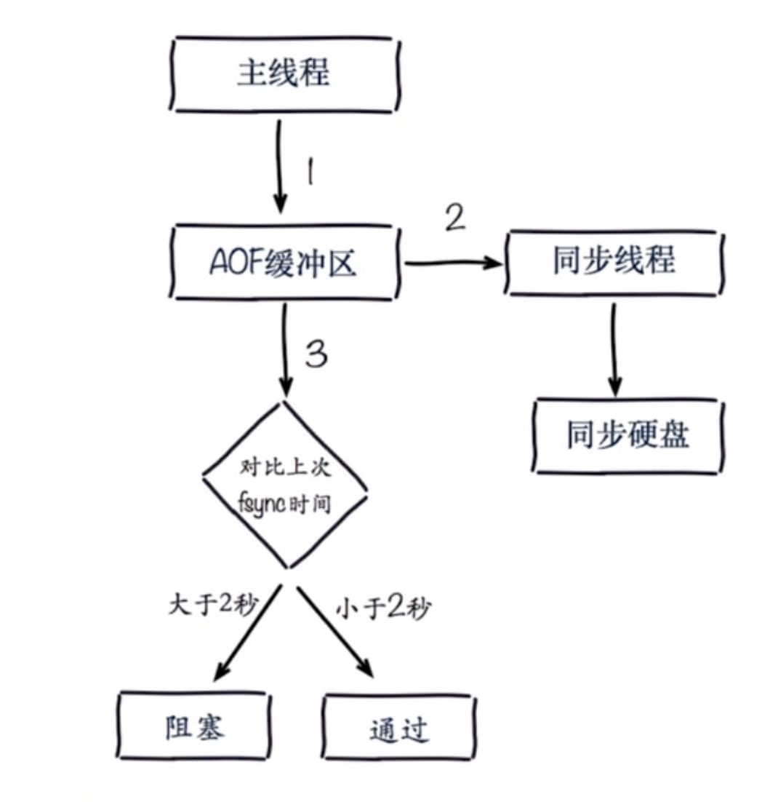

# Redis常见问题
#### fork操作
* 同步操作
* 与内存量有关，内存越大，耗时越长
* info: latest_fork_usec

#### 改善fork
* 优先使用物理机
* 控制redis最大可用内存maxmemory
* 合理配置linux内存分配策略: vm.overcommit_memory=1
* 降低fork频率

#### 子进程开销和优化
* RDB和AOF文件生成，属于CPU密集型
* 不做CPU绑定，不和CPU密集型部署
* 内存
* 开销 copy-on-write
* echo never > /sys/kernel/mm/transparent_hugepage/enabled
* 硬盘
* AOF和RDB文件写入，可以结合iostat, iotop分析
* 不要和高硬盘负载服务在一起  存储和消息队列
* no-appendfsync-on-rewrite = yes
* 根据写入量决定磁盘类型
* 单机多实例持久化目录可以考虑分盘

#### AOG追加阻塞
* 
* Redis日志
* info persistence