# Redis开发规范

#### 键值设计
* 可读性和可管理性
* 以业务名（或数据库名）为前缀(防止 key 冲突),用冒号分割比如业务名表名，比如ugc:video:1
* 简洁性
* 保证语义的前提下，控制 key 的长度，当 key 较多时，内存占用也不容忽=
* 不要包含特殊字符 反例：包含空格、换行、单双引号以及其他转义字符

#### 内部编码
* embstr
* 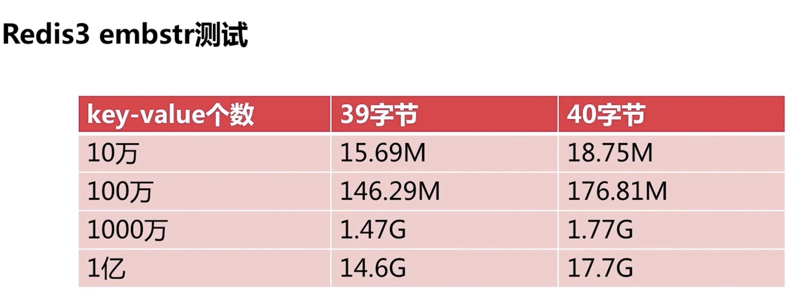
* raw
* int

#### Value设计

##### 拒绝bigkey
* string 类型控制在 10 KB 以内
* hash、list、set、zset 元素个数不要超过 5000
* 网络阻塞
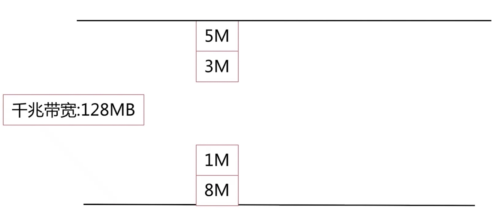
* 集群节点数据不均衡
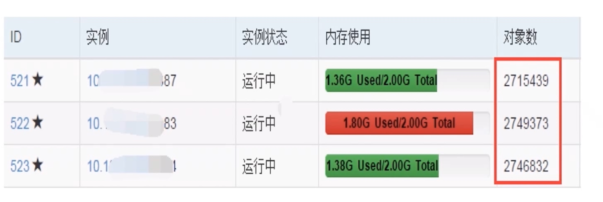
* Rediss阻塞
* 频繁序列化：应用服务器 CPU 消耗
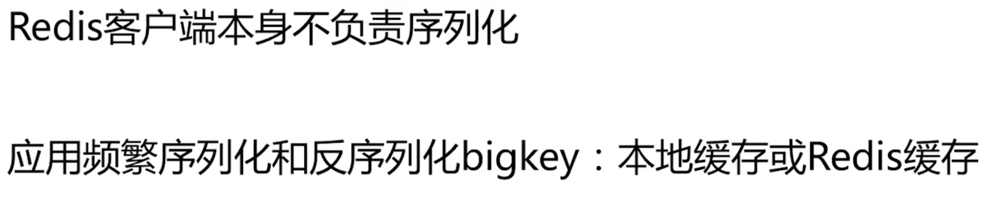
* 慢查询
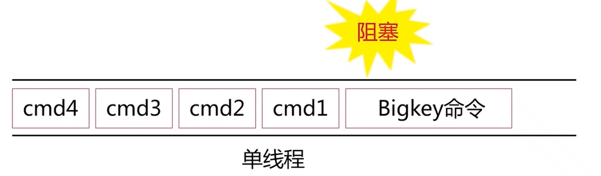

##### 发现bigkey
* 应用方的发现
* redis-cli --bigkeys 建议在slave节点
* scan + debug object
* 主动报警：网络流量监控，客户端监控
* 内核热点key问题优化
* 建立堆
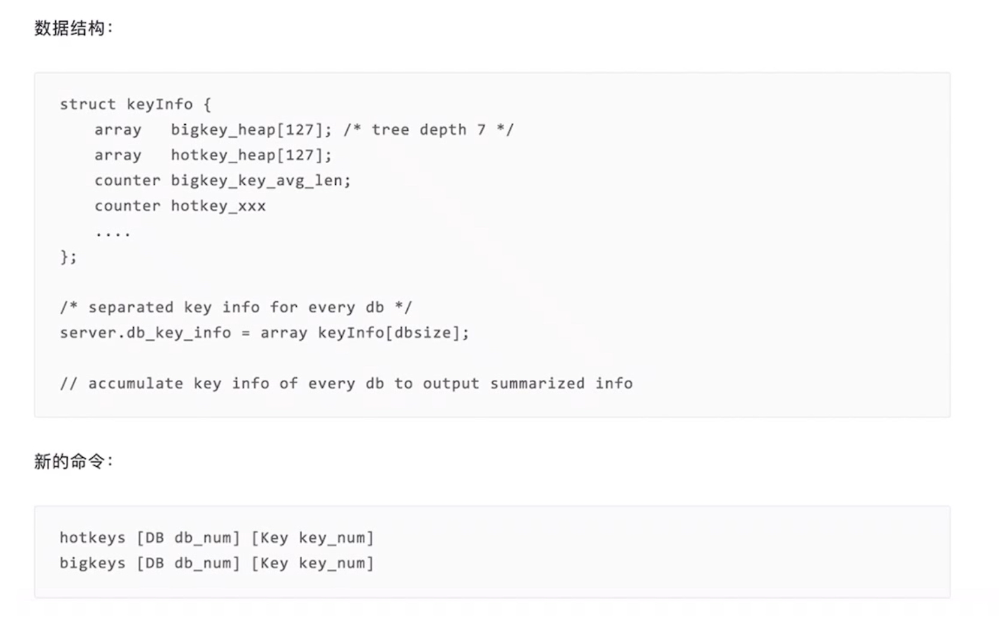

##### bigkey删除
* 注意隐性删除
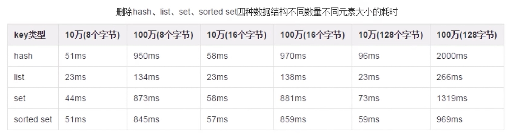
* 过期事件删除导致阻塞，不会在主节点慢查询日志，在从节点慢查询有
* lazy delete
* 通过scan 进行子删除

##### bigkey预防
* 优化数据结构
* 优化数据结构：例如二级拆分
* 物理隔离或者万兆网卡：不是治标方案
* 命令优化：例如 hgetall-~ hmget、scan 
* 报警和定期优化

##### bigkey总结
* 牢记 Reds 单线程特性
* 选择合理的数据结构和命令
* 凊楚自身OPS
* 了解 bigley 的危害

#####  选择合适的数据结构
* 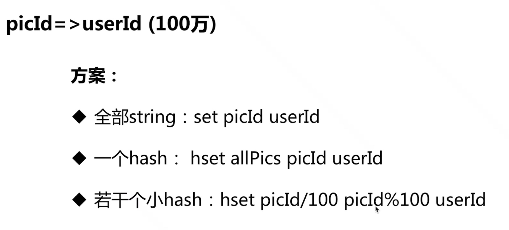
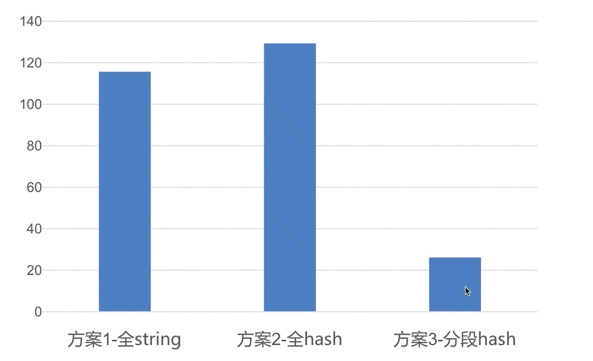
* 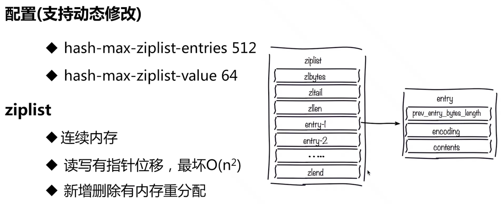
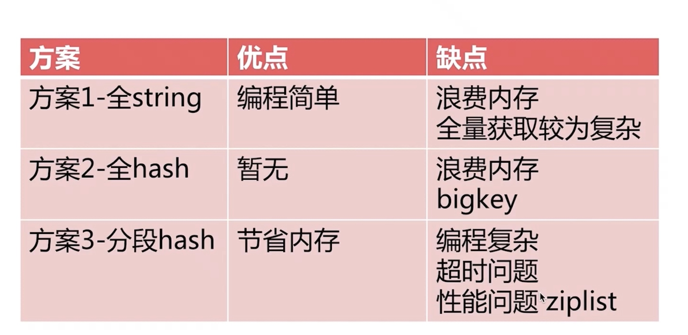

#### 键值生命周期
* Redis不是垃圾桶
* idletime
* 周期数据需要设置过期时间，object idletime key可以找垃圾 key-value
* 过期时间不宜集中：缓存穿透和雪崩等问题

#### 命令优化
* O (N）以上命令关注 N 的数量 例如：hgetal、lange、smembers、zrange、sinter 等并非不能使用，但是需要明确 N 的值。有遍历的需求可以使用 hscan、sscan、zscan 代替。
* 禁止线上使用 keys、flushall、flushes 等，通过 redis 的 rename 机制禁掉命令，或者使用 scan 的方式渐进式处理。

```
rename-command FLUSHALL ""
rename-command FLUSHDB  ""
rename-command CONFIG   ""
rename-command KEYS ""
```
* 合理使用select 
* redis事务弱 不支持回滚
* 集群版本（自研和官方）要求一次事务操作的 key 必须在一个 slot 上（可以使用 hashtag 功能解決）
* redis集群版本在lua上有特殊要求
* 必要使用monitor命令，不能长时间使用
* 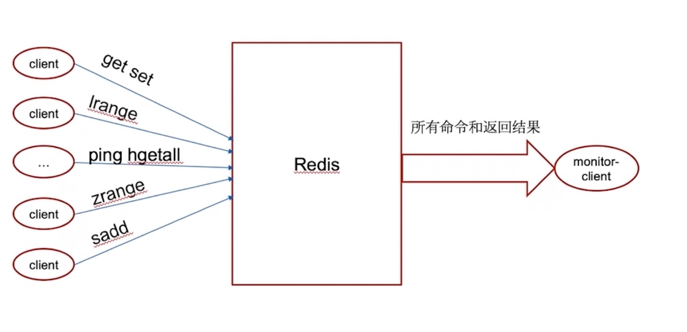

##### 客户端优化
* 避免多个应用使用一个redis实例
* 不想干的业务拆分
* 