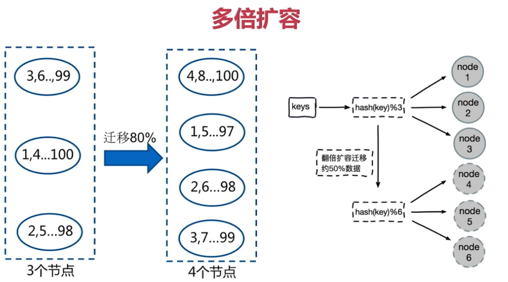
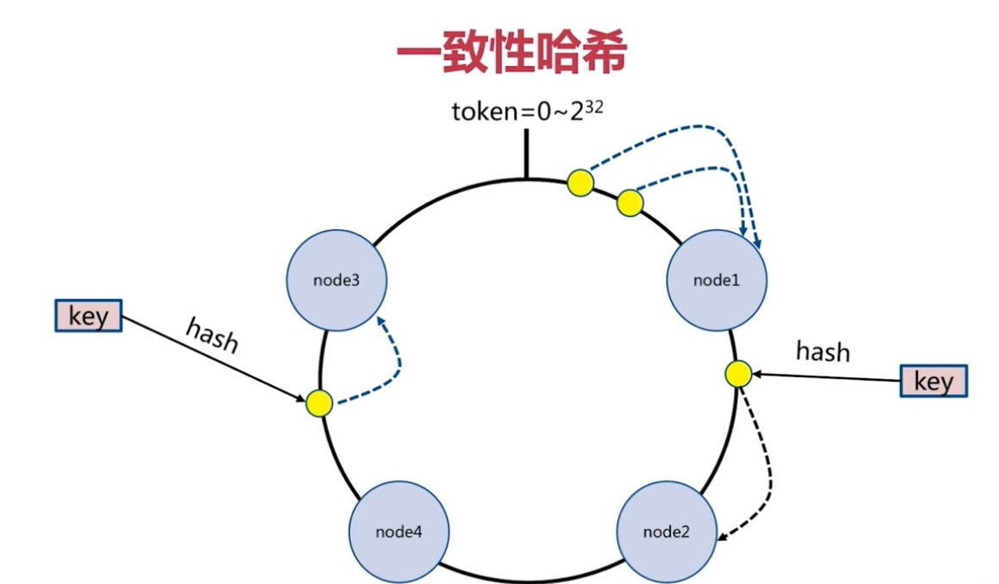
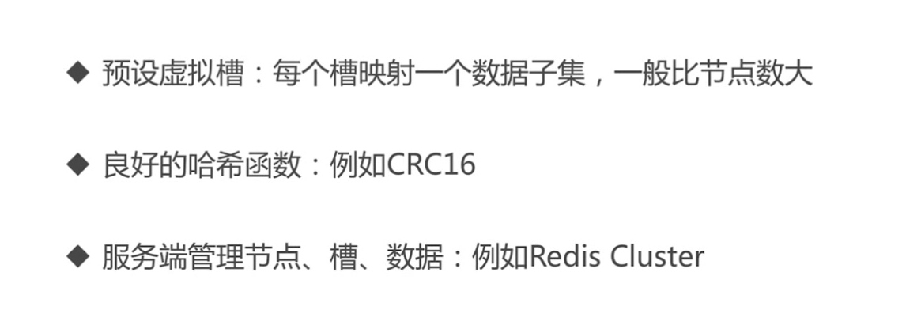
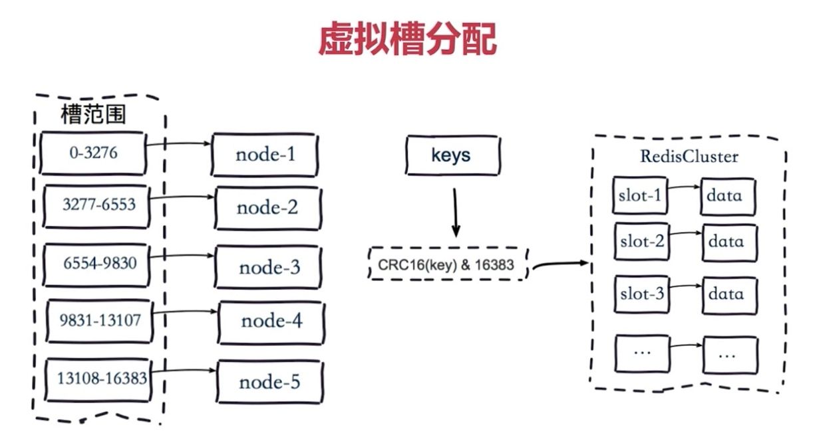
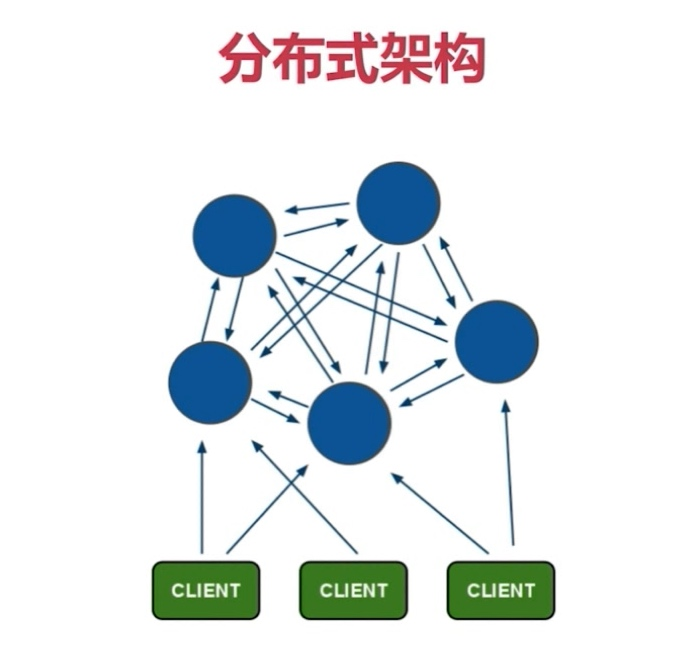
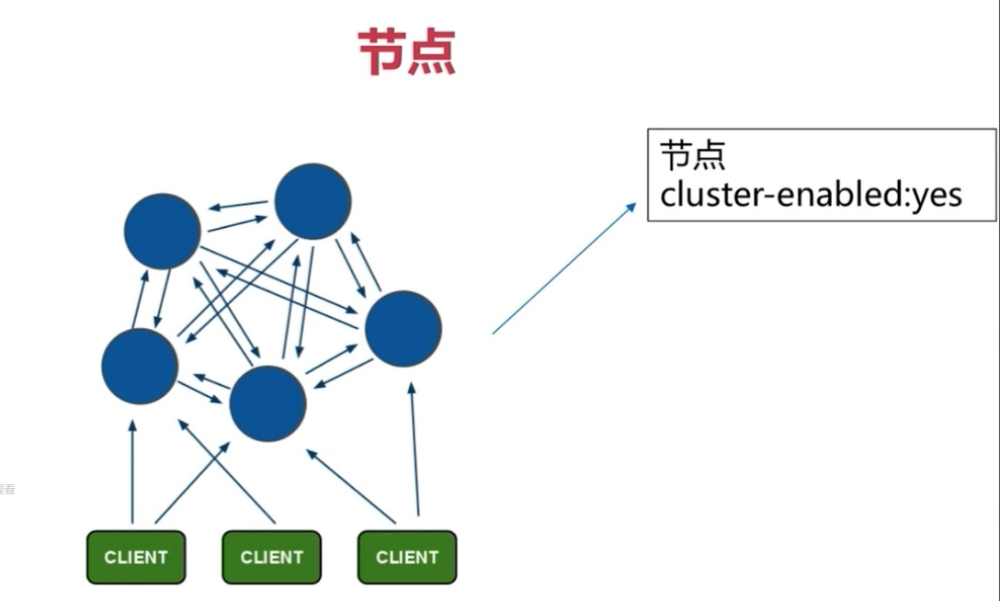
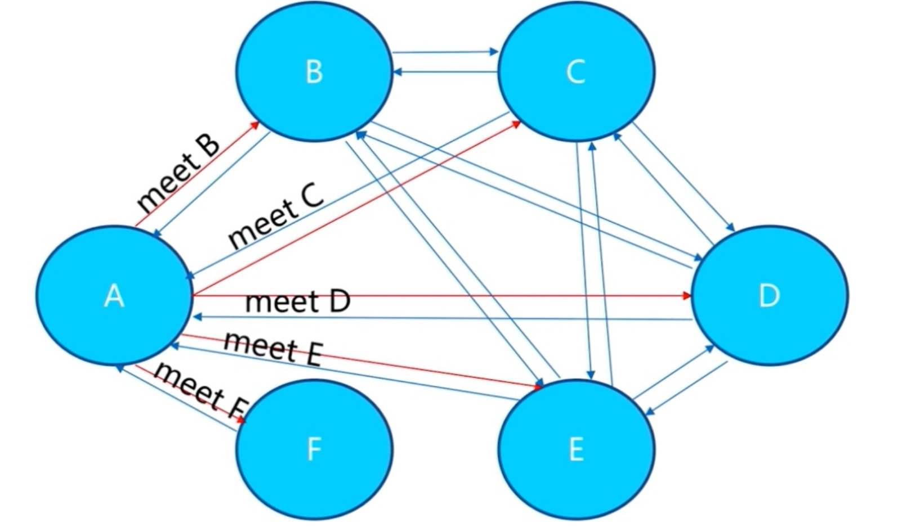
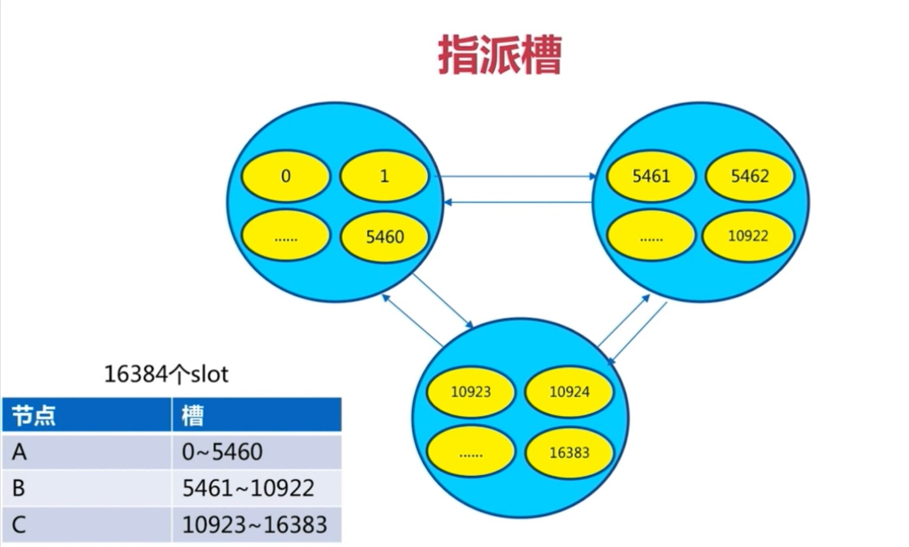

# Redis集群

#### 多倍扩容
* 
* 引起50%的数据迁移
* 客户端分片：哈希+取余
* 节点伸缩：数据节点关系变化，导致数据迁移
* 迁移数量和添加节点数量有关：建议翻倍扩容

#### 一致性hash
* 
* 

#### 虚拟槽分区
* 
* 

#### 集群架构
* 

#### Redis集群架构
* 
* 节点
* 
* meet
* 
* 槽
* 

#### 客户端与槽
* 

#### cluser特性
* 复制
* 高可用
* 分片

#### 安装
* 开启节点配置
* meet

```
redis-cli -h $master -p 6379 cluster meet $master 6380
redis-cli -h $master -p 6379 cluster meet $node1 6379
redis-cli -h $master -p 6379 cluster meet $node1 6380
redis-cli -h $master -p 6379 cluster meet $node2 6379
redis-cli -h $master -p 6379 cluster meet $node2 6380
```
* 指派槽

```
#!/bin/bash
master=192.168.31.186
node1=192.168.31.224
node2=192.168.31.125
start=$1
last=$2
port=$4
h=$3
ip=""
case $h in
  "master") ip=$master;;
  "node1") ip=$node1;;
  "node2") ip=$node2;;
esac

for slot in `seq ${start} ${last}`
do
  echo "slot:${slot}}"
  redis-cli -h ${ip} -p ${port} cluster addslots ${slot}
done
./slot.sh 0 5461 master 6379 && ./slot.sh 5462 10922 node1 6379  && ./slot.sh 10923 10683 node2 6379
```
* 主从

```
redis-cli -p 6379 cluster replicate 1da43f4f45d110b849bdfbc0fc55dc311fa69a76
redis-cli -p 6380 cluster replicate 261b726a6cafacddbf8f23596c738bdf4a30f085
```
* 访问

```
redis-cli -c -p 6379
Redirected to slot [4554] located at 192.168.31.186:6379
查看节点 redis-cli -p 6380 cluster nodes
查看槽 redis-cli -p 6380 cluster slots
查看信息 redis-cli -p 6380 cluster info

```

#### 一键创建集群
```
//启动节点
master redis-server ./redis-master_6379.conf \
&& redis-server ./redis-master_6380.conf
node1 redis-server ./redis-master_6379.conf \
&& redis-server ./redis-master_6380.conf
node2 redis-server ./redis-master_6380.conf \
&& redis-server ./redis-master_6381.conf
//创建集群
redis-cli --cluster create --cluster-replicas 1 \
$master:6379 $master:6380 \
$node1:6379 $node1:6380 \ 
$node2:6380 $node2:6381
```
