# Sentinel

#### 主从复制高可用
* 手动故障转移
* 写能力和存储能力受限制

#### 主要任务
* 监控(Monitoring): Sentinel 会不断地检查你的主服务器和从服务器是否运作正常。                
* 提醒(Notification): 当被监控的某个 Redis 服务器出现问题时， Sentinel 可以通过 API 向管理员或 者其他应用程序发送通知。
* 自动故障迁移(Automatic failover): 当一个主服务器不能正常工作时， Sentinel 会开始一次自动故 障迁移操作， 它会将失效主服务器的其中一个从服务器升级为新的主服务器， 并让失效主服务器的其 他从服务器改为复制新的主服务器; 当客户端试图连接失效的主服务器时， 集群也会向客户端返回新 主服务器的地址， 使得集群可以使用新主服务器代替失效服务器

#### 基本架构
* 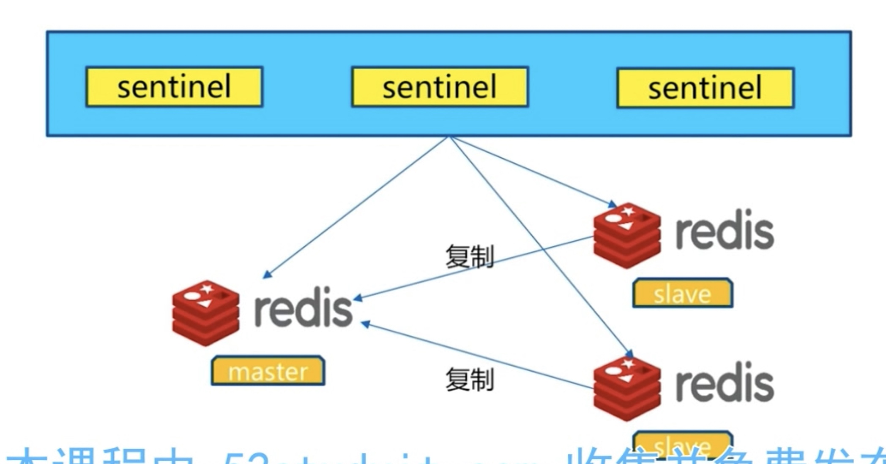
* 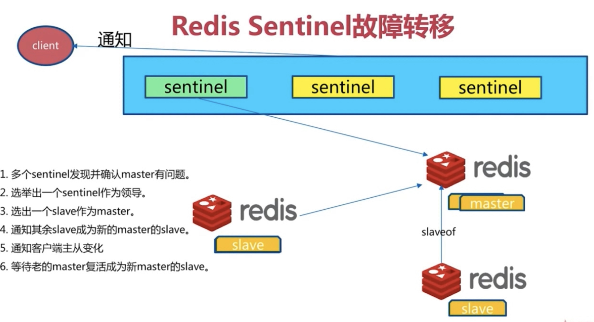

#### sentinel配置
* 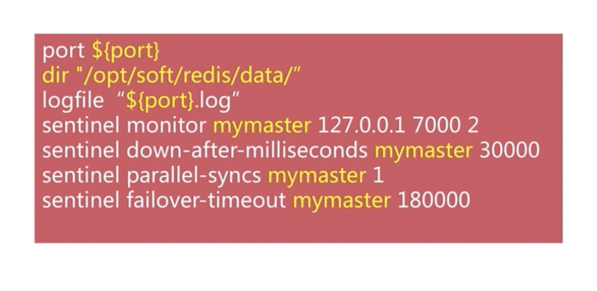
* sentinel monitor mymaster 127.0.0.1 6379 1 名称为mymaster的主节点名，1表示将这个主服务器判断 为失效至少需要 1个 Sentinel 同意 (只要同意 Sentinel 的数量不达标，自动故障迁移就不会执行)
* down-after-milliseconds 选项指定了 Sentinel 认为服务器已经断线所需的毫秒数
* failover过期时间，当failover开始后，在此时间内仍然没有触发任何failover操作，当前sentinel 将会认 为此次failoer失败
* parallel-syncs 选项指定了在执行故障转移时， 最多可以有多少个从服务器同时对新的主服务器进行同 步， 这个数字越小， 完成故障转移所需的时间就越长。 如果从服务器被设置为允许使用过期数据集， 那么你可能不希望所有从服务器都在同一时间向新的主 服务器发送同步请求， 因为尽管复制过程的绝大部分步骤都不会阻塞从服务器， 但从服务器在载入主 服务器发来的 RDB 文件时， 仍然会造成从服务器在一段时间内不能处理命令请求: 如果全部从服务 器一起对新的主服务器进行同步， 那么就可能会造成所有从服务器在短时间内全部不可用的情况出 现。

#### 客户端
* 连接sentinel
* 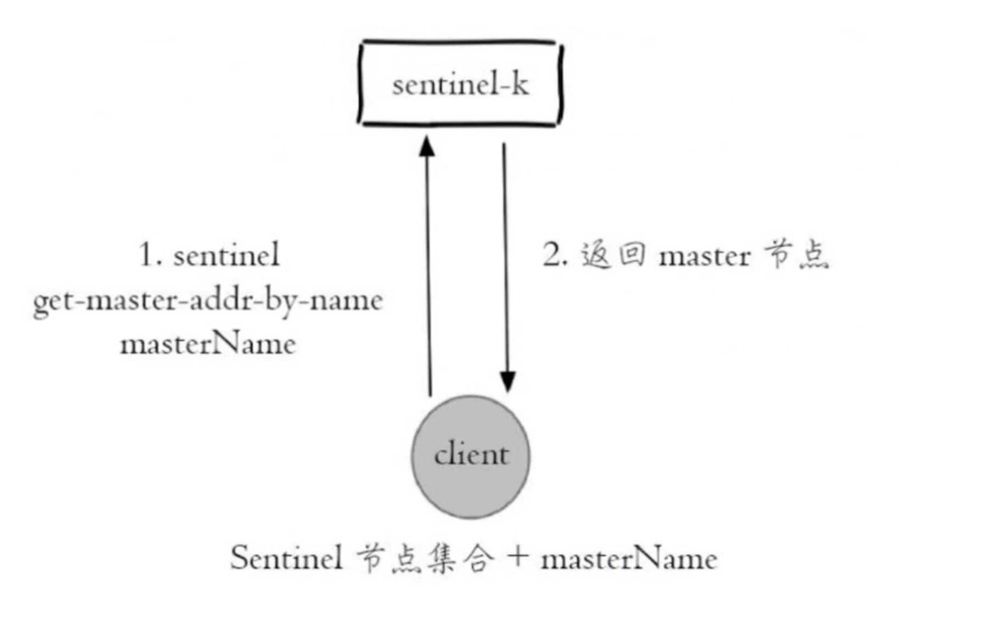
* 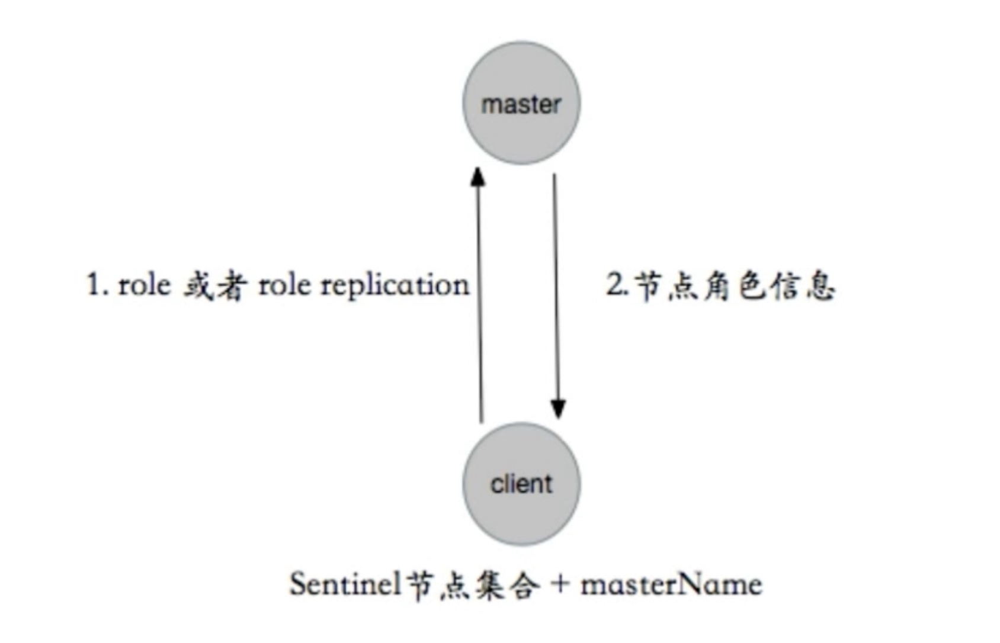

#### 三个定时任务
* 每10秒每个sentinel对master和slave指向info
* 发现slave节点
* 确定主从关系
* 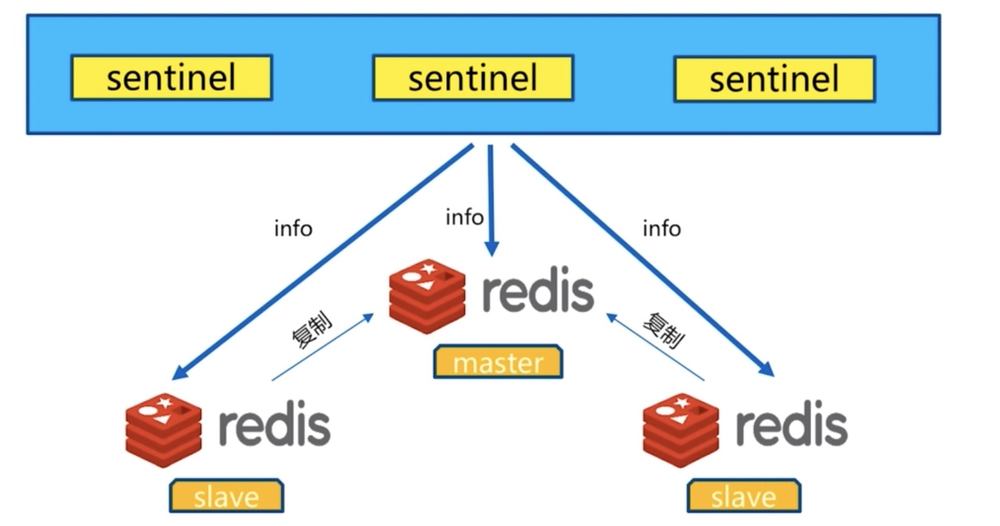
* 每2秒每个sentinel通过master的channel频道交互信息(pub/sub)
* __sentinel__:hello
* 交互对节点的看法和自身信息
* 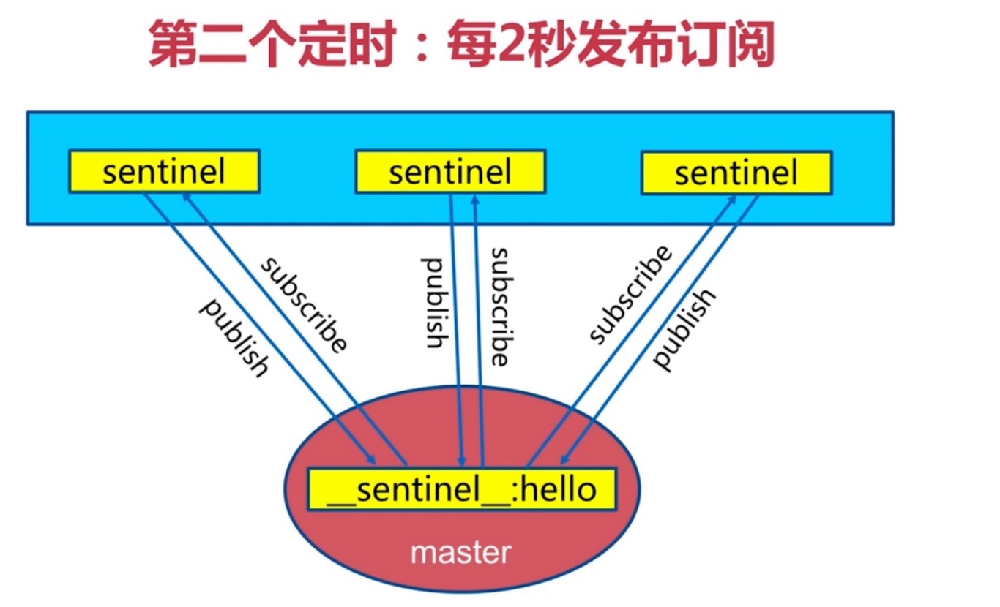
* 每1s每个sentinel对其他sentinel进行ping访问
* 心跳检测，失败判定依据
* 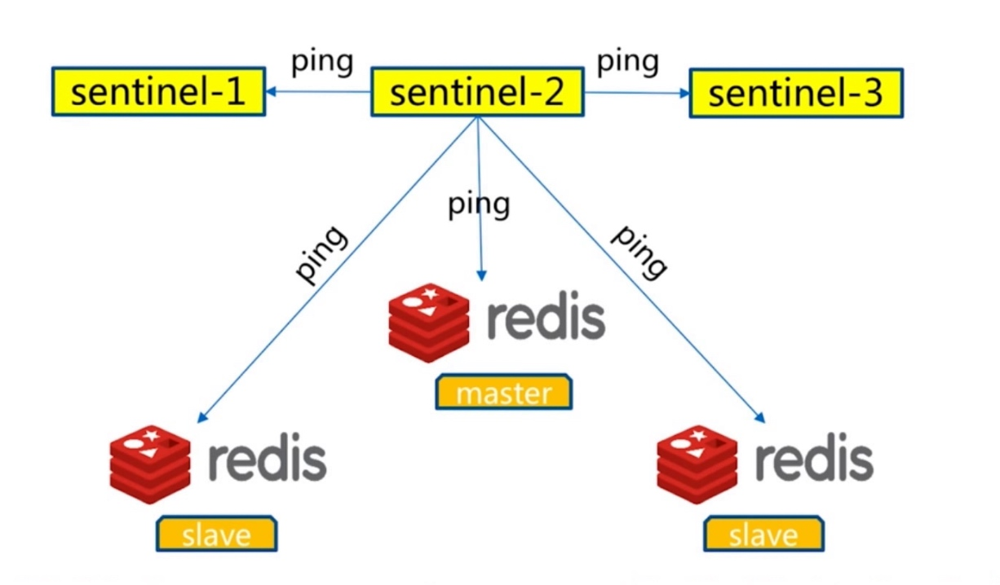

#### 主观下线和客观下线
* sentinel monitor mymaster 192.168.31.191 6379 2主观下限法定人数
* sentinel down-after-milliseconds mymaster 30000 主观超时下线判断
* 主观下线：每个 sentinel 节点对 Redis 节点失败的“偏见
* 客观下线：所有 sentinel 节点对 Redis 节点失败“达成共识“（超过 quorum 个统一）
* sentinel is-master-down-by-addr

#### 领导者选举
* 原因：只有一个 sentinel 节点完成故障转移
* 选举：通过 sentinel is- master-down-by-addr 命令都希望成为领导者
* 每个做主观下线的 Sentinel 节点向其他 Sentinel 节点发送命令，要求将它设置为领导者收到命令的 Sentinel 节点如果没有同意通过其他 Sentinel 节点发送的命令，那么将同意该请求，否则拒绝
* 如果该 Sentinel 节点发现自己的票数已经超过 Sentinel 集合半数且超过 quorum，那么它将成为领导者
* 如果此过程有多个 Sentinel 节点成为了领导者，那么将等待一段时间重新进行选举。
* 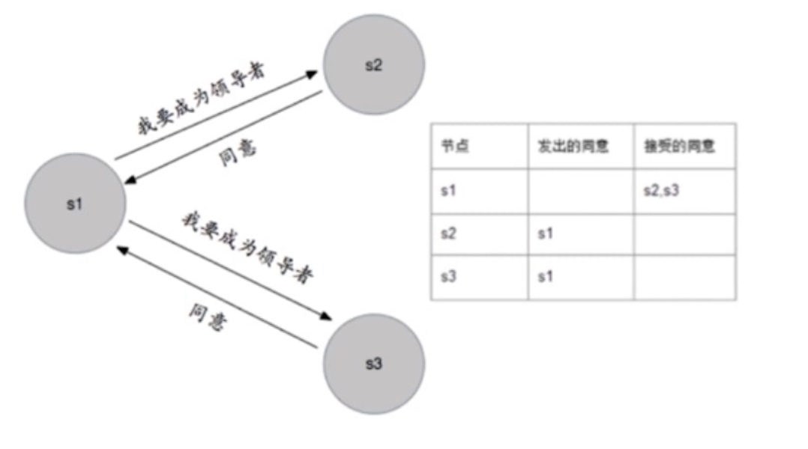

#### 故障转移
* 从 slave 节点中选出一个“合适的”节点作为新的 master 节点 
* 对上面的 slave 节点执行 slaveof no oner 命令让其成为 master 节点。
* 向剩余的 Slave 节点发送命令，让它们成为新 master 节点的 slave 节点，复制规则和 parallel- syncs 参数有关。
* 更新对原来 master-节点配置为 slave，并保持着对其“关注“，当其恢复后命令它去复制新的 master 节点

#### 选择合适的slave节点
* 选择 slave- priority (slave 节点优先级）最高的』ave 节点，如果存在则返回，不存在则继续。
* 选择复制偏移量最大的 slave 节点（复制的最完整），如果存在则返回，不存在则继续
* 选择 runed 最小的 slave 节点。

#### 节点运维
* 主节点 
* 从节点
* sentinel节点

#### 手动故障转移
* 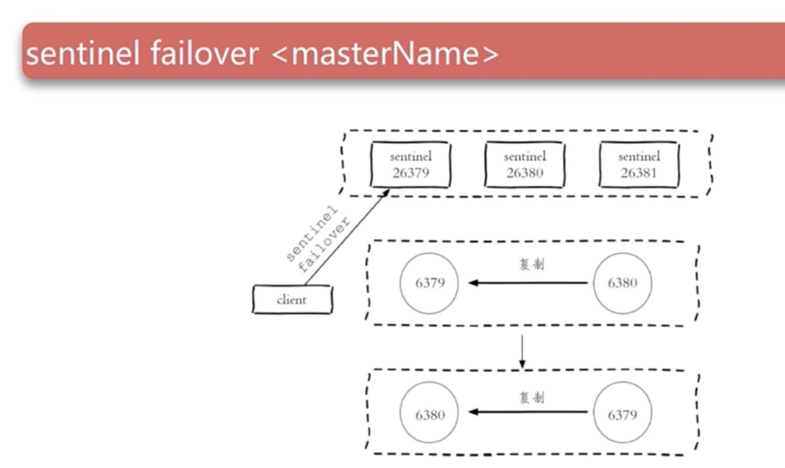

#### 节点上线
* 主节点：sentinel failover 进行替换。
* 从节点：slaveofe 即可，sentinel 节点可以感知。
* sentinel 节点：参考其他 sentinel 节点启动即可。

#### 从节点的作用
* 副本 高可用的基础
* 扩展 读能力

#### 三个消息
* + switch- master：切换主节点（从节点晋升主节点
* + convert-to- slave：切换从节点（原主节点降为从节点）
* + sdown：主观下线。

#### 高可用读写分离
* 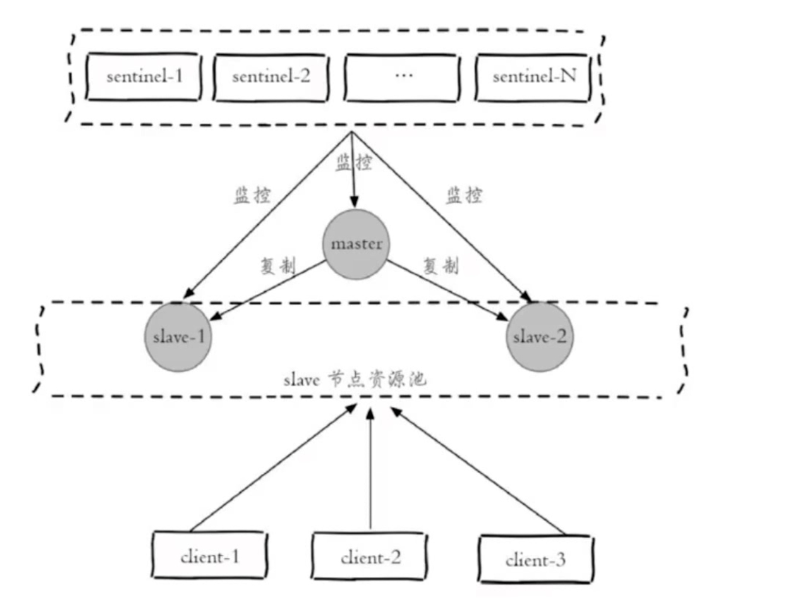

#### 总结
* 故障发现、故障自动转移、配置中心、客户端通知。
* Redis Sentinel 中的 Sentinel=节点个数应该为大于等于 3 且最好为奇数。
* Redis Sentinel 中的数据节点与普通数据节点没有区别
* 客户端初始化时连接的是 Sentinel 节点集合，不再是具体的 Redis 节点，但 Sentinel 只是配置中心不是代理
* Redis Sentinel 通过三个定时任务实现了 Sentinel 节点对于主节点、从节点其余 Sentinel 节点的监控。
* Redis Sentinel 在对节点做失败判定时分为主观下线和客观下线。
* 看懂 Redis Sentine 故障转移日志对于 Redis Sentinel 以及问题排查非常有帮助
* Redis Sentinels 实现读写分离高可用可以依赖 Sentinel 节点的消息通知，获取 Redis 数据节点的状态变化