# 持久化

#### 作用
* 数据落盘

#### 持久化
* 快照
* 写日志

#### RDB
* 触发机制 save 同步阻塞
* bgsave 异步
* 自动 

#### save
* 文件策略 存在老的RDB文件，新替换老的 O(n)

#### bgsave
* 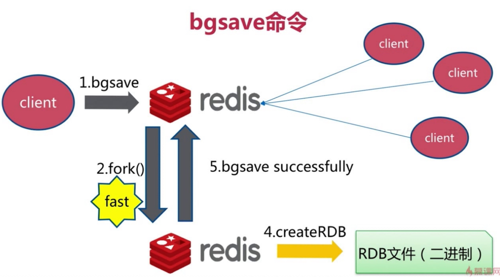
* fork 会阻塞redis
* 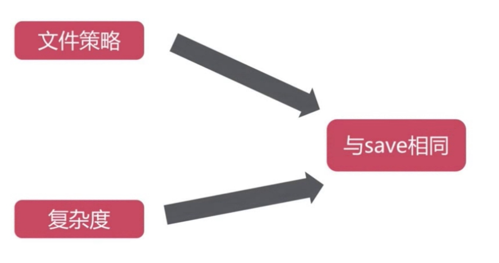
* 对比
* 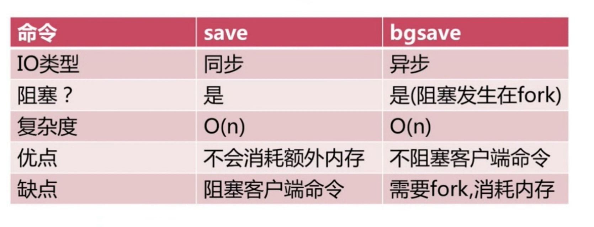

#### 自动生成RDB
* 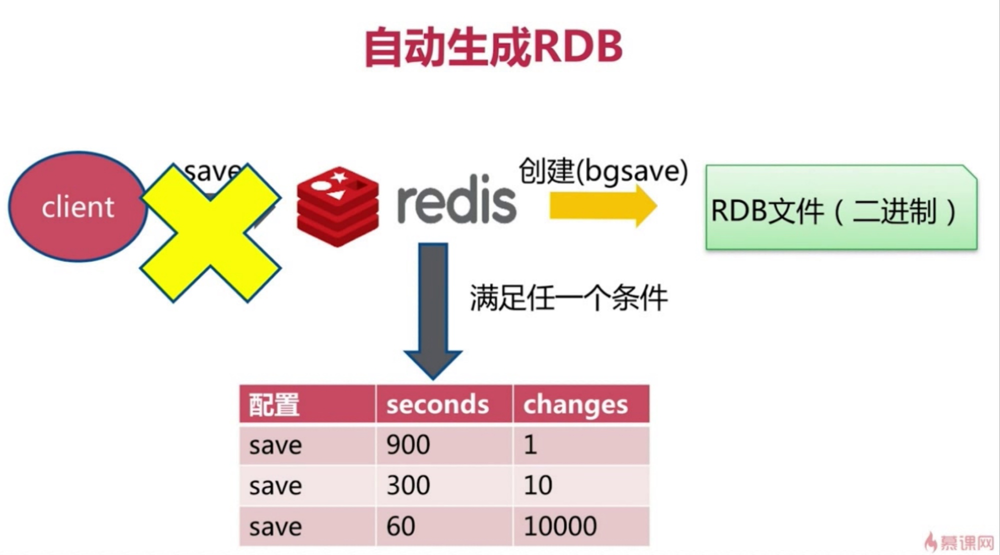

```
stop-writes-on-bgsave-error yes
rdbcompression yes
rdbchecksum yes
save 900 1
save 300 10
save 60 10000 关闭
dbfilename dump-${port}.rdb
dir /bigdiskpath
```

#### 触发机制
* 全量复制
* debug reload
* shutdown
* info memory

#### 总结
* 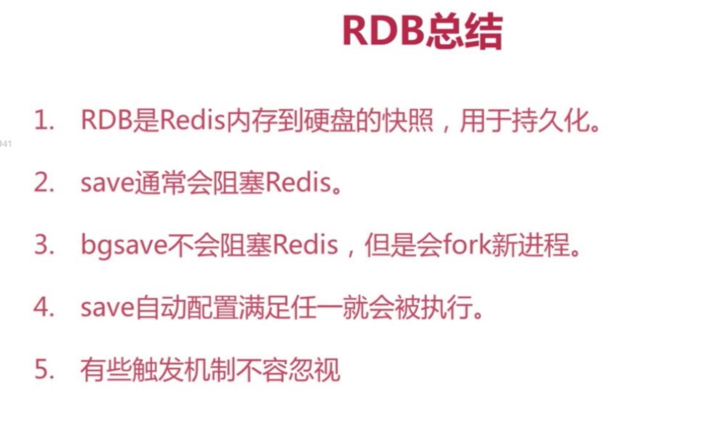

#### RDB不足
* 
* 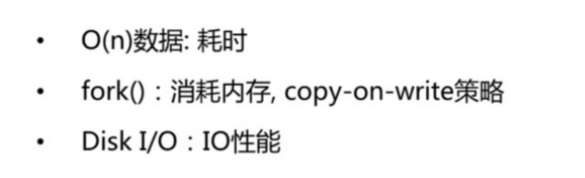
* 


#### AOF
* always 每条命令
* everysec 每秒
* no OS决定刷盘
* 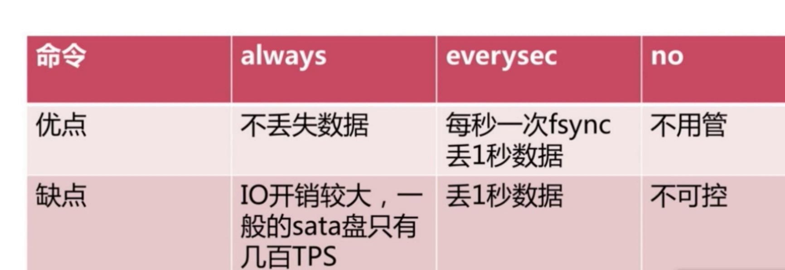
* 重写
* 过期重复命令优化
* 减少磁盘占用
* 加速恢复速度
* bgrewriteaof 内存中操作
* 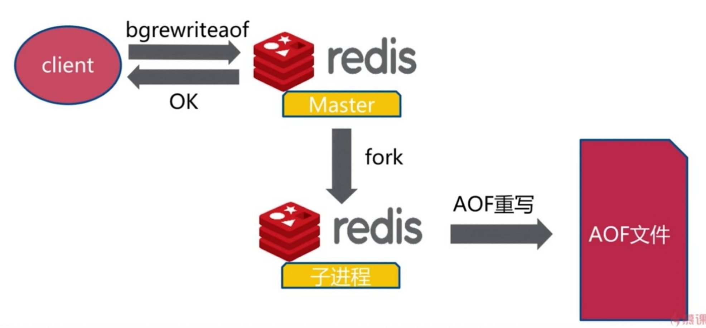
* auto-aof-rewrite-min-size
* auto-aof-rewrite-percentage
* 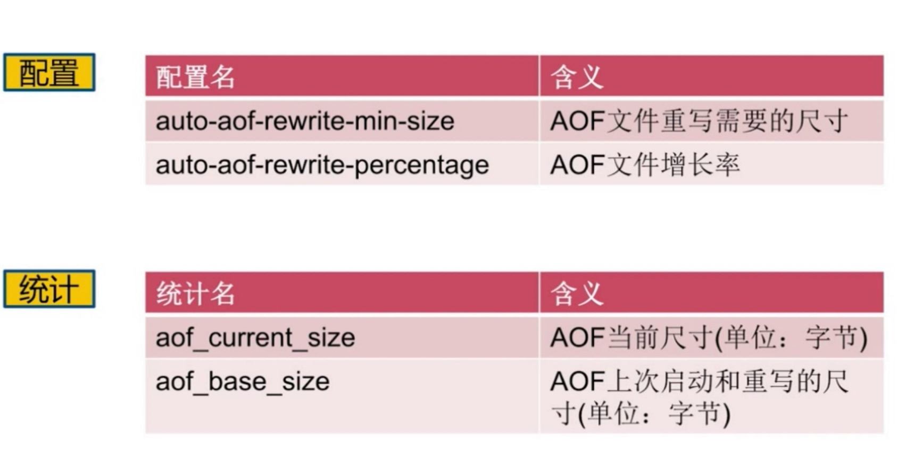
* 重写流程
* 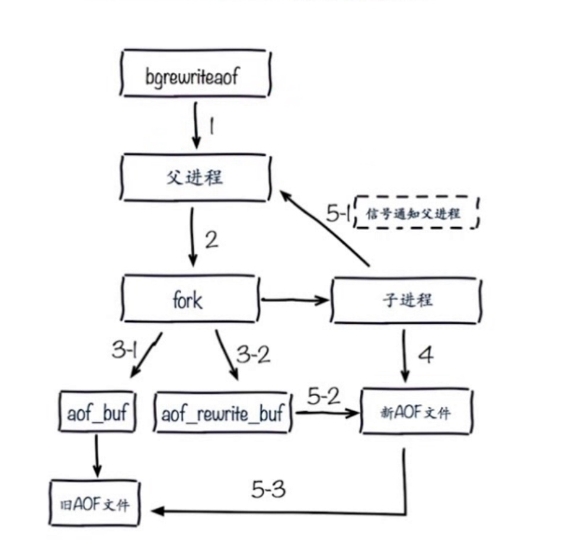
* 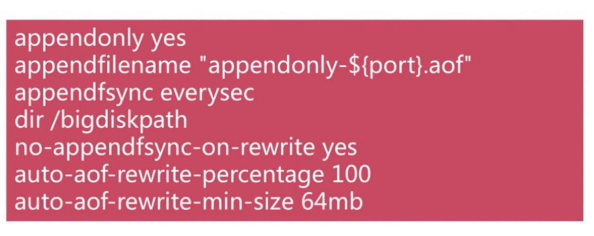
* no-appendfsync-on-rewrite重写的时候不要进行aof操作
* aof-load-truncated yes是否忽略错误

#### RDB和AOF
* RDB 关
* 集中管理
* 主从 从开
* AOF 开 缓存和存储
* AOF重写集中管理
* everysec

#### 最佳策略
* 小分片
* 缓存和存储
* 监控 磁盘 内存 负载 网络
* 足够的内存

