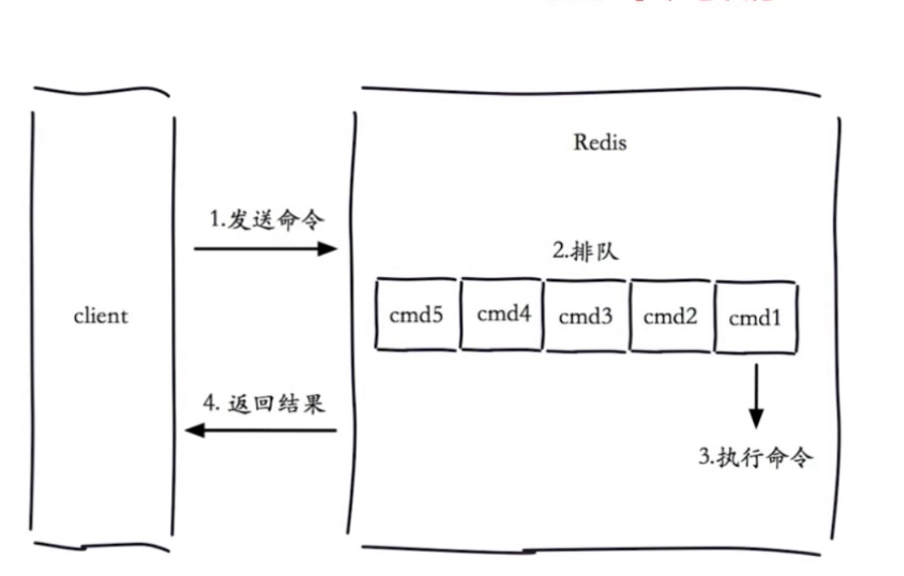
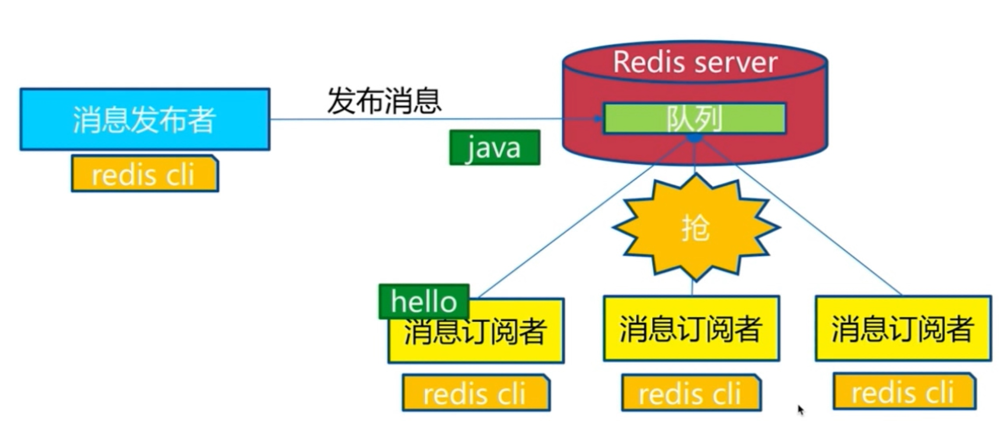
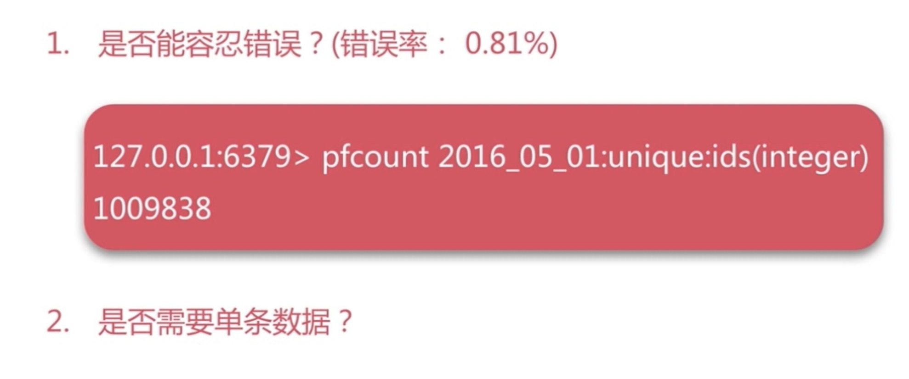

# 瑞士军刀

#### 用途
* 慢查询
* pipeline
* 发布订阅
* Bitemap
* HyperLogLog
* GEO

#### 慢查询
* 
* 慢查询发生在第三个阶段
* 客户端超时不一定是慢查询
* 但是慢查询是客户端超时的一个可能因素
* 两个配置 slowlog-max-len 长度 1000
* slowlog-log-slower-than 时间 1ms
* 获取慢查询
* slowlog get 获取慢查询信息
* slowlog len 长度
* slowlog reset 清空队列长度

#### pipeline
* 原生M操作是原子
* pipeline拆分成多个pipeline子命令
* 

#### 发布订阅
* subscribe sohu:tv
* publish sohu:tv "Ok"
* pubsub numsub channel 给定频道的订阅数量
* pubsun channels  订阅的频道

#### 消息队列
* 

#### Bitmap
* 字符串对应的二进制位
* setbit key offset value
* offer超出中间都会补0
* bitcount key 指定区间1的个数
* bitop op destkey key1 key2
* bitpos key target start end
* 独立用户统计
* 使用
* 注意setbit偏移量有较大损耗
* 位图不是绝对的好

#### HyperLogLog
* 极小的空间完成数量统计
* 本质还是字符串
* 
* 

#### GEO
* 地理位置信息
* geoadd
* geopos
* geodist
* geodist city:loc tianjin beijing km
* georadiusbymember key beijing 150 km
* type geoKey zset
* 没有删除zrem

