# 缓存的使用和设计
* 缓存的受益与成本
* 无底洞问题优化
* 缓存更新策略
* 缓存雪崩优化
* 缓存粒度控制
* 热点key重建优化
* 缓存穿透优化

#### 缓存的收益与成本

##### 收益
* 加速读写
通过缓存加速读写速度: CPUL1/L2/L3 Cache、Linux page Cache 加速硬盘读写、浏览器缓存、Ehcache 存数据库结果。
* 降低后端负载
后端服务器通过前端缓存降低负载：业务端使用 Redisp 降低后端 MYSQLF 负载

##### 成本
* 数据不一致：缓存层和数据层有时间窗口不一致，和更新策略有关
* 代码维护成本：多了一层缓存逻辑。
* 运维成本：例如 Redis Cluster

##### 使用场景
* 降低后端负载
* 对高消耗的 SQL: join结果集/分组统计结果缓存。
* 加速请求响应
* 利用 Redis/ Memcache 优 IO 响应时间
* 大量写合并为批量写
* 如如计数器先 Redisg 累加再批量写 DB

##### 缓存更新策略
* LRU/LFU/FIFO算法剔除:例如 maxmemory-policy
* 超时剔除：例如 expire。
* 主动更新：开发控制生命周期
* 对比
* 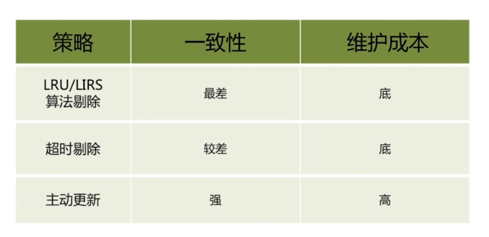

##### 建议
* 低一致性 最大内存和淘汰策略
* 高一致性：超时剔别除和主动更新结合，最大内存和淘汏策略兜底。

#### 缓存粒度控制
* 通用性：全量属性更好。
* 占用空间：部分属性更好
* 代码维护：表面上全量属性更好。

#### 缓存穿透问题
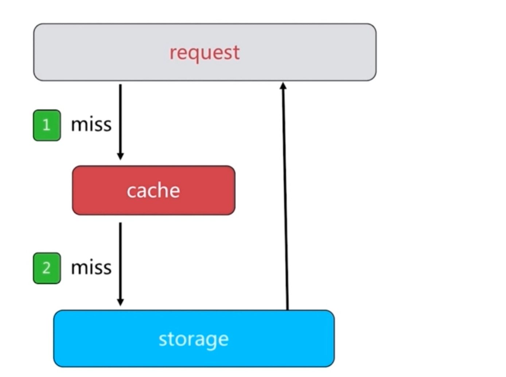
* 业务代码自身问题
* 恶意攻击、爬虫等等

##### 如何发现
* 业务的相应时间
* 业务本身问题
* 相关指标：总调用数、绶存层命中数、存储层命中数

##### 如何解决
* 缓存空对象
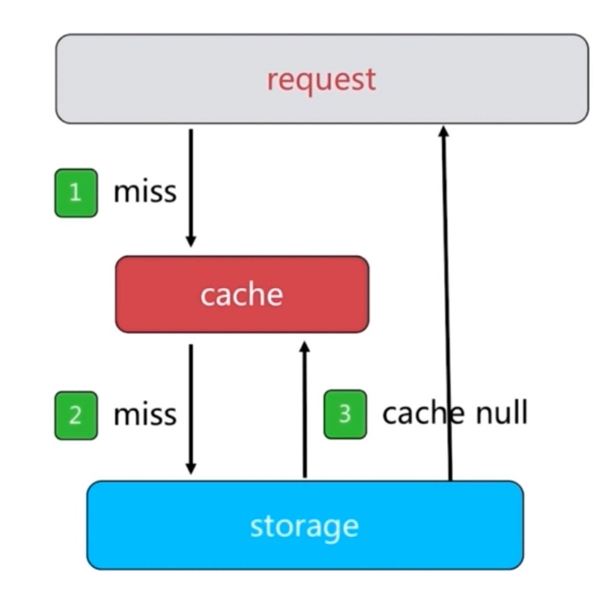
* 需要更多的键，设置过期时间
* 缓存层和存储层数据短期不一致 订阅消息刷新缓存
* 布隆过滤器
 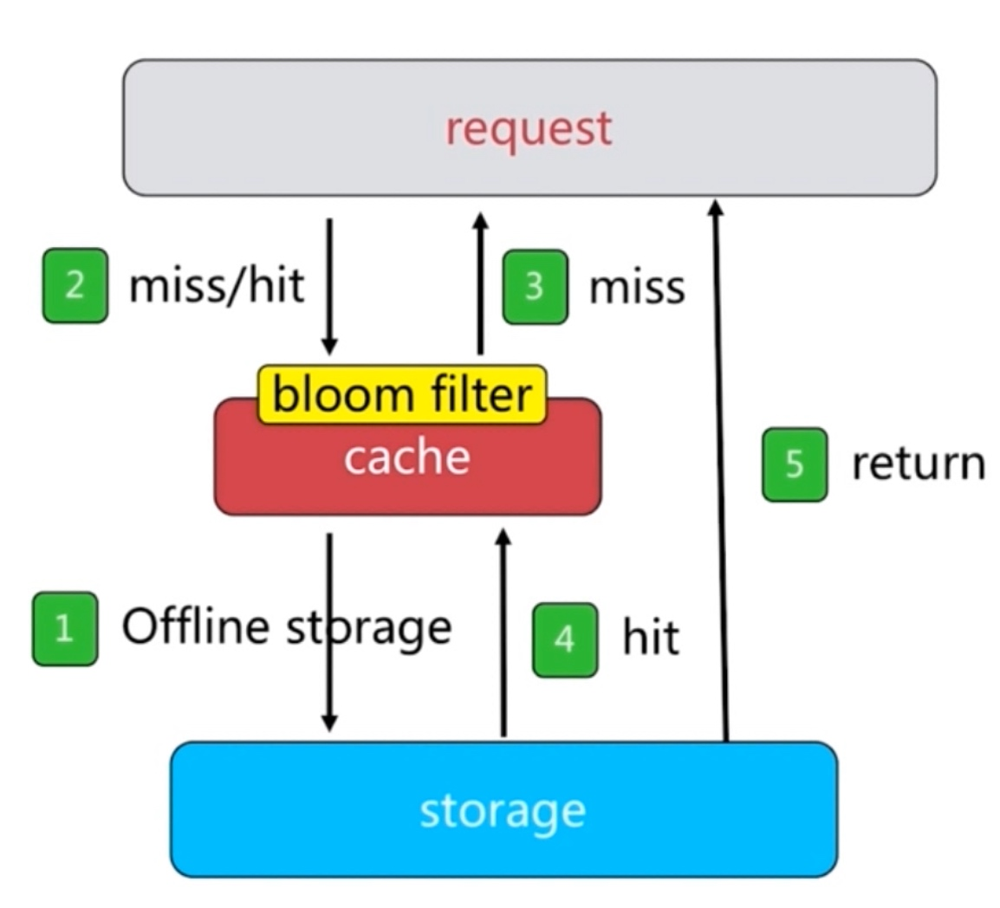
 * 比较固定的数据适合
 * 布隆过滤器可以实时更新
 
#### 缓存雪崩
 * 由于 cache 服务承载大量请求，当 cache服务异常/脱机,流量直接压向后端组件（例如 DB），造成级联故障。
 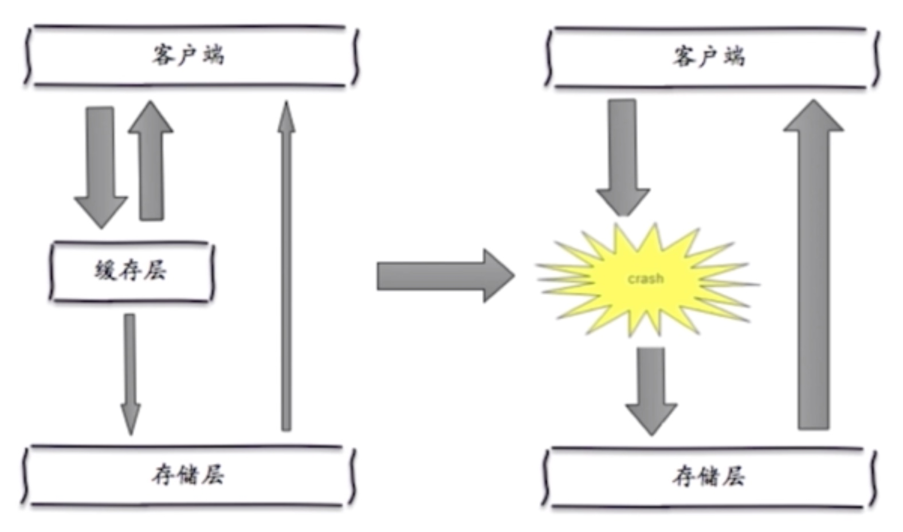
* 保证缓存高可用
* 个别节点个别机器个别机房
* 依赖隔离组件为后端限流
* 提前演练 

##### Cache服务高可用
* sentinel
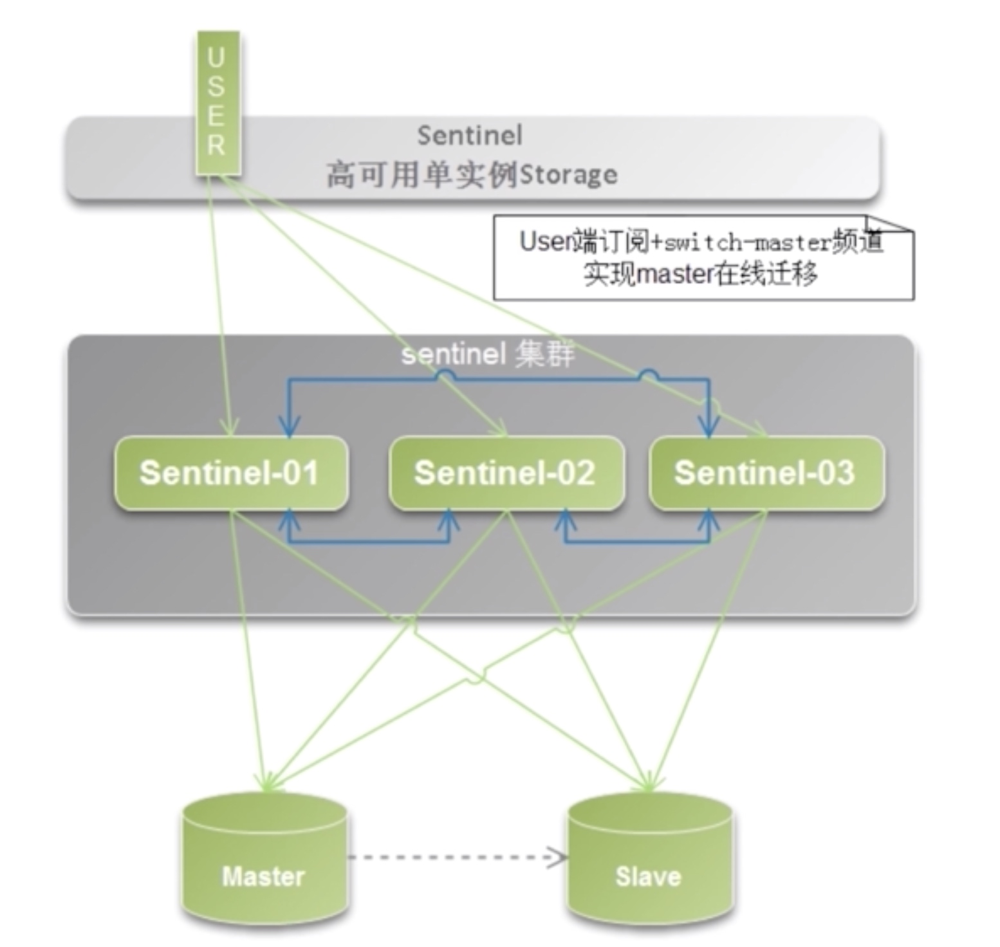
* 主从漂移
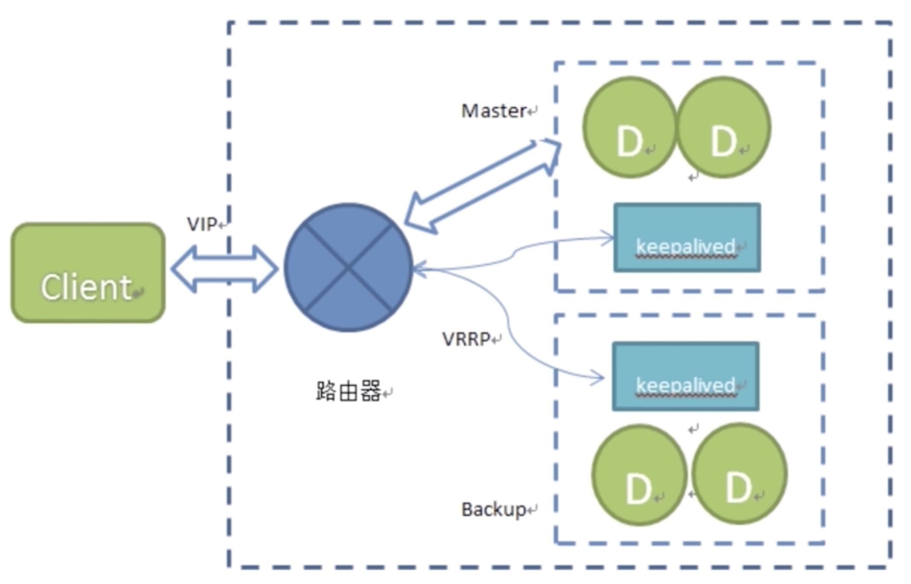
* 隔离组件  线程池/信号量
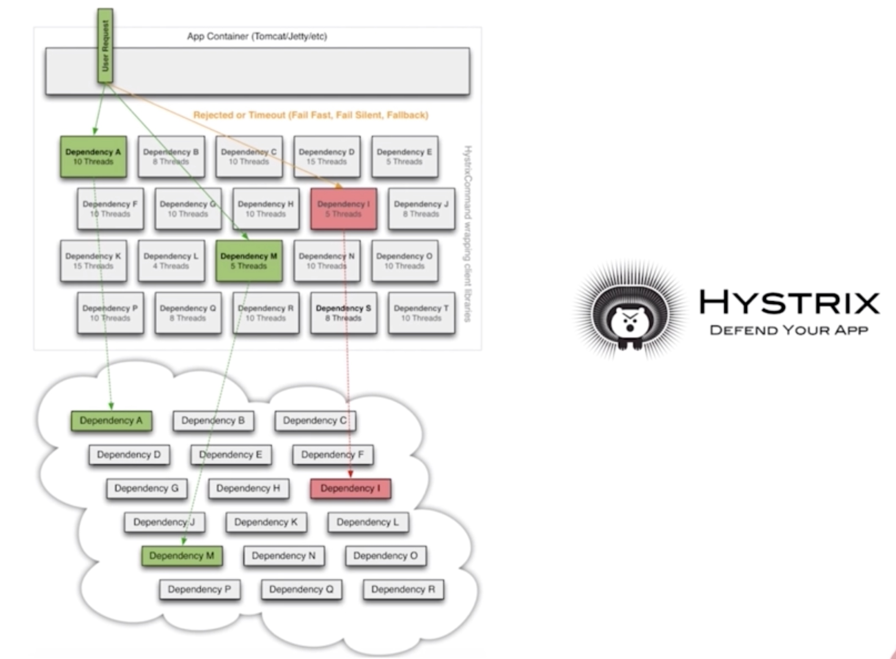

#### 无底洞问题
* http://highscalability.com/blog/2009/10/26/facebooks-memcached-multiget-hole-more-machines-more-capacit.html
* 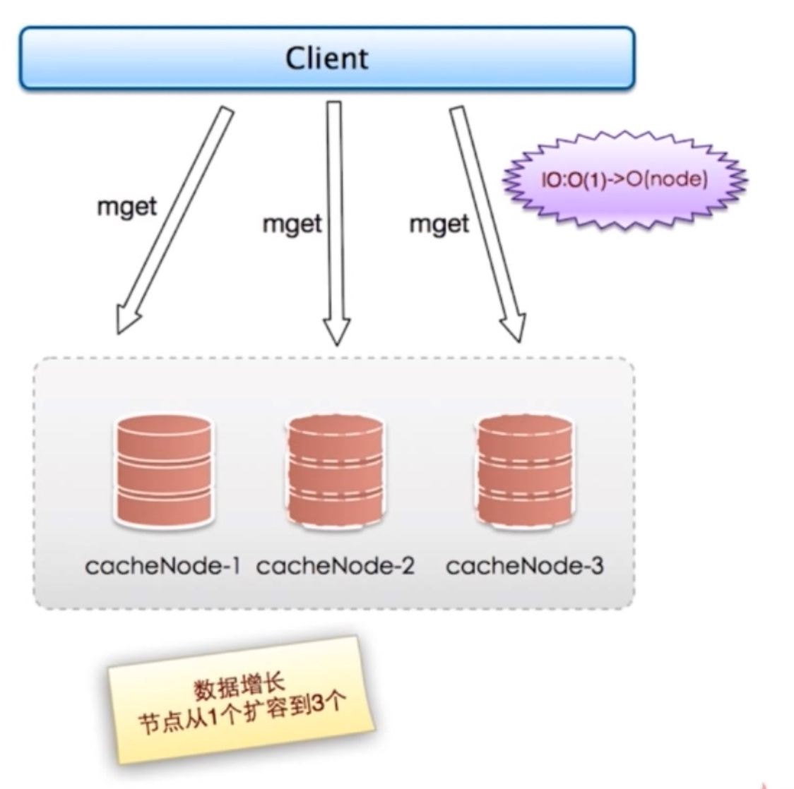
* 更多的机器！=更高的性能
* 批量接口需求（mget, mset 等
* 数据增长与水平扩展需求

##### 优化IO
* 命令本身优化：例如慢查询 keys、hgetall bigkey
* 减少网络通信次数
* 降低接入成本: 例如客户端长连接/连接池、NIO 等

#### 热点key重建优化
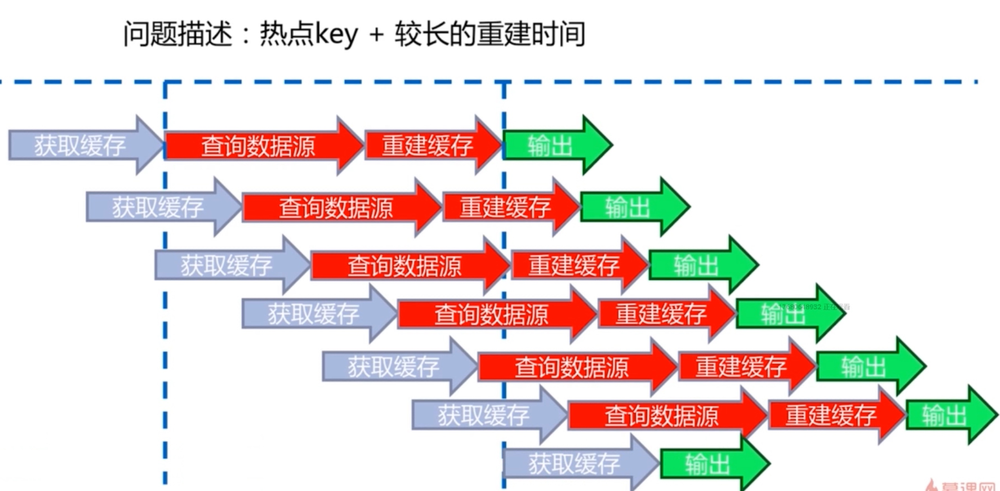

##### 三个目标
* 减少重缓存的次数
* 数据尽可能一致
* 减少潜在危险

##### 解决
* 互斥锁（mutex key）没有大量重建 
* 永远不过期
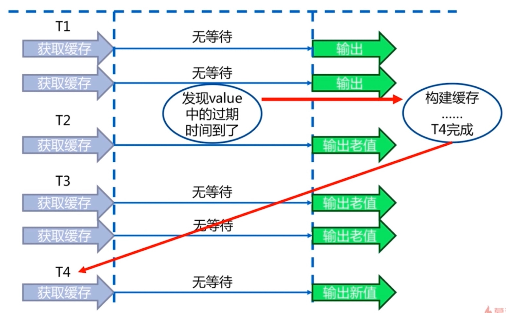
* 功能层面：为每个 value 添加逻辑过期时间，但发现超过逻辑过期时间后，会使用单独的线程去构建缓存。
* 对比
* 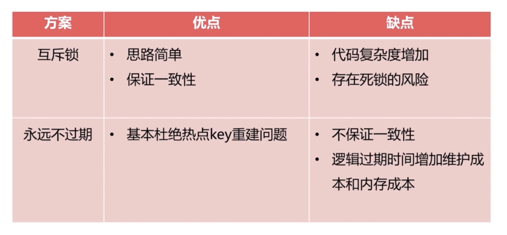

#### 总结
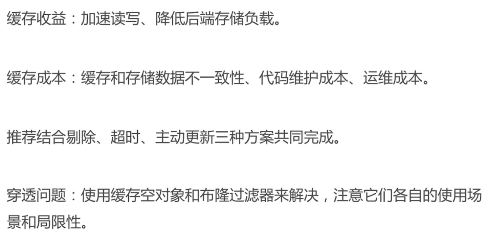

