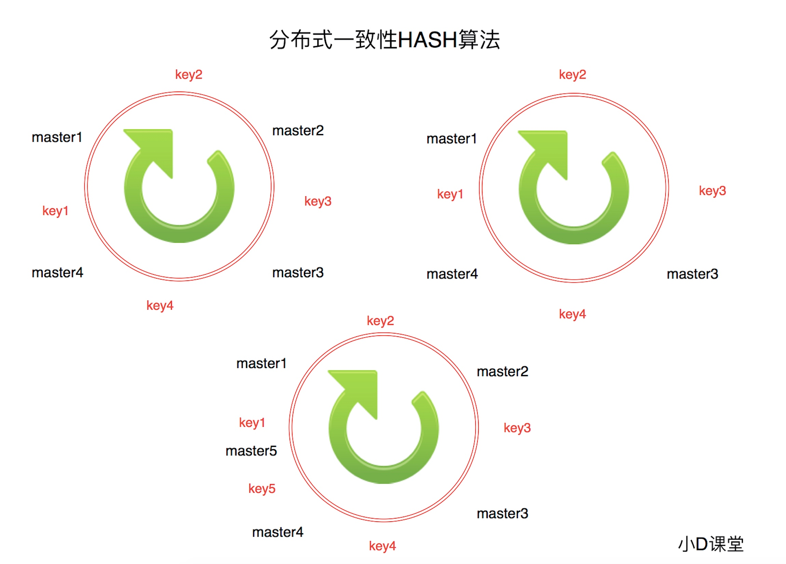

# Redis 集群

#### 一致性保证
* 主节点对命令的复制工作发生在返回命令回复之后， 因为如果每次处理命令请求都需要等待复制操作 完成的话， 那么主节点处理命令请求的速度将极大地降低 —— 我们必须在性能和一致性之间做出权 衡。 注意:Redis 集群可能会在将来提供同步写的方法。 Redis 集群另外一种可能会丢失命令的情况 是集群出现了网络分区， 并且一个客户端与至少包括一个主节点在内的少数实例被孤立。

#### 分片重哈希
* 添加一个新的主节点

```
./redis-trib.rb add-node 127.0.0.1:7006 127.0.0.1:7000
```
* 添加一个新的从节点

```
./redis-trib.rb add-node --slave 127.0.0.1:7006 127.0.0.1:7000
```
* 移除一个节点

```
./redis-trib.rb del-node 127.0.0.1:7000 <node-id> 
```
第一个参数是任意一个节点的地址,第二个节点是你想要移 除的节点地址。

#### 集群问题


#### 分片问题
* 水平切分于垂直切分相比，相对来说稍微复杂一些。因为要将同一个表中的不同数据拆分到不同的数据 库中。 分片是一种基于数据库分成若干片段的传统概念扩容技术，它将数据库分割成多个碎片并将这 些碎片放置在不同的服务器上。
* 垂直切分的最大特点就是规则简单，实施也更为方便，尤其适合各业务之间的耦合度非常低，相互影响很小，业务逻辑非常清晰的系统。按照业务维度将不同数据放入不同的表

#### 一致性hash算法


* hash环上顺时针从整数0开始，一直到最大正整数，我们根据四个ip计算的hash值肯定会落到这个hash 环上的某一个点，至此我们把服务器的四个ip映射到了一致性hash环
*  当用户在客户端进行请求时候，首先根据hash(用户id)计算路由规则(hash值)，然后看hash值落到了 hash环的那个地方，根据hash值在hash环上的位置顺时针找距离最近的ip作为路由ip

#### 一致性HASH算法虚拟节点
* 