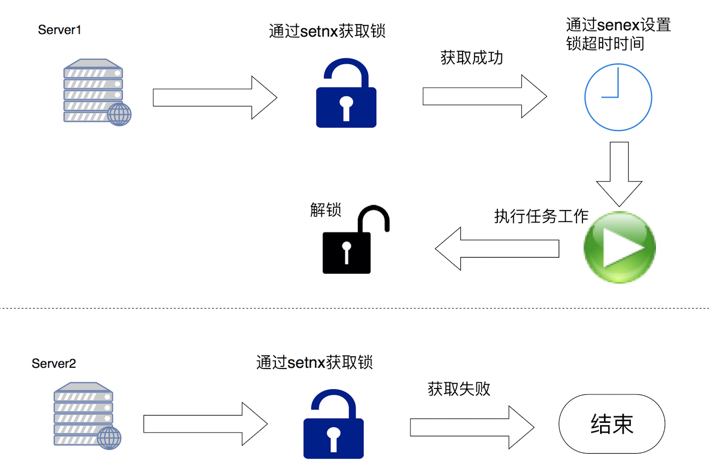
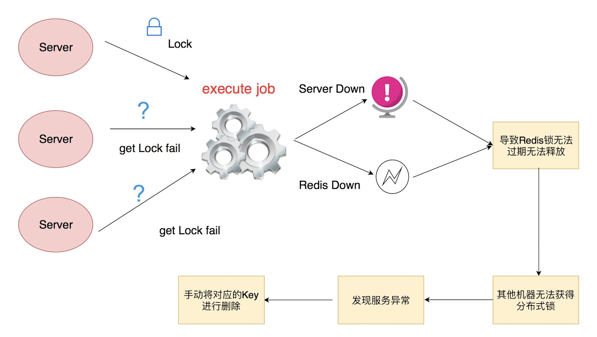
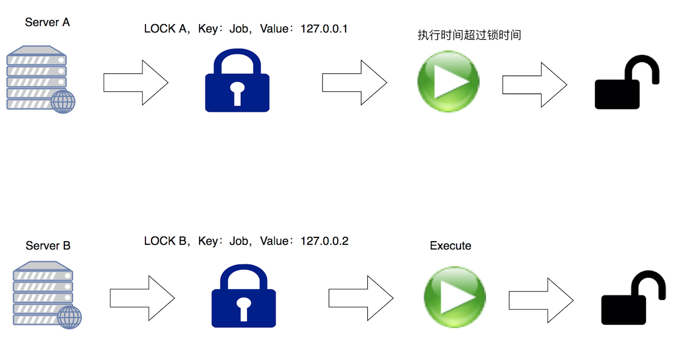

# 分布式锁

#### 分布式锁是什么
* 分布式锁是控制分布式系统或不同系统之间共同访问共享资源的一种锁实现
* 如果不同的系统或同一个系统的不同主机之间共享了某个资源时，往往通过互斥来防止彼此干扰。   
   
#### 目的
* 可以保证在分布式部署的应用集群中，同一个方法在同一操作只能被一台机器上的一个线程执行。

#### 设计要求
* 这把锁要是一把可重入锁(避免死锁)
* 这把锁有高可用的获取锁和释放锁功能
* 这把锁获取锁和释放锁的性能要好

#### 分布式锁
*  分布式任务


```go
package main
 
import (
	"fmt"
	"log"
	"time"
 
	"github.com/garyburd/redigo/redis"
)
 
type Lock struct {
	resource string
	token    string
	conn     redis.Conn
	timeout  int
}
 
func (lock *Lock) tryLock() (ok bool, err error) {
	_, err = redis.String(lock.conn.Do("SET", lock.key(), lock.token, "EX", int(lock.timeout), "NX"))
	if err == redis.ErrNil {
		// The lock was not successful, it already exists.
		return false, nil
	}
	if err != nil {
		return false, err
	}
	return true, nil
}
 
func (lock *Lock) Unlock() (err error) {
	_, err = lock.conn.Do("del", lock.key())
	return
}
 
func (lock *Lock) key() string {
	return fmt.Sprintf("redislock:%s", lock.resource)
}
 
func (lock *Lock) AddTimeout(ex_time int64) (ok bool, err error) {
	ttl_time, err := redis.Int64(lock.conn.Do("TTL", lock.key()))
	fmt.Println(ttl_time)
	if err != nil {
		log.Fatal("redis get failed:", err)
	}
	if ttl_time > 0 {
		fmt.Println(11)
		_, err := redis.String(lock.conn.Do("SET", lock.key(), lock.token, "EX", int(ttl_time+ex_time)))
		if err == redis.ErrNil {
			return false, nil
		}
		if err != nil {
			return false, err
		}
	}
	return false, nil
}
 
func TryLock(conn redis.Conn, resource string, token string, DefaulTimeout int) (lock *Lock, ok bool, err error) {
	return TryLockWithTimeout(conn, resource, token, DefaulTimeout)
}
 
func TryLockWithTimeout(conn redis.Conn, resource string, token string, timeout int) (lock *Lock, ok bool, err error) {
	lock = &Lock{resource, token, conn, timeout}
 
	ok, err = lock.tryLock()
 
	if !ok || err != nil {
		lock = nil
	}
 
	return
}
 
func main() {
	fmt.Println("start")
	DefaultTimeout := 10
	conn, err := redis.Dial("tcp", "localhost:6379")
 
	lock, ok, err := TryLock(conn, "xiaoru.cc", "token", int(DefaultTimeout))
	if err != nil {
		log.Fatal("Error while attempting lock")
	}
	if !ok {
		log.Fatal("Lock")
	}
	lock.AddTimeout(100)
 
	time.Sleep(time.Duration(DefaultTimeout) * time.Second)
	fmt.Println("end")
	defer lock.Unlock()
}
```

#### 分布式锁的缺陷


#### lua脚本
```lua
local lockKey = KEYS[1]
--唯一随机数
local lockValue = KEYS[2]
--失效时间，如果是当前线程，也是续期时间

--setnx info
local result_1 = redis.call('SETNX', lockKey, lockValue)

if result_1 == true
then
local result_2 = redis.call('SETEX', lockKey, 3600, lockValue)
return result_1
else
return result_1
end

```

#### 分布式锁优化

* 锁都超时了，任务还没有执行完，导致AB同时执行任务

```lua
local lockkey = KEYS[1]
--唯一随机数
local uid = KEYS[2]
--失效时间，如果是当前线程，也是续期时间
local time = KEYS[3]

if redis.call('set',lockkey,uid,'nx','px',time)=='OK' then
return 'OK'
else
    if redis.call('get',lockkey) == uid then
       if redis.call('EXPIRE',lockkey,time/1000)==1 then
       return 'OOKK'
       end
    end
end
```

#### 分布式锁面试
* 为了确保分布式锁可用，我们至少要确保锁的实现同时满足以下三个条件:
* 互斥性。在任意时刻，只有一个客户端能持有锁。
* 不会发生死锁。即使有一个客户端在持有锁的期间崩溃而没有主动解锁，也能保证后续其他客户端能加锁。
* 解铃还须系铃人。加锁和解锁必须是同一个客户端，客户端自己不能把别人加的锁给解了
* 怎么实现
* 采用lua脚本操作分布式锁 采用setnx、setex命令连用的方式实现分布式锁
* 解锁需要注意什么
解铃还须系铃人。加锁和解锁必须是同一个客户端，客户端自己不能把别人加的锁给解了
