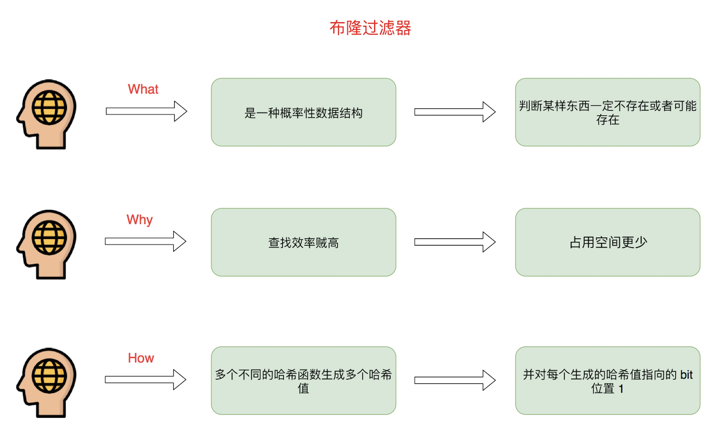
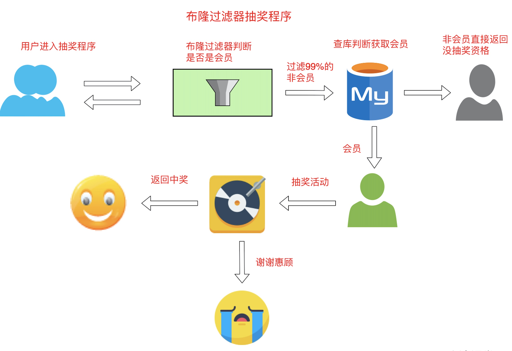
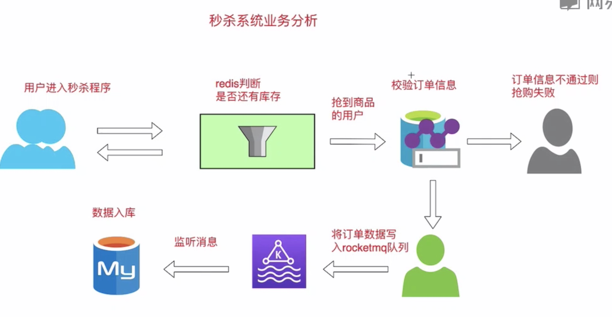
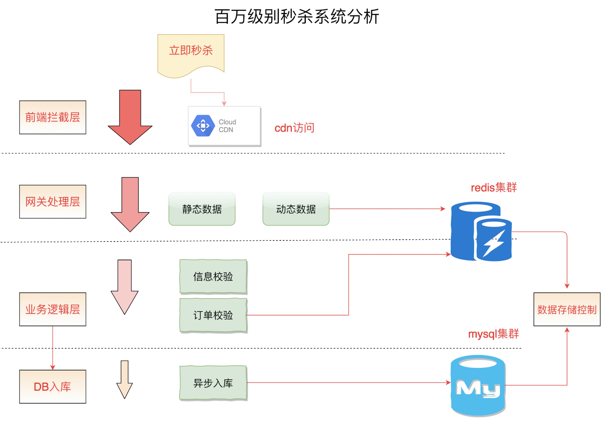
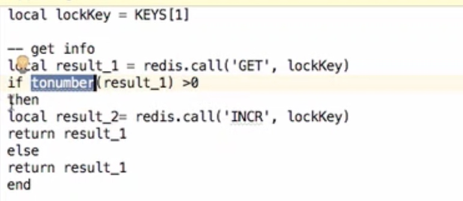

# 布隆过滤器

#### 结构

#### 抽奖程序
* 
* 可以调整误码率，没有过滤的%1根据mysql进行过滤

####  google布隆过滤器
* 基于内存布隆过滤器有什么特点
* 启动时间长，
* 内存级别产物
* 重启即失效
* 本地内存无法用在分布式场景
* 不支持大数据量存储

#### redis安装布隆过滤器
* loadmodule /usr/local/rebloom.so
* redis-cli -p 6379 bf.add myBloom redis1

#### 秒杀系统

* 功能核心点
* 经典互联网商品抢购秒杀功能
* 功能api 商品秒杀接口
* 数据落地存储方案
* 通过分布式redis减库存
* DB存最终订单信息数据 api性能调优
* 性能瓶颈在高并发秒杀
* 技术难题在于超卖问题

##### 系统分析
* 

#### 秒杀功能步骤
* 首先通过数据控制模块，提前将秒杀商品缓存到读写分离 Redis，并设置秒杀开始标记如下:
* "skuId_start": 0 //开始标记0表示秒杀开始
* "skuId_count": 10000 //总数 
* "skuId_access": 12000 //接受抢购数
* 秒杀开始前，服务集群读取 goodsId_Start 为 0，直接返回未开始。 
* 服务时间不一致可能导致流量倾斜，所有流量打到一个机器
* 数据控制模块将 goodsId_start 改为1，标志秒杀开始。
* 当接受下单数达到 sku_count*1.2 后，继续拦截所有请求，商品剩余数量为 0

#### API实战
* 判断秒杀是否开始
* 流量拦截

##### 信息校验层
* 订单信息校验层
* 校验当前用户是否已经买过这个商品
* 需要存储用户的uid 存数据库效率太低
* 存Redis value方式数据太大 
* 存布隆过滤器性能高且数据量小
* 校验完通过直接返回抢购成功

#### 库存扣减
* 库存扣除成功，获取当前最新库存 如果库存大于0，即马上进行库存扣除，并且访问抢购成功给用户 
* 考虑原子性问题
* 保证原子性的方式，采用lua脚本
* 采用lua脚本方式保证原子性带来缺点
* 性能有所下降不保证原子性缺点，放入请求量可能大于预期值
* 当前扣除库存场景必须保证原子性，否则会导致超卖 返回抢购结果
* 抢购成功
* 库存没了 ，抢购失败

