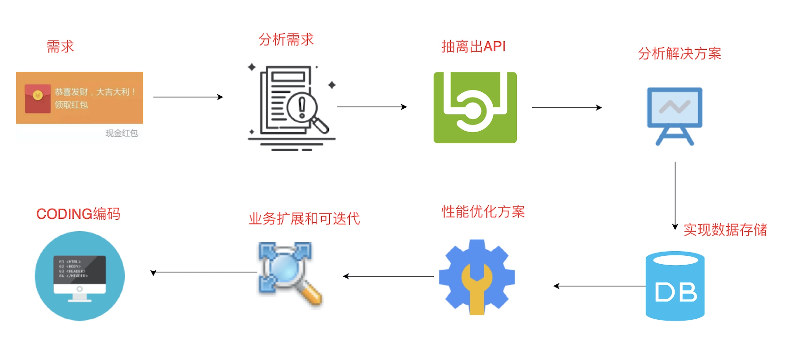
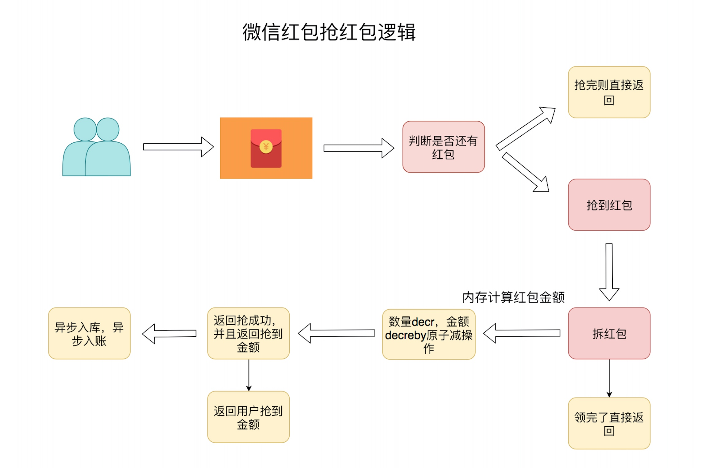
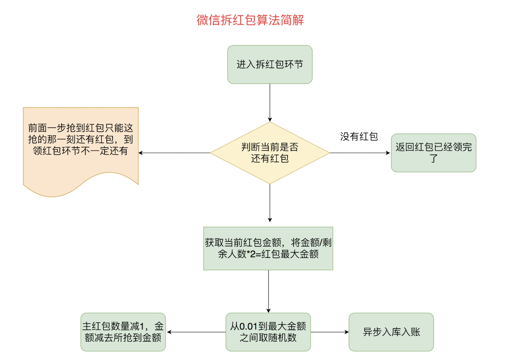

# 微信红包

#### 开发流程


#### 业务功能点
* 新建红包:在DB、cache各新增一条记录
* 抢红包:请求访问cache，剩余红包个数大于0则可拆开红包
* key:1，value:20 string decr原子减，每次减1 ， 而decreby减指定数量2
* 拆红包: 20个红包里面有500块，key:1,value:50000(以分为单位) decreby 548，decreby 1055 ，decreby 2329
* 请求访问cache，剩余红包个数大于0则继续，同时获取可抢红包数与金额 计算金额(从1分到剩余平均值2倍之间随机数，如果不是最后一个红包，剩余金额预留 最少1分给cas更新失败，最后一位拿红包的人) cas更新数据库(更新红包计数表记录【剩余红包个数、剩余红包金额】、插入领取记 录)
* 查看红包记录:用户进来直接查DB即可

#### 红包的库表设计
```mysql

CREATE TABLE `red_packet_info` (
`id` int(11) NOT NULL AUTO_INCREMENT,
`red_packet_id` bigint(11) NOT NULL DEFAULT 0 COMMENT '红包id，采用timestamp+5位随机数', `total_amount` int(11) NOT NULL DEFAULT 0 COMMENT '红包总金额，单位分',
`total_packet` int(11) NOT NULL DEFAULT 0 COMMENT '红包总个数',
`remaining_amount` int(11) NOT NULL DEFAULT 0 COMMENT '剩余红包金额，单位分', `remaining_packet` int(11) NOT NULL DEFAULT 0 COMMENT '剩余红包个数',
`uid` int(20) NOT NULL DEFAULT 0 COMMENT '新建红包用户的用户标识',
`create_time` timestamp COMMENT '创建时间',
`update_time` timestamp NOT NULL DEFAULT CURRENT_TIMESTAMP ON UPDATE CURRENT_TIMESTAMP
COMMENT '更新时间', PRIMARY KEY (`id`)
) ENGINE=InnoDB AUTO_INCREMENT=1 DEFAULT CHARSET=utf8mb4 COMMENT='红包信息表，新建一个红包插 入一条记录';

CREATE TABLE `red_packet_record` (
`id` int(11) NOT NULL AUTO_INCREMENT,
`amount` int(11) NOT NULL DEFAULT '0' COMMENT '抢到红包的金额',
`nick_name` varchar(32) NOT NULL DEFAULT '0' COMMENT '抢到红包的用户的用户名',
`img_url` varchar(255) NOT NULL DEFAULT '0' COMMENT '抢到红包的用户的头像',
`uid` int(20) NOT NULL DEFAULT '0' COMMENT '抢到红包用户的用户标识',
`red_packet_id` bigint(11) NOT NULL DEFAULT '0' COMMENT '红包id，采用timestamp+5位随机
数',
`create_time` timestamp COMMENT '创建时间',
`update_time` timestamp NOT NULL DEFAULT CURRENT_TIMESTAMP ON UPDATE CURRENT_TIMESTAMP
COMMENT '更新时间', PRIMARY KEY (`id`)
) ENGINE=InnoDB AUTO_INCREMENT=1 DEFAULT CHARSET=utf8mb4 COMMENT='抢红包记录表，抢一个红包插 入一条记录';
```

#### 发红包接口实现
* 发红包功能接口开发
* 新增一条红包记录 往mysql里面添加一条红包记录 往redis里面添加一条红包数量记录 decr 往redis里面添加一条红包金额记录 decreby
* 抢红包功能接口开发
* 抢红包功能属于原子减操作
* 当大小小于0时原子减失败 当红包个数为0时后面进来的用户全部抢红包失败，并不会进入拆红包环节
* 抢红包功能扩展设计
* 将红包ID的请求放入请求队列中，如果发现超过红包的个数，直接返回
* 类推出token令牌和秒杀设计原理 注意点
* 抢到红包不到能拆成功
* 2014年的红包一点开就知道金额，分两次操作，先抢到金额，然后再转账。 2015年后的红包的拆和抢 是分离的，需要点两次，因此会出现抢到红包了，但点开后告知红包已经被领完的状况。进入到第一个 页面不代表抢到，只表示当时红包还有。

#### 抢红包接口实现



* 抢红包功能接口开发
* 在抢红包这里并不能保证用户已经能领到这个红包 抢红包只是做了一个判断，判断当前是否还有红包 有红包则返回可以领
* 没红包则返回不可以领
* 拆红包功能接口开发
* 拆红包才是用户能领导红包 这时候要先减redis里面的金额和红包数量 减完金额再入库

#### 红包业务思考
* take all操作 入库转账时需要保证红包个数和红包剩余金额正确
* 高并发处理:红包如何计算被抢完?
* cache会抵抗无效请求，将无效的请求过滤掉，实际进入到后台的量不大。cache记录红包个数，原子操作进行个数递减，到0表示被抢光
* lua原子操作减红包个数和金额
* 性能扩展
* 多主sharding，水平扩展机器 数据库层面sharding分片 redis层面sharding分片技术
* 业务能动性，从发展的角度来看待业务 观察总结，技术赋能业务
