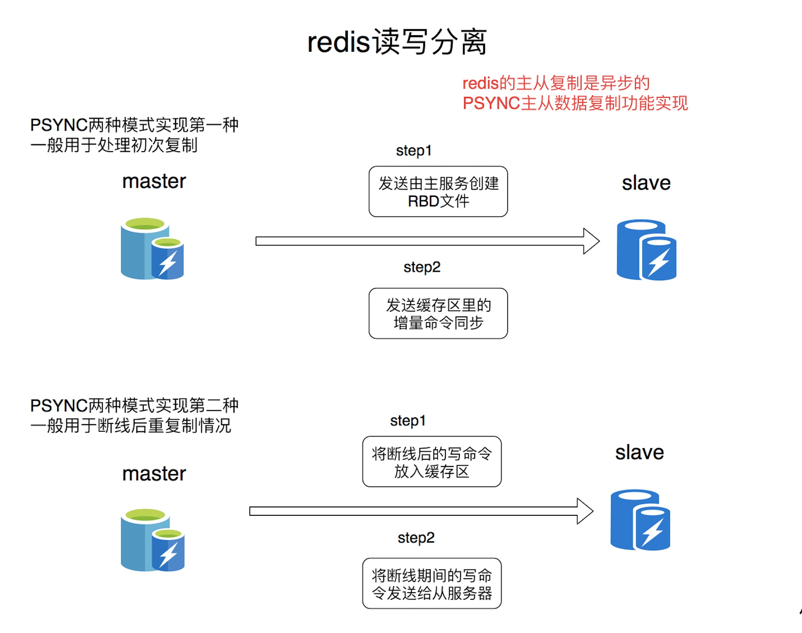
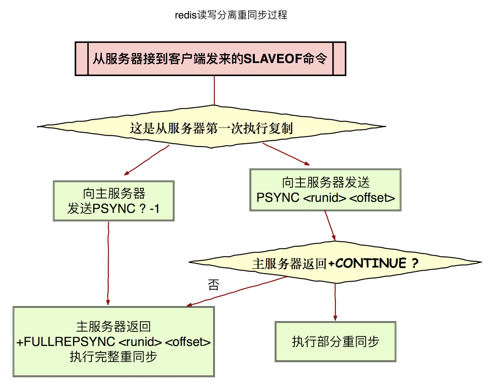

# 读写分离高可用

#### 旧版本复制
* SYNC是一个非常耗费资源的操作
* 主服务器需要执行BGSAVE命令来生成RDB文件，这个生成操作会耗费主服务器大量的的 CPU、内存和磁盘读写资源 主服务器将RDB文件发送给从服务器，这个发送操作会耗费主从服务器大量的网络带宽和流 量，并对主服务器响应命令 请求的时间产生影响:接收到RDB文件的从服务器在载入文件的过程是阻塞的，无法处理命令 请求

#### 新版本复制

* 主服务的复制偏移量(replication offset)和从服务器的复制偏移量 主服务器的复制积压缓冲区(replication backlog),默认大小为1M
* 服务器的运行ID(run ID),用于存储服务器标识，如从服务器断线重新连接，取到主服务器 的运行ID与重接后的主服务器运行ID进行对比，从而判断是执行部分重同步还是执行完 整重同步
