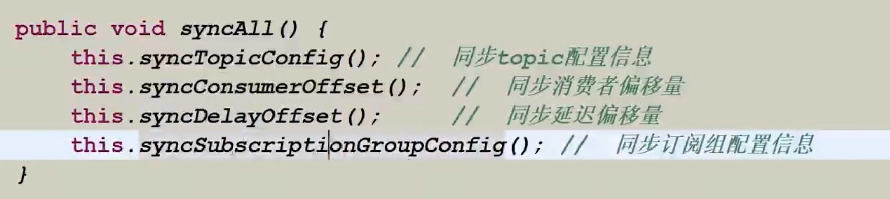
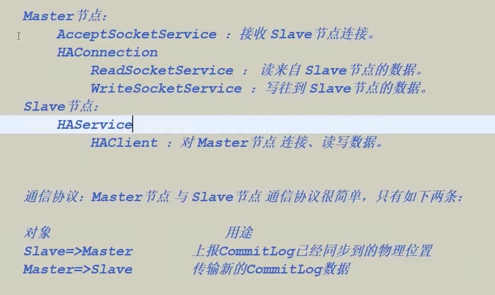

# 生产者应用

#### 核心参数详
* Producergroup：组名
* createtopickey
* defaulttopicqueuenums（默认为 4)
* sendMsgTimeout ms
* producer从nameserver拉取配置，发送的时候就决绝了

#### 主从同步
* Master-Slave主从同步
* 同步信息：数据内容+元数据信息
* 元数据同步：Broker 角色识别，为 Slave 则启动同步任务 Netty

* 消息同步(commit-log)：HAservice、HAconnection、WaitnotfiyObject原生Socket

#### 同步消息发送
* 消息的返回状态
* SEND_OK
* FLUSH_DISK_TIMEOUT
* FLUSH_SLAVE_TIMEOUT
* SLAVE_NOT_AVAILABLE

#### 延迟消息
* 延迟消息：消息发到 Broker 后，要特定的时间才会被 Consumer 消费
* 目前只支持固定精度的定时消息
* MessagestoreConfig 配置类& Schedule Messageservice 任务类
* setdelaytimelevel 方法设置

#### 自定义消息发送规则
* 如何把消息发送到指定的队列（Message Queue)
* MessageQueueSelector
* 