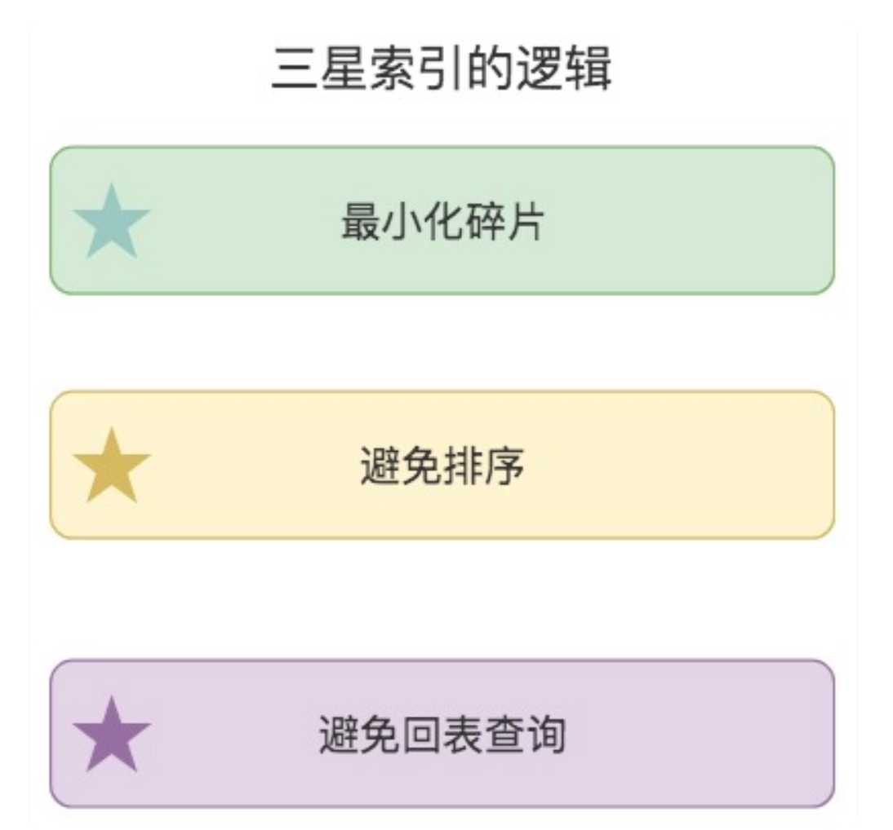

# 查询索引

#### 三星索引
* 在 WHERE 条件语句中，找到所有等值谓词中的条件列，将它们作为索引片中的开始列；
* 将 GROUP BY 和 ORDER BY 中的列加入到索引中；
* 将 SELECT 字段中剩余的列加入到索引片中。

#### 考虑因子
* 索引会增加磁盘压力和缓冲池
* 索引维护也需要成本

#### 如何设计索引
* 索引数不能过多
* 在索引片中，我们也需要控制索引列的数量，通常情况下我们将 WHERE 里的条件列添加到索引中，而 SELECT 中的非条件列则不需要添加。除非 SELECT 中的非条件列数少，并且该字段会经常使用到
* 单列索引和复合索引的长度也需要控制，在 MySQL InnoDB 中，系统默认单个索引长度最大为 767 bytes，如果单列索引长度超过了这个限制，就会取前缀索引，也就是取前 255 字符。