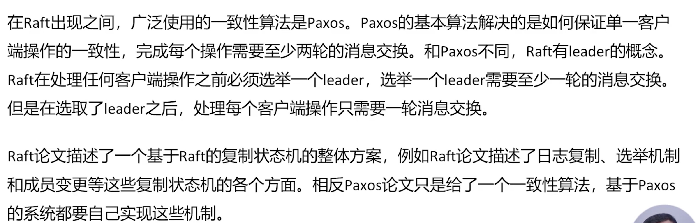
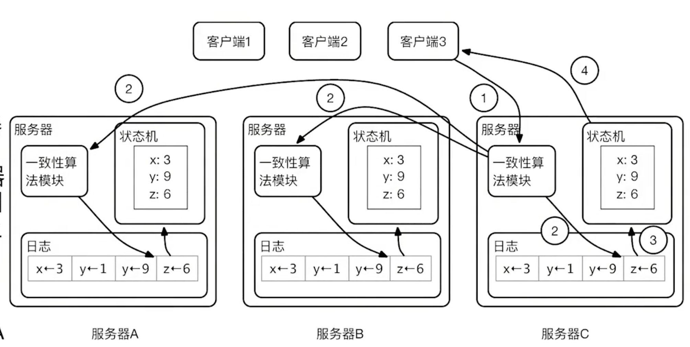
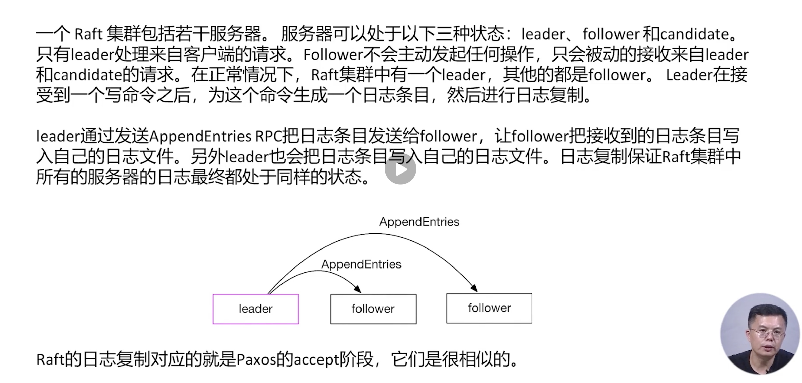
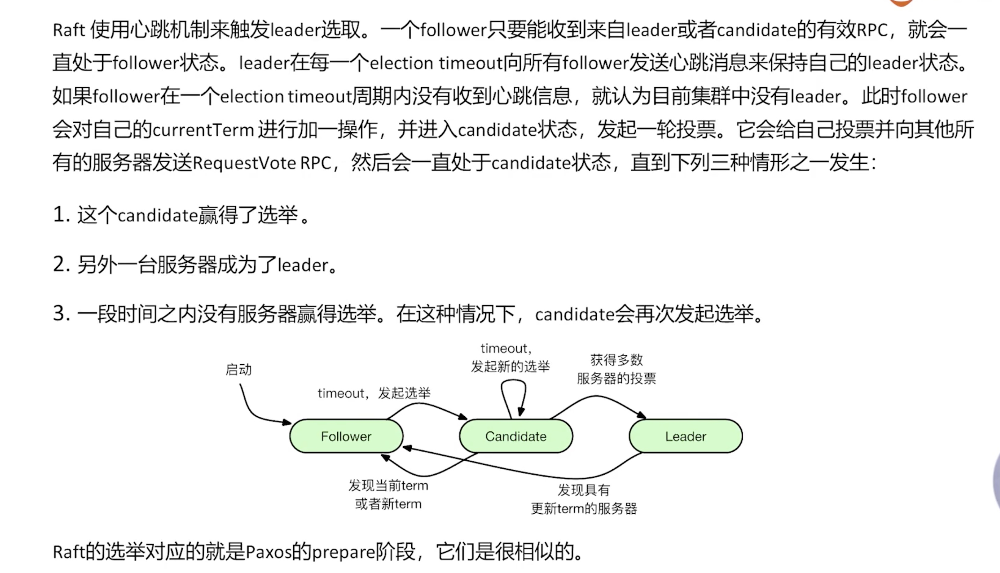
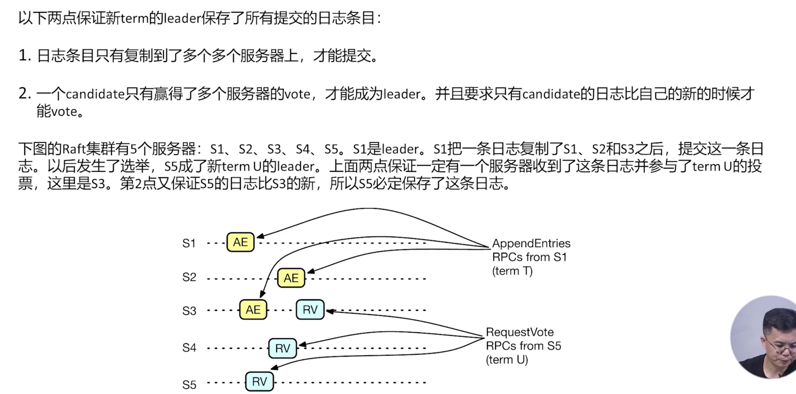
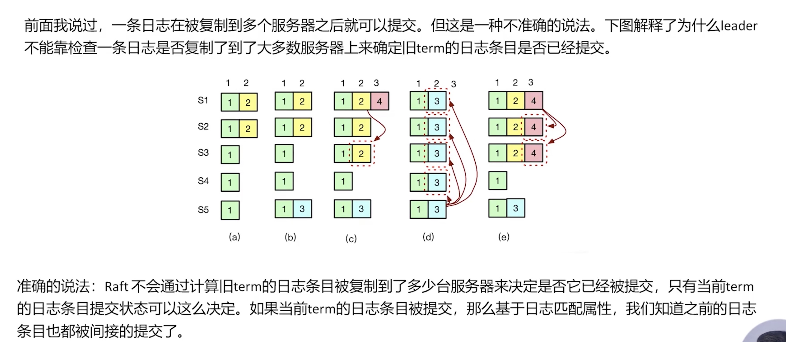

# Raft
#### 比较

#### 复制状态机系统架构

#### 日志复制

* 容错：在数量少于 Raft 服务器总数一半的 Follower 失败的情况下，Raf 集群仍然可以正常处理来自客户端的请求。、
* 确保重叠：一旦 Raft leader 响应了一个客户端请求，即使出现 Raf 集群中少数服务器的失败，也会有一个服务器包含所有以前提交的日志条目。

#### 选举算法
* 

#### 保证新term的leader保存了所有提交的日志项目

#### 状态机命令
* 

#### 集群成员更新
* 