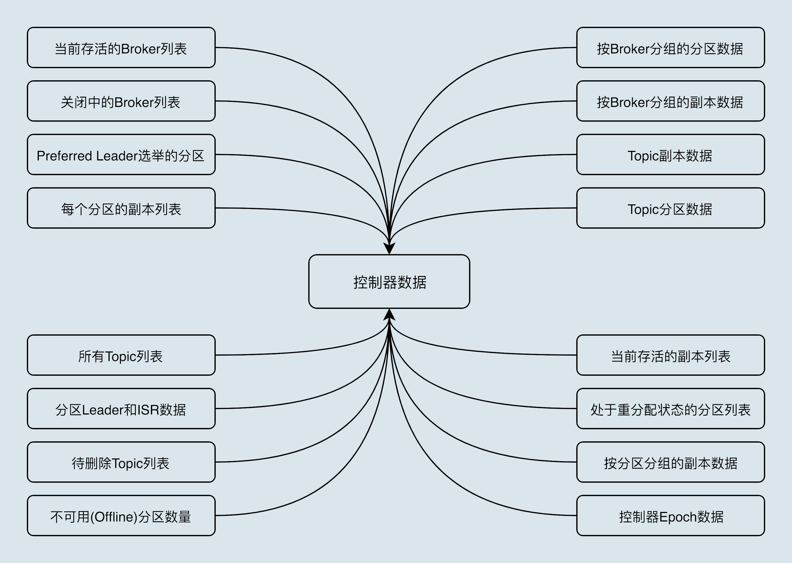
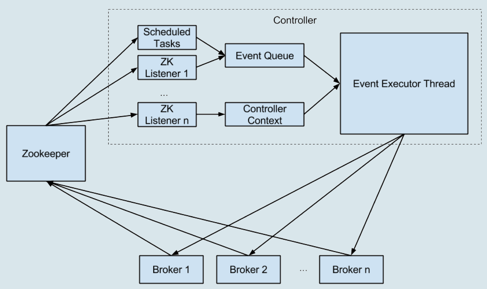

# Kafka控制器

#### watch
* 所谓的 Watch 通知功能。一旦 znode 节点被创建、删除，子节点数量发生变化，抑或是 znode 所存的数据本身变更，ZooKeeper 会通过节点变更监听器 (ChangeHandler) 的方式显式通知客户端

#### 控制器数据

#### 控制器组件
* 控制器组件（Controller），是 Apache Kafka 的核心组件。它的主要作用是在 Apache ZooKeeper 的帮助下管理和协调整个 Kafka 集群
* 主题管理
* 分区重分配
* 领导者选举
* 集群成员管理 存活机制 每个 Broker 启动后，会在 /brokers/ids 下创建一个临时 znode。当 Broker 宕机或主动关闭后，该 Broker 与 ZooKeeper 的会话结束，这个 znode 会被自动删除。通过watch机制观察
* 数据服务 

#### 内部设计原理
* 统一处理各种控制
* 
器事件，然后控制器将原来执行的操作全部建模成一个个独立的事件，发送到专属的事件队列中，供此线程消费
* 之前同步操作 ZooKeeper 全部改为异步操作

#### 快速删除主题
* ZooKeeper 中手动删除 /controller 节点
