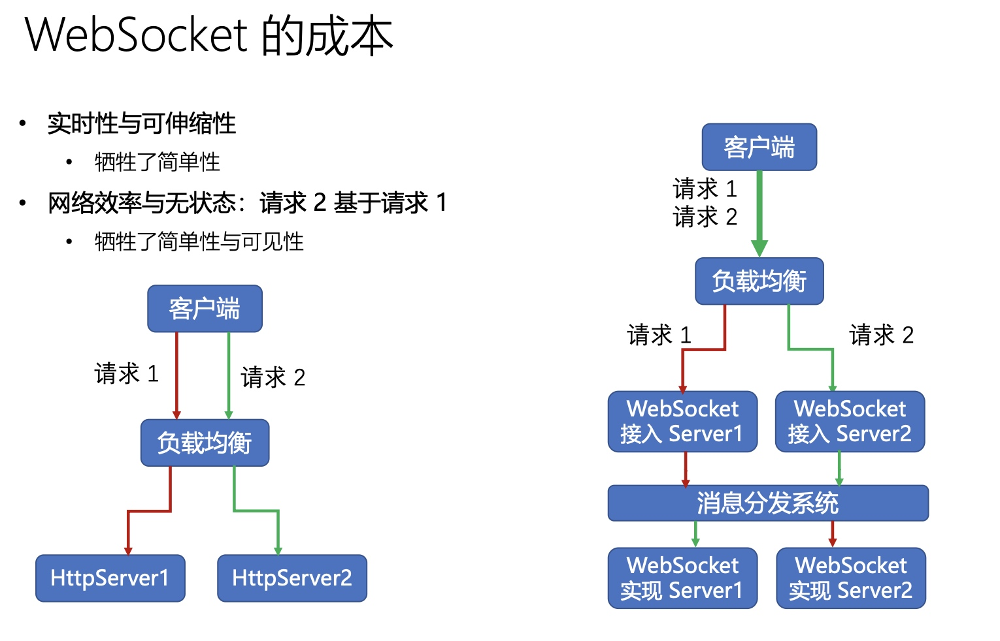
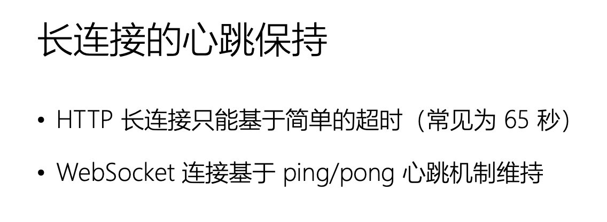
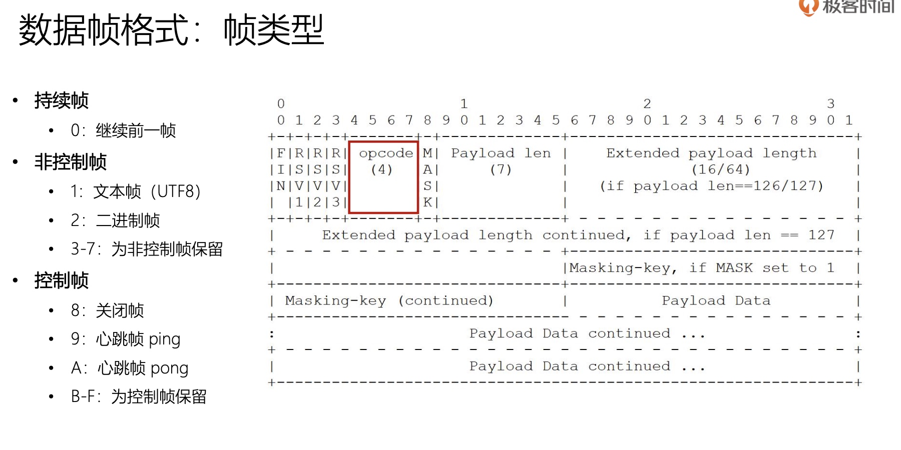
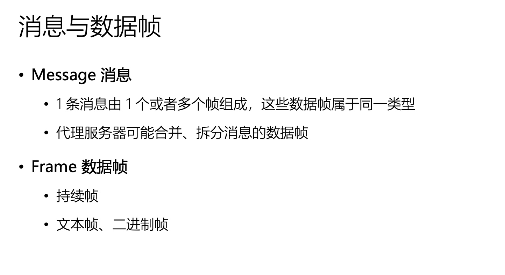
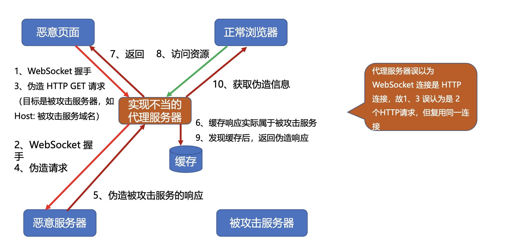

# WebSocket

#### 成本
* 

#### 长连接
* 

#### 设计哲学

#### 设计帧

#### 升级流程
* 

#### 消息和消息祯
* 
* 
* 
* opcode来区分 op=0持续帧 op=1/2文本帧和持续帧

#### 发送消息
* 

#### 掩码编码
* 

#### 在线异或
* xor.pw/

#### 心跳
* 

#### 协议关闭
* 
