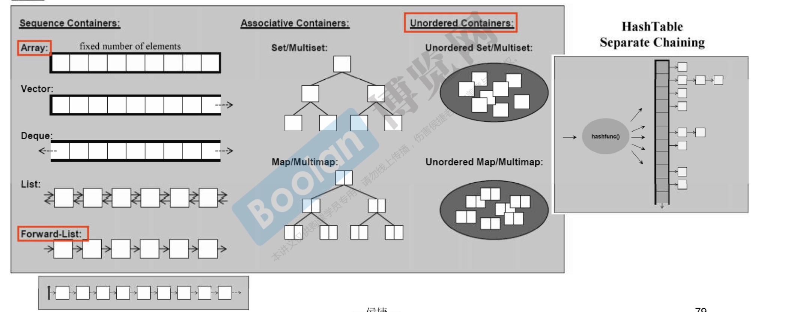
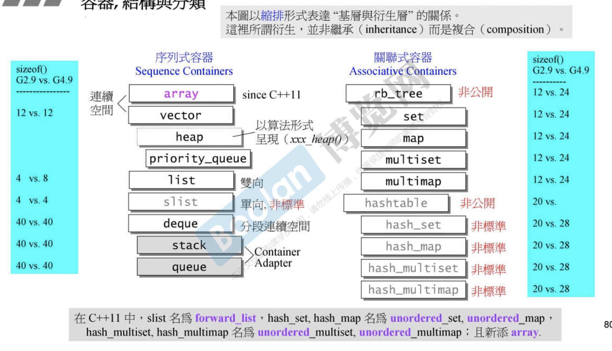
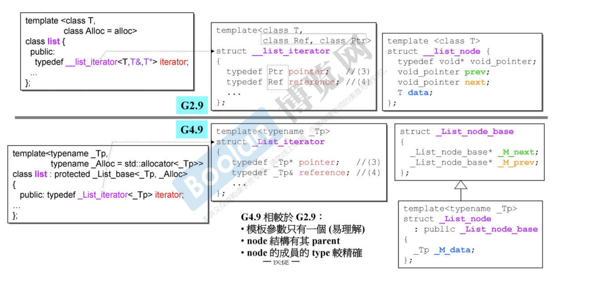
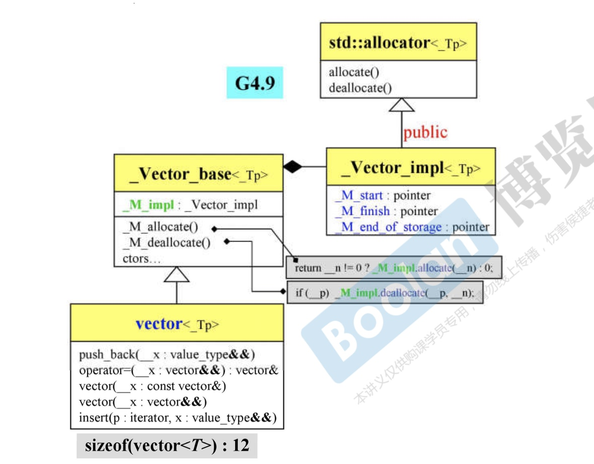
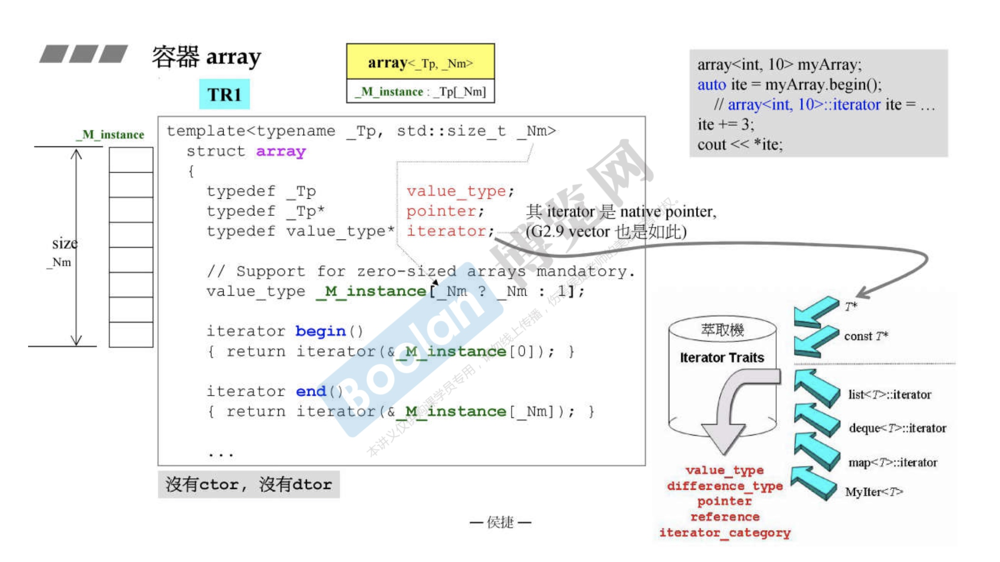
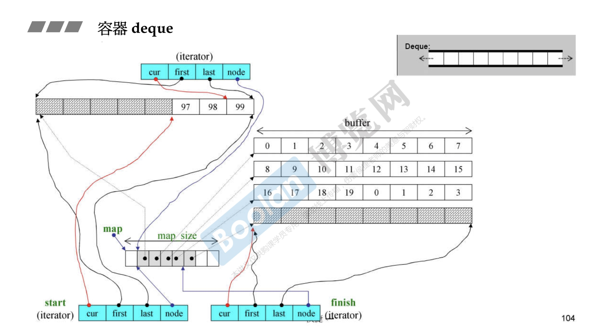
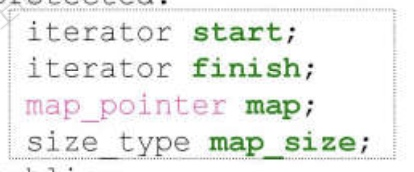
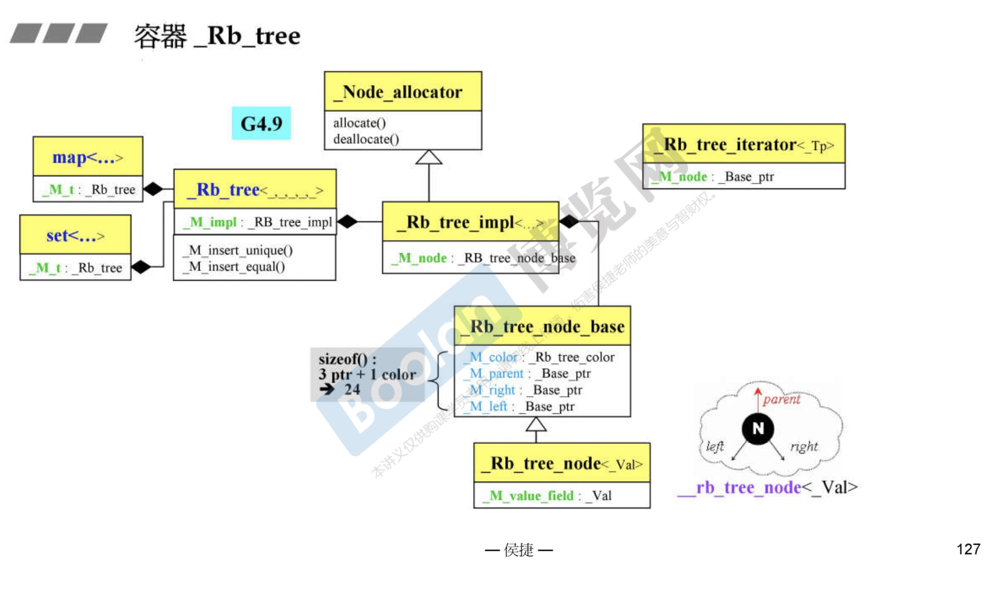
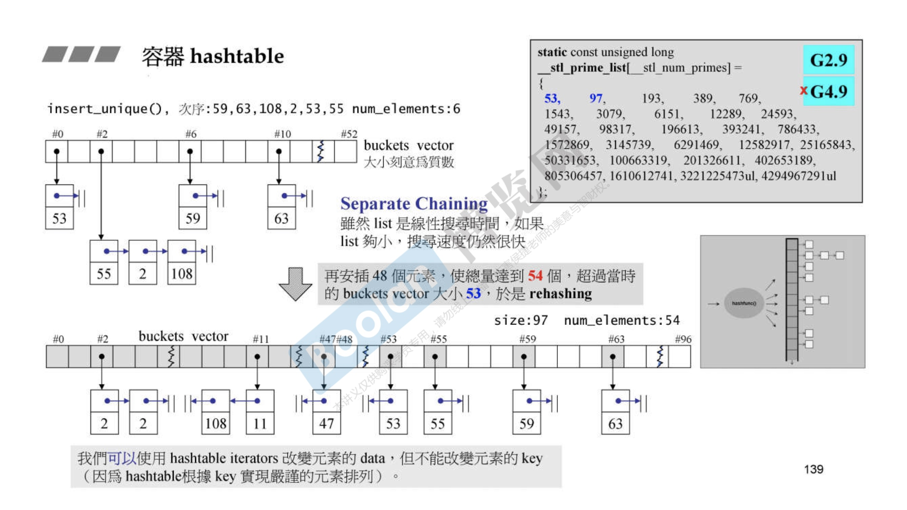

# 容器分类

#### 结构和内存

#### List
* 
* 前闭后关
* _List_node_base<_Tp> 中有两个指针
* 

#### vector
* 

#### array
* TR版本

#### deque

* 通过buffer串起来
* cur是当前位置，first,last是buffer的起始位置，node 控制iterator访问到边界之后，跳到下一个缓冲区
* map是中控制，数据结构是vector
* 
* dequeue和stack是封装的deque对象，并且调用部分成员函数
* 可以选择list和dequeue
* 不可以选择set或者map做底部支撑

#### 容器
* set 和 queue不算容器

#### 红黑树

* handle and body
* set调用的是insert_unique()
* multiset调用的是insert_equal()
* set不能修改元素借用的是const_iterator

#### map
* 将key改成const

#### hash_table
* 
* 
