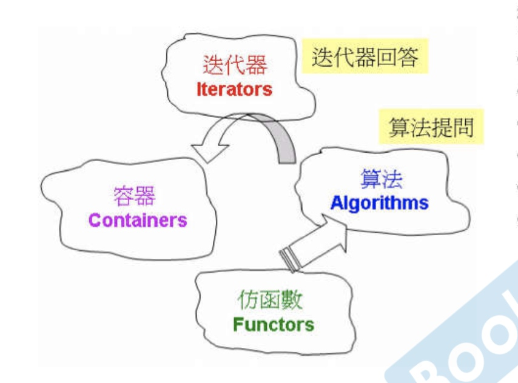
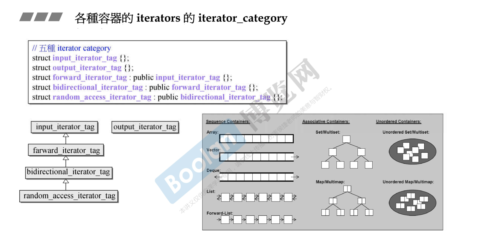
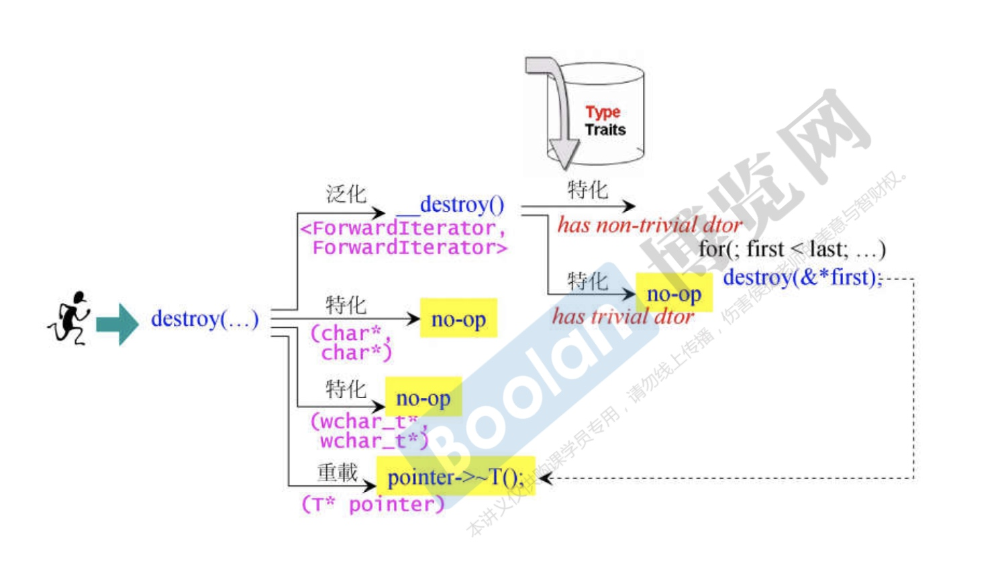
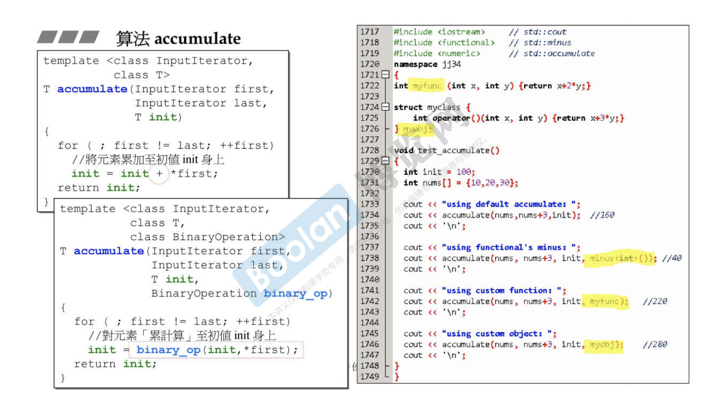
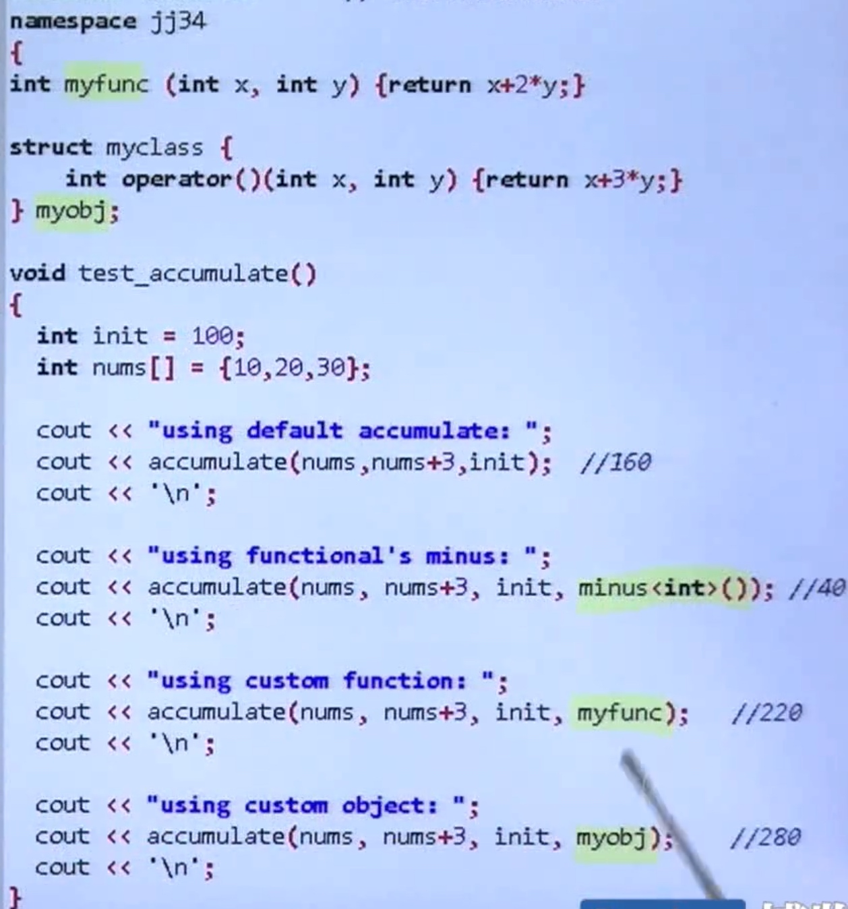
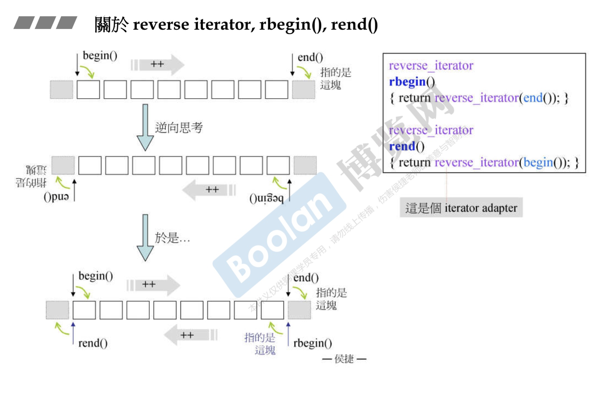
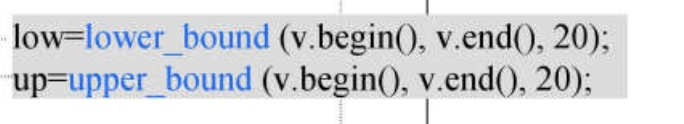
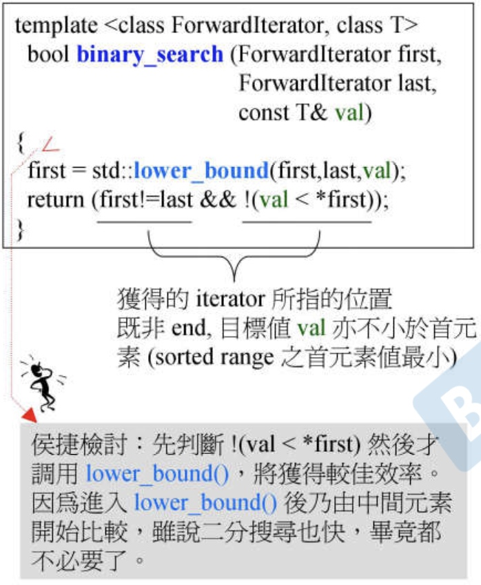

# 算法

#### 结构图

#### iterator

#### 迭代器对算法影响
* 
* 根据迭代器的分类来调用次函数
* 主函数配合辅助函数
* distance
* advance

#### copy
* 
* 

#### accumulate
* 
* 

#### replace&replace_if&replace

#### count&count_if
* 如果容器带count，用自带的
* 不带count用算法的
* 带count是一个字典结构，关联容器

#### rebegin&rend
* 

#### binary_search
* 
* lower_bound能够插入的最低点
* upper_bound能够插入的最高点
* 

#### 防函数
* 