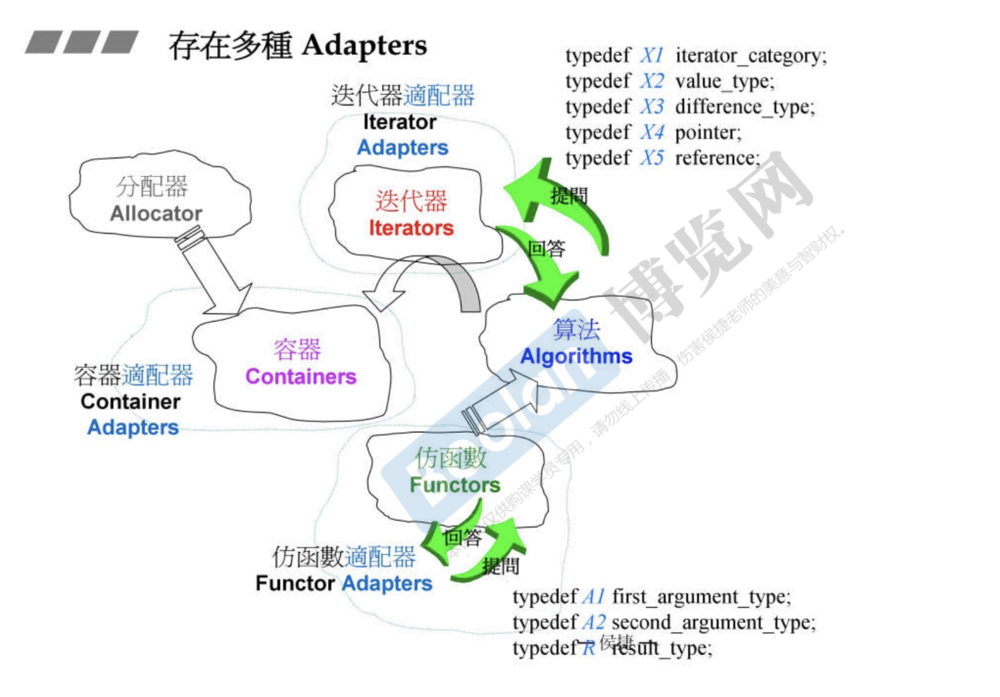
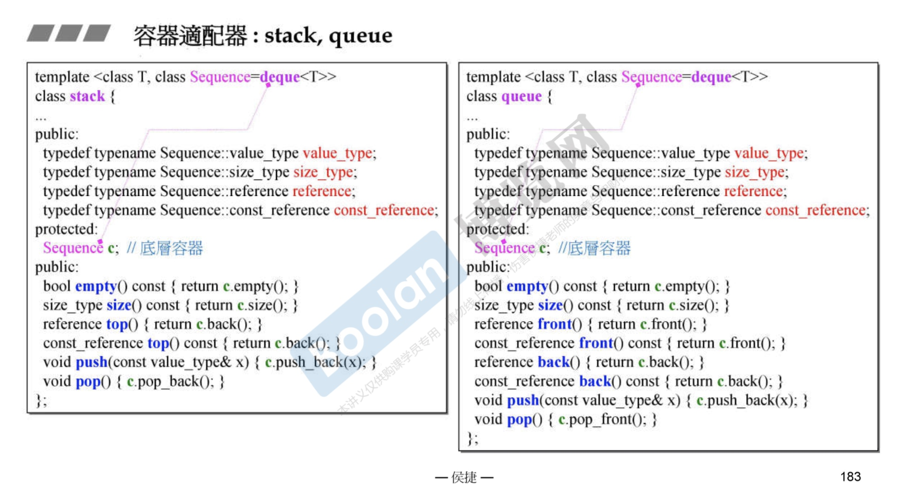
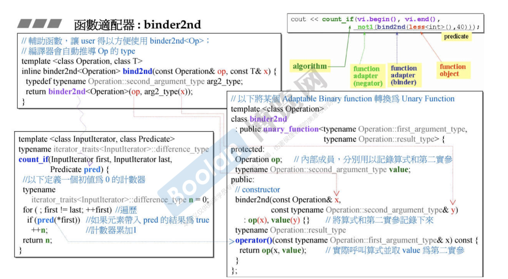

# 适配器

#### Adapters
* 

#### 三种适配器
* 容器适配器
* 迭代器适配器
* 仿函数适配器

#### 容器适配器
* 

#### 函数适配器
* 
* less对应Operator op
* 40对应typename Operation::second argument_type value
* Operation进行类型检测
* 将参数存起来，以备后面使用

##### 适配器回答三个问题
* 第一实参type是什么
* 第二实参type是什么
* 二者比较完后的type是什么

##### 可适配条件
* binary_function
* unary_fucntion

#### 新型适配器
* bind
* 