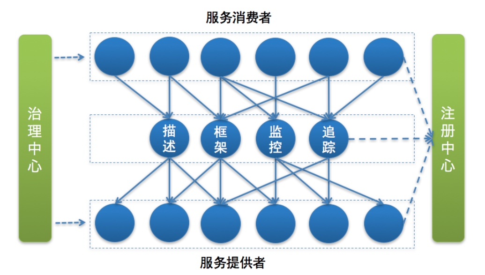

# 微服务架构
#### 结构
* 

#### 服务监控
* 指标收集。就是要把每一次服务调用的请求耗时以及成功与否收集起来，并上传到集中的数据处理中心。
* 数据处理。有了每次调用的请求耗时以及成功与否等信息，就可以计算每秒服务请求量、平均耗时以及成功率等指标。
* 数据展示。数据收集起来，经过处理之后，还需要以友好的方式对外展示，才能发挥价值。通常都是将数据展示在 Dashboard 面板上，并且每隔 10s 等间隔自动刷新，用作业务监控和报警等。

#### 服务追踪
* 工作原理
* 服务消费者发起调用前，会在本地按照一定的规则生成一个 requestid，发起调用时，将 requestid 当作请求参数的一部分，传递给服务提供者。
* 服务提供者接收到请求后，记录下这次请求的 requestid，然后处理请求。如果服务提供者继续请求其他服务，会在本地再生成一个自己的 requestid，然后把这两个 requestid 都当作请求参数继续往下传递。

#### 服务治理
* 单机故障 依据策略自动摘除故障节点
* 单IDC故障 自动切换故障IDC
* 依赖服务不可用 通过熔断机制

#### 