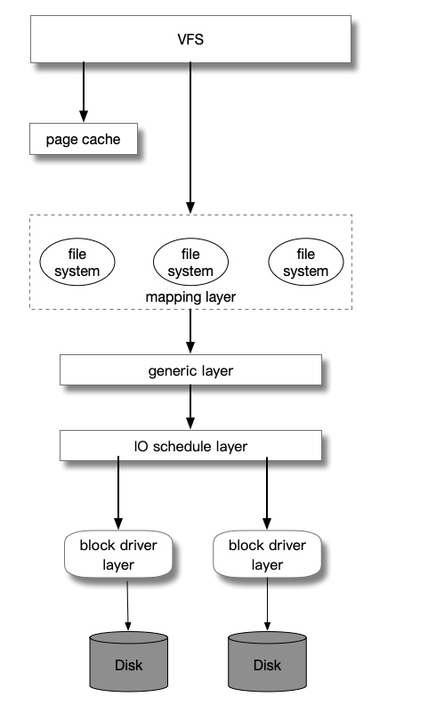
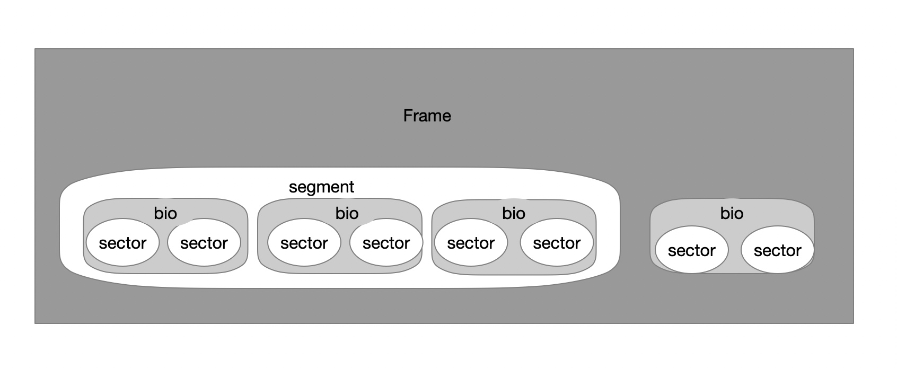

# 块设备

#### 块设备操作的内核组件
* 

#### 磁盘数据的典型构造

* 硬件设备采用扇区管理数据
* 虚拟文件系统和映射层和文件系统将数据放在块的逻辑单元，块对应文件系统的最小的磁盘存储单元
* 块设备驱动程序能够处理数据的段，一个段就是一个内存页或者内存页的一部分
* 磁盘高速度缓存位于数据的页中
* 通用块层将所有的上层和下层的组件组合在一起，需要了解数据的扇区，块和页面

#### 设备

#### 段
* 不同的段在ram中对应的页框正好是连续的并且磁盘对应的数据块也是连续的，通用块层可以合并他们
* 