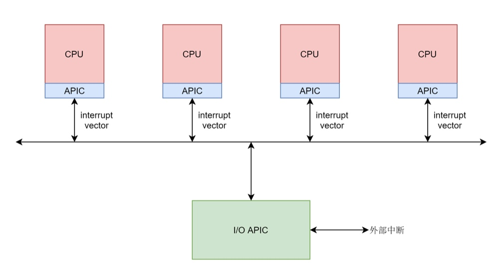

# 字符设备下
#### 中断处理
* unsigned int irq 是中断信号；
* q_ handler_ t handler 是中断处理函数；unsigned long flags 是一些标识位；const char*name 是设备名称；
* void*dev 这个通用指针应该和中断处理函数的 void*dev 相对应。

#### 中断处理成员
* 中断处理函数 handler;
* void* dev id 为设备 id; rq 为中断信
* 如果中断处理函数在单独的线程运行，则有 thread_fn 是线程的执行函数，thread 是线程task struct

####  中断层次
* 第一个层次是外部设备给中断控制器发送物理中断信号。
* 第二个层次是中断控制器将物理中断信号转换成为中断向量 Interrupt vector，发给各个 CPU。
* 第三个层次是每个 CPU 都会有一个中断向量表，根据 Interrupt vector 调用一个 IRQ处理函数。注意这里的 IRQ 处理函数还不是咱们上面指定的 irq_ handler_t，到这一层还是 CPU 硬件的要求。
* 第四个层次是在 IRQ 处理函数中，将 interrupt vector 转化为抽象中断层的中断信号 irq 调用中断信号 irq 对应的中断描述结构里面的 irq_ handler_t。

#### 中断向量表
*  0 到 31 的前 32 位是系统陷入或者系统异常，这些错误无法屏蔽，一定要处理
*  外加一位 32 位系统调用

#### 总结
* 
