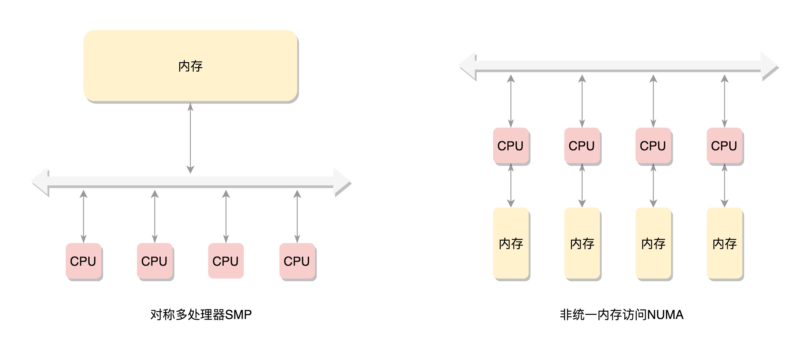

# 物理内存分配

#### 经典内存使用方式
* 

#### SMP和NUMA模式
* 

#### NUMA模型
* 内存被分成了多个节点，每个节点再被分成一个一个的页面。由于页需要全局唯一定位，页还是需要有全局唯一的页号的。但是由于物理内存不是连起来的了，页号也就不再连续了。于是内存模型就变成了非连续内存模型
* CPU访问内存不用过总线

#### 节点
* pglist_data
* 每一个节点都有自己的 ID：node_id；
* node_mem_map 就是这个节点的 struct page 数组，用于描述这个节点里面的所有的页；
* node_start_pfn 是这个节点的起始页号；
* node_spanned_pages 是这个节点中包含不连续的物理内存地址的页面数；
* node_present_pages 是真正可用的物理页面的数目。

#### DMA机制
* DMA 是这样一种机制：要把外设的数据读入内存或把内存的数据传送到外设，原来都要通过 CPU 控制完成，但是这会占用 CPU，影响 CPU 处理其他事情，所以有了 DMA 模式。CPU 只需向 DMA 控制器下达指令，让 DMA 控制器来处理数据的传送，数据传送完毕再把信息反馈给 CPU，这样就可以解放 CPU。

#### 区域
* spanned_pages = zone_end_pfn - zone_start_pfn，也即 spanned_pages 指的是不管中间有没有物理内存空洞，反正就是最后的页号减去起始的页号。
* present_pages = spanned_pages - absent_pages(pages in holes)，也即 present_pages 是这个 zone 在物理内存中真实存在的所有 page 数目。
* managed_pages = present_pages - reserved_pages，也即 managed_pages 是这个 zone 被伙伴系统管理的所有的 page 数目，
* per_cpu_pageset

#### 页面
* 匿名页  一整页的内存，或者直接和虚拟地址空间建立映射关系，我们把这种称为匿名页（Anonymous Page）
* 文件页 关联一个文件，然后再和虚拟地址空间建立映射关系，这样的文件，我们称为内存映射文件（Memory-mapped File）。

#### 匿名页
* struct address_space *mapping 就是用于内存映射，如果是匿名页，最低位为 1；如果是映射文件，最低位为 0；
* pgoff_t index 是在映射区的偏移量；
* atomic_t _mapcount，每个进程都有自己的页表，这里指有多少个页表项指向了这个页；
* struct list_head lru 表示这一页应该在一个链表上，例如这个页面被换出，就在换出页的链表中；
* compound 相关的变量用于复合页（Compound Page），就是将物理上连续的两个或多个页看成一个独立的大页

#### 文件页
* 分配小块内存，存储进程描述结构的对象
* slub allocator

#### 页的分配
* 分配大内存使用伙伴系统
* 