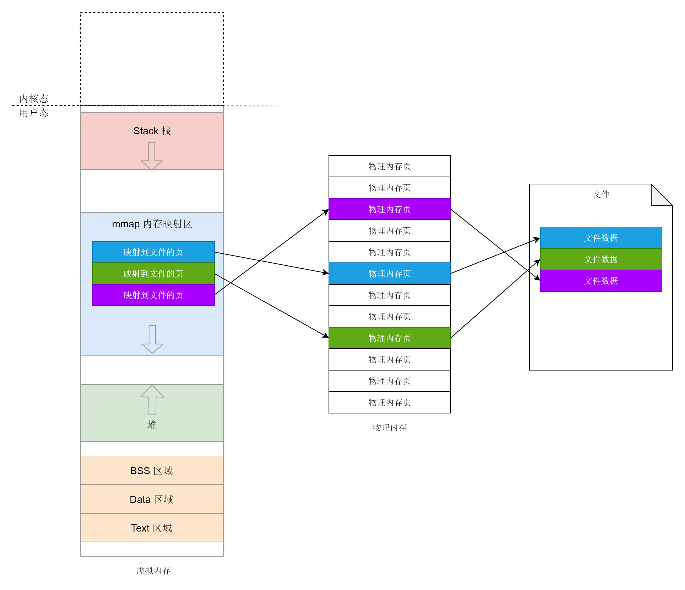
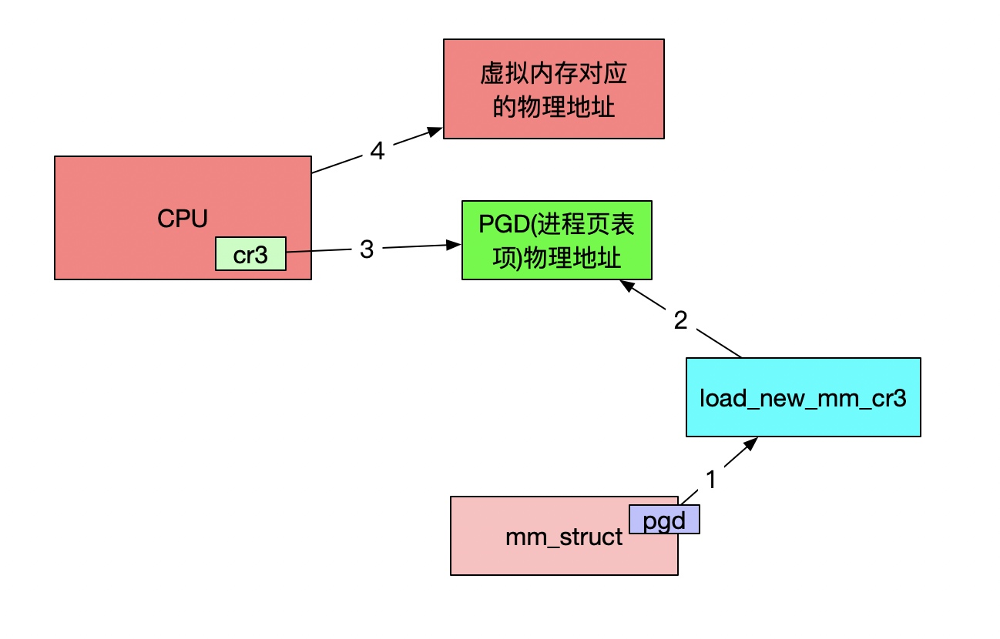

# 用户态内存映射
#### 内存映射
* 物理内存和虚拟内存之间的映射
* 文件中的内容映射到虚拟内存空间
* 

#### 内存映射文件流程
* 通过文件描述符fd获取struct file
* 调用 get_unmapped_area 找到一个没有映射的区域；
* 调用 mmap_region 映射这个区域

##### 匿名映射
* 调用 mm_struct 里面的get_unmapped_area 函数
* 查找vm_area_struct红黑树的位置

##### 文件映射
* struct file->file_operations->thp_get_unmapped_area
* get_unmapped_area

#### 映射内存区域
* 找到前一个虚拟内存区域的vm_area_struct
* 如果不能合并，创建新的vm_area_struct加入队列
* 通过__vma_link_file建立文件到内存的映射关系
* struct_file的vm_area_struct挂在i_mmap的红黑树上

#### 用户态缺页异常
* 访问虚拟内存没有对应的物理页面
* 调用handle_mm_fault映射区域
* 通过五级进程页表PGD->PUD->PMD->PTE->Offset
* 页表项 task_struct->mm_struct->pgd
* 进程的虚拟地址空间分为用户态和内核态两部分
* 页表也分为用户地址空间的页表和内核页表
* 用户地址空间需要等到进程在CPU上运行，对内存访问的时候

#### 访问物理内存
* context_switch->switch_mm_irqs_off->load_new_mm_cr3
* 

#### 映射
* 匿名页面 分配页表项->分配页
* 文件映射  filemap_fault  kmap_atomic，将物理内存映射到内核的虚拟地址空间，得到内核中的地址 kaddr
* swap page  kmap_atomic 映射

#### 总结
* 
