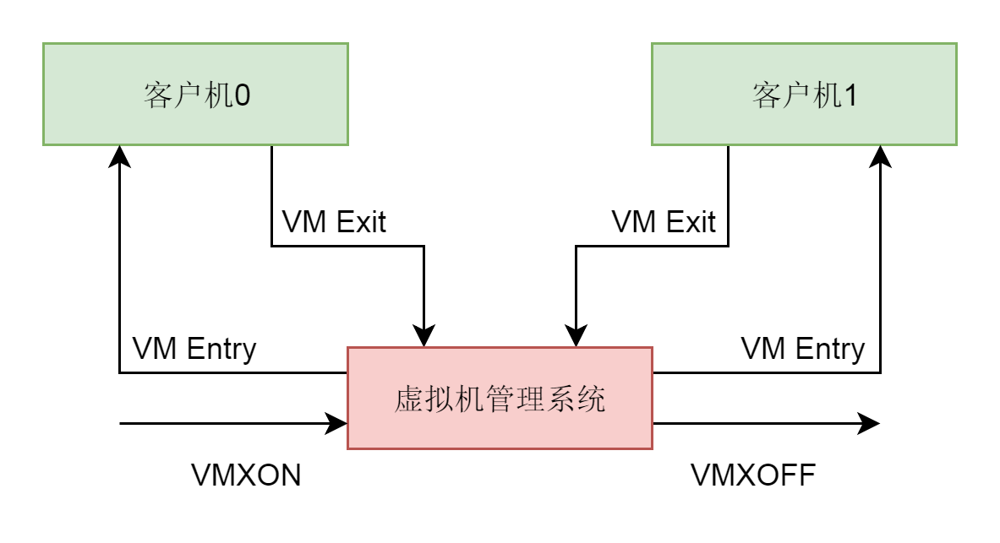

# 虚拟化之CPU
#### 创建虚拟机
* kvm_create_vm 创建一个 struct kvm 结构。这个结构在内核里面代表一个虚拟机

#### 虚拟机本质
* KVM 的内核模块是一个文件，可以通过 ioctl 进行操作。基于这个内核模块创建的 VM 也是一个文件，也可以通过 ioctl 进行操作。在这个 VM 上创建的 vcpu 同样是一个文件，同样可以通过 ioctl 进行操作

#### VMCS
* MSR(特殊模块寄存器), 辅助完成某些功能(包括系统调用)
* VMCS的全称是 Virtual Machine Control Structure
* Intel 实现 CPU 虚拟化，记录 vCPU 状态的一个关键数据结构

#### VMCS结构信息
* Guest-state area，即 vCPU 的状态信息，包括 vCPU 的基本运行环境，例如寄存器等。
* Host-state area，是物理 CPU 的状态信息。物理 CPU 和 vCPU 之间也会来回切换，所以，VMCS 中既要记录 vCPU 的状态，也要记录物理 CPU 的状态。
* VM-execution control fields，对 vCPU 的运行行为进行控制。例如，发生中断怎么办，是否使用 EPT（Extended Page Table）功能

#### 重要操作
* VM-Entry，我们称为从根模式切换到非根模式，也即切换到 guest 上，这个时候 CPU 上运行的是虚拟机。
* VM-Exit 我们称为 CPU 从非根模式切换到根模式，也即从 guest 切换到宿主机
* 

#### 虚拟cpu运行
```
 do {
        if (cpu_can_run(cpu)) {
            r = kvm_cpu_exec(cpu);
        }
        qemu_wait_io_event(cpu);
    } while (!cpu->unplug || cpu_can_run(cpu));
int kvm_cpu_exec(CPUState *cpu)
{
    struct kvm_run *run = cpu->kvm_run;
    int ret, run_ret;
......
    do {
......
        run_ret = kvm_vcpu_ioctl(cpu, KVM_RUN, 0);
......
        switch (run->exit_reason) {
        case KVM_EXIT_IO:
    
```
* 如果一直是客户机的操作系统占用这个 CPU，则会一直停留在这一行运行，一旦这个调用返回了，就说明 CPU 进入 VM-Exit 退出客户机模式，将 CPU 交还给宿主机。在循环中，我们会对退出的原因 exit_reason 进行分析处理，因为有了 I/O，还有了中断等，做相应的处理。处理完毕之后，再次循环，再次通过 VM-Entry，进入客户机模式。如此循环，直到虚拟机正常或者异常退出

#### 总结
* 
* CPU 初始化的时候，会调用 pc_new_cpu 创建一个虚拟 CPU，它会调用 CPU 这个类的初始化函数。
* 每一个虚拟 CPU 会调用 qemu_thread_create 创建一个线程，线程的执行函数为 qemu_kvm_cpu_thread_fn。
* 在虚拟 CPU 对应的线程执行函数中，我们先是调用 kvm_vm_ioctl(KVM_CREATE_VCPU)，在内核的 KVM 里面，创建一个结构 struct vcpu_vmx，表示这个虚拟 CPU。在这个结构里面，有一个 VMCS，用于保存当前虚拟机 CPU 的运行时的状态，用于状态切换。
* 在虚拟 CPU 对应的线程执行函数中，我们接着调用 kvm_vcpu_ioctl(KVM_RUN)，在内核的 KVM 里面运行这个虚拟机 CPU。运行的方式是保存宿主机的寄存器，加载客户机的寄存器，然后调用 __ex(ASM_VMX_VMLAUNCH) 或者 __ex(ASM_VMX_VMRESUME)，进入客户机模式运行。一旦退出客户机模式，就会保存客户机寄存器，加载宿主机寄存器，进入宿主机模式运行，并且会记录退出虚拟机模式的原因。大部分的原因是等待 I/O，因而宿主机调用 kvm_handle_io 进行处理。
* 