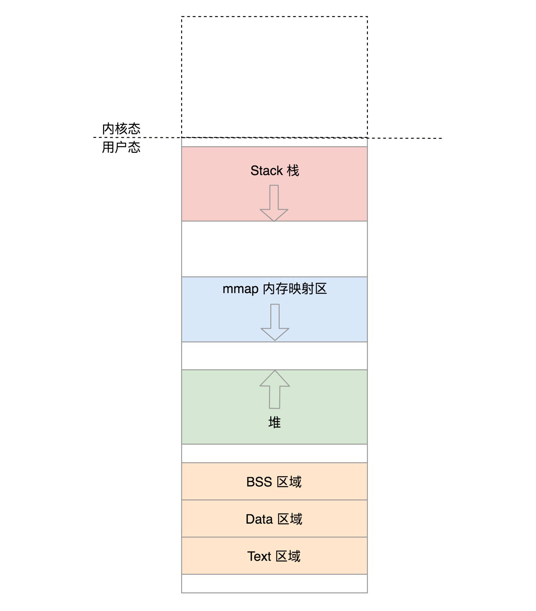

# 进程空间管理
#### 用户态和内核态
* 

#### 进程空间部署
* 

##### 各区域的位置信息
* total_vm 是总共映射的页的数目。
* locked_vm 就是被锁定不能换出，pinned_vm 是不能换出，也不能移动。
* data_vm 是存放数据的页的数目，exec_vm 是存放可执行文件的页的数目，stack_vm 是栈所占的页的数目。
* start_code 和 end_code 表示可执行代码的开始和结束位置，start_data 和 end_data 表示已初始化数据的开始位置和结束位置。
* start_brk 是堆的起始位置，brk 是堆当前的结束位置。前面咱们讲过 malloc 申请一小块内存的话，就是通过改变 brk 位置实现的。
* start_stack 是栈的起始位置，栈的结束位置在寄存器的栈顶指针中。
* arg_start 和 arg_end 是参数列表的位置， env_start 和 env_end 是环境变量的位置。它们都位于栈中最高地址的地方。

```
unsigned long mmap_base;	/* base of mmap area */
unsigned long total_vm;		/* Total pages mapped */
unsigned long locked_vm;	/* Pages that have PG_mlocked set */
unsigned long pinned_vm;	/* Refcount permanently increased */
unsigned long data_vm;		/* VM_WRITE & ~VM_SHARED & ~VM_STACK */
unsigned long exec_vm;		/* VM_EXEC & ~VM_WRITE & ~VM_STACK */
unsigned long stack_vm;		/* VM_STACK */
unsigned long start_code, end_code, start_data, end_data;
unsigned long start_brk, brk, start_stack;
unsigned long arg_start, arg_end, env_start, env_end;
```

##### 各区域的属性信息
* 每一块区域使用vm_area_struct来描述信息
* vm_area_struct来描述位置信息
* 解析ELF
* 建立内存映射

###### load_elf_binary
* 调用 setup_new_exec，设置内存映射区 mmap_base；
* 调用 setup_arg_pages，设置栈的 vm_area_struct，这里面设置了 mm->arg_start 是指向栈底的，current->mm->start_stack 就是栈底；
* elf_map 会将 ELF 文件中的代码部分映射到内存中来；
* set_brk 设置了堆的 vm_area_struct，这里面设置了 current->mm->start_brk = current->mm->brk，也即堆里面还是空的；
* load_elf_interp 将依赖的 so 映射到内存中的内存映射区域。
* 内存映射图


##### 修改映射
* 函数的调用
* malloc申请堆内的空间 brk 或者 mmap

#### 堆内存分配
* sys_brk的新堆顶地址和旧的堆顶地址进行合并
* 考虑需要不需要分配页的问题
* 如果是释放，直接释放
* 如果是分配堆内存 当前的堆顶和下一个 vm_area_struct 之间还能不能分配一个完整的页
* do_brk 进一步分配堆空间，从旧堆顶开始，分配计算出的新旧堆顶之间的页数。

#### 伙伴系统页的分配
* 把所有的空闲页分组为 11 个页块链表，每个块链表分别包含很多个大小的页块，有 1、2、4、8、16、32、64、128、256、512 和 1024 个连续页的页块
* 在一个循环中先看当前节点的 zone。如果找不到空闲页，则再看备用节点的 zone
* 先去free_area找与当前2^order匹配的队列
* 找不到去更大的2^order队列中找，然后把多余的页面放入其他页面链表

#### 物理内存的总结
* 


