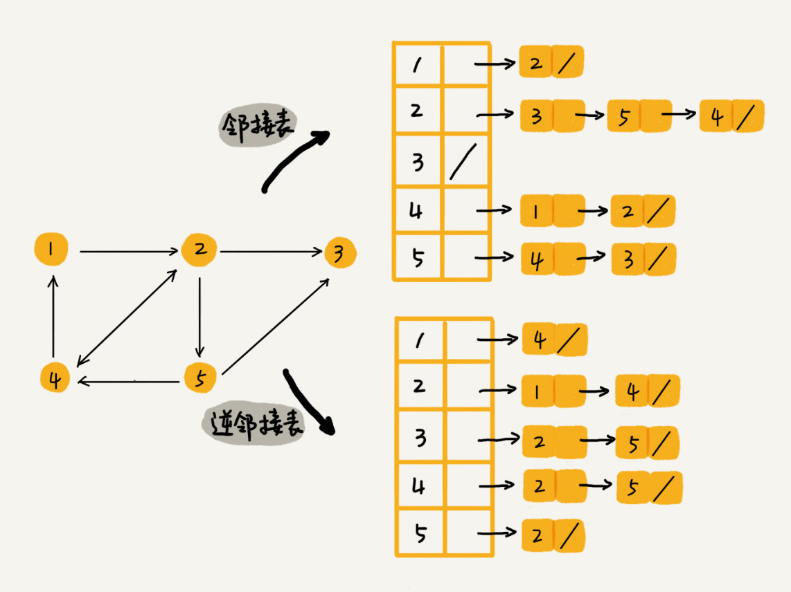

# 图

#### 概念
* 在有向图中，我们把度分为入度（In-degree）和出度（Out-degree）

#### 存储方法
* 邻接矩阵
* 邻接表
* 邻接矩阵存储起来比较浪费空间，但是使用起来比较节省时间。相反，邻接表存储起来比较节省空间，但是使用起来就比较耗时间。
* 邻接表中的链表改成平衡二叉查找树。实际开发中，我们可以选择用红黑树。这样，我们就可以更加快速地查找两个顶点之间是否存在边了

#### 存储社交关系
* 邻接表中存储了用户的关注关系，逆邻接表中存储的是用户的被关注关系
* 
* 
