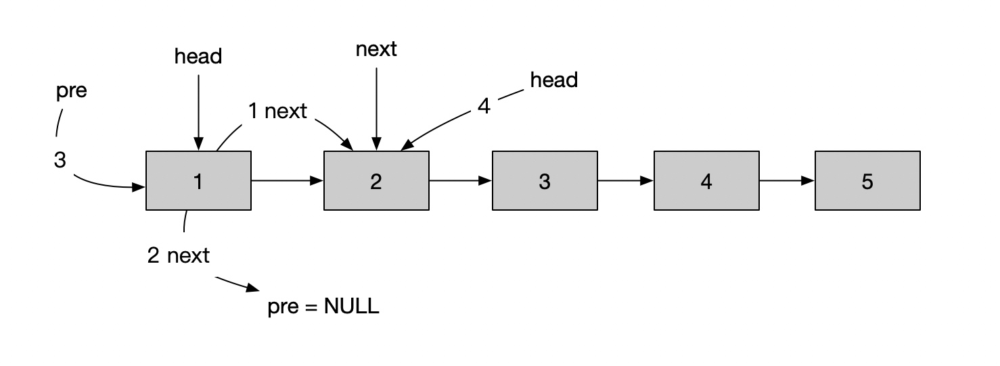
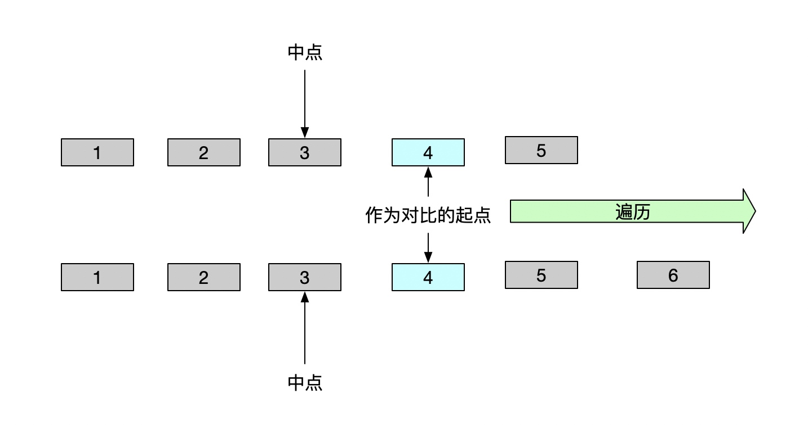

# 链表
#### 数组高效原因
* 数组简单易用，在实现上使用的是连续的内存空间，可以借助 CPU 的缓存机制，预读数组中的数据，所以访问效率更高。而链表在内存中并不是连续存储，所以对 CPU 缓存不友好，没办法有效预读。

#### 链表代码原则
* 理解指针和引用的含义
* 警惕指针丢失和内存泄露
* 利用哨兵简化实现难度
* 重点留意边界条件
 * 如果链表为空时，代码是否能正常工作？
 * 如果链表只包含一个结点时，代码是否能正常工作？
 * 如果链表只包含两个结点时，代码是否能正常工作？
 * 代码逻辑在处理头结点和尾结点的时候，是否能正常工作？
 
#### 链表训练
* 单链表反转
* 链表中环的检测
* 两个有序的链表合并
* 删除链表倒数第n个节点
* 求链表的中间节点

#### 判断链表是否回文
```
class Solution {
public:
    bool isPalindrome(ListNode* head) {
        if(head==NULL||head->next==NULL)
            return true;
        ListNode* slow=head;
        ListNode* fast=head;
        while(fast->next!=NULL&&fast->next->next!=NULL){
            slow=slow->next;
            fast=fast->next->next;
        }
        slow->next=reverseList(slow->next);
        slow=slow->next;
        while(slow!=NULL){
            if(head->val!=slow->val)
                return false;
            head=head->next;
            slow=slow->next;
        }
        return true;
    }
    ListNode* reverseList(ListNode* head) {
        ListNode* pre=NULL;
        ListNode* next=NULL;
        while(head!=NULL){
            next=head->next;
            head->next=pre;
            pre=head;
            head=next;
        }
        return pre;
    }
};
```

#### 链表反转


#### 回文对比
* 无须判断奇偶，只需要以中点后的节点为基准就可以了


  