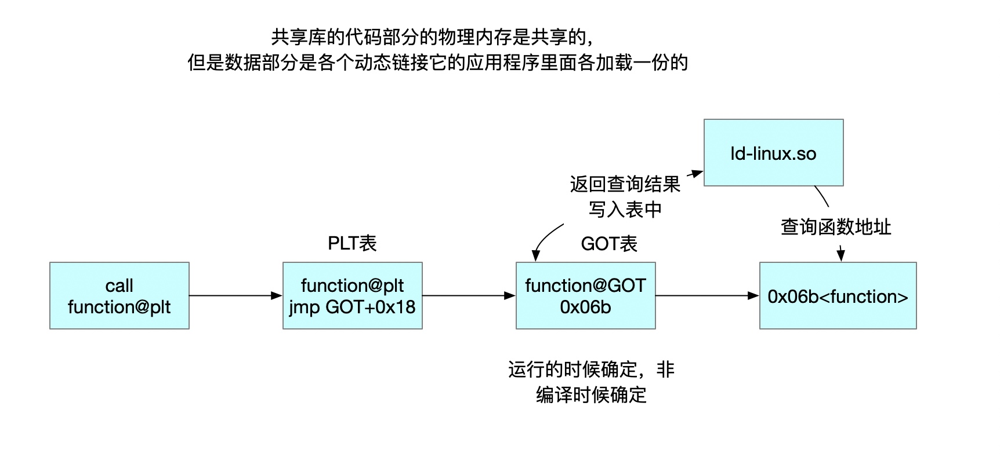
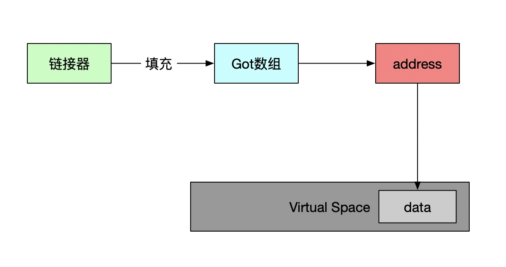
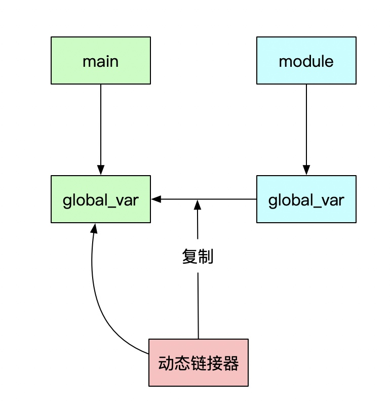
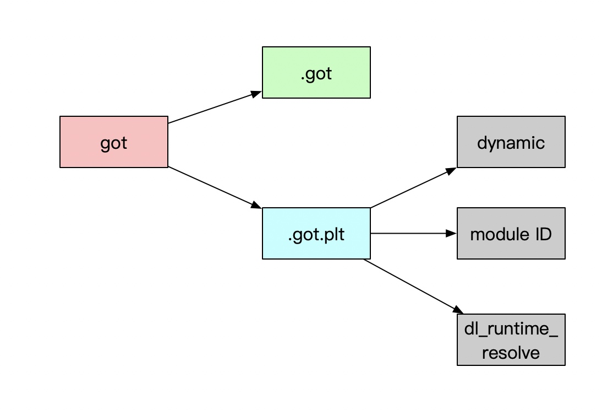

# 动态链接
#### fPIC
* 把指令中那些需要被修改的部分分离出来，跟数据部分放在一起，这样指令部分就可以保持不变，而数据部分可以在每个进程中拥有一个副本。这种方案就是目前被称为地址无关代码（PIC, Position independent Code）的技术。
* 动态链接模块被装载映射至虚拟空间后，指令部分是在多个进程之间共享的，由于装载时重定位的方法需要修改指令，所以没有办法做到同一份指令被多个进程共享

#### 共享对象模块的地址引用
* 模块内部引用和模块外部引用
* 按照不同的引用方式又可以分为指令引用和数据访问

#### 动态库访问原理

#### 依赖库
* VDSO(Virtual Dynamically-linked Shared Object)
* 内核虚拟共享对象linux-vdso.so.1
* 它将内核态的调用映射到用户态的地址空间中, 使得调用开销更小, 路径更好.
* 较新的内核提供了进程随机地址化功能, linux-vdso.so.1的地址每次cat /proc/self/maps都会变化

#### 引用外部函数
* 如果是在静态模块中，按照静态链接的规则重定位
* 如果是动态共享对象中的函数，链接器将这个符号的引用标记为一个动态链接的符号
* 链接器解析的时候发现动态符号，可以做动态引用

#### 装载时重定位
* 基地址重置

#### 引用方式
* 模块内部函数跳转
* 模块内部数据访问
* 模块外部函数调用、跳转
* 模块外部数据访问

#### 模块内部跳转
* 基于寄存器的相对调用，不需要重定位

#### 模块内部数据访问
* 获取PC寄存器的值，然后加上偏移量访问相应变量

#### 模块外部数据访问
* 

#### 模块间跳转
* 通过Got中函数的相对位置跳转

#### 共享模块全局变量
* 一个模块引用了定义在共享对象的全局变量的时候，全部当作其他模块引用处理

#### 数据段地址无关性
* 绝对地址引用，编译器和链接器产生重定位表，包含了类型的重定位入口

#### 延迟绑定
* 动态链接访问全局和静态数据需要GOT定位和间接跳转
* 链接工作是在运行时完成

#### PLT原理
* 函数符号引用在重定位表rel.plt的下标
* 模块ID压栈

#### 加载原理
* 读取可执行文件的头部，检查合法性
* 从头部的header读取各个segment，映射到进程虚拟空间

#### 动态符号表
* .dynsym
* .symtab 包含所有符号

#### 装载时重定位
* .rel.dyn 数据，函数非-fPIC编译时也在回dyn中
* .rel.plt 函数引用

