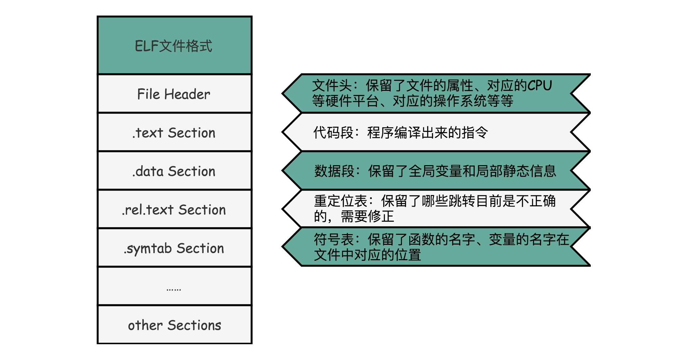

# ELF和静态连接
#### 编译，链接和装载
* 第一个部分由编译（Compile）、汇编（Assemble）以及链接（Link）三个阶段组成。在这三个阶段完成之后，我们就生成了一个可执行文件。
* 第二部分，我们通过装载器（Loader）把可执行文件装载（Load）到内存中。CPU 从内存中读取指令和数据，来开始真正执行程序。

#### ELF格式和链接
* 程序最终是通过装载器变成指令和数据的
* gcc -g -c add_lib.c link_example.c
* objdump -d -M intel -S add_lib.o
* objdump -d -M intel -S link_example.o
* gcc -o link-example add_lib.o link_example.o
* objdump -d -M intel -S link-example

#### ELF文件
* 首先是.text Section，也叫作代码段或者指令段（Code Section），用来保存程序的代码和指令；
* 接着是.data Section，也叫作数据段（Data Section），用来保存程序里面设置好的初始化数据信息；
* 然后就是.rel.text Secion，叫作重定位表（Relocation Table）。重定位表里，保留的是当前的文件里面，哪些跳转地址其实是我们不知道的。比如上面的 link_example.o 里面，我们在 main 函数里面调用了 add 和 printf 这两个函数，但是在链接发生之前，我们并不知道该跳转到哪里，这些信息就会存储在重定位表里；
* 最后是.symtab Section，叫作符号表（Symbol Table）。符号表保留了我们所说的当前文件里面定义的函数名称和对应地址的地址簿。

#### 链接器
* 把所有符号表里的信息收集起来，构成一个全局的符号表
* 根据重定位表，把所有不确定要跳转地址的代码，根据符号表里面存储的地址，进行一次修正
* 把所有的目标文件的对应段进行一次合并，变成了最终的可执行代码

#### 装载器
* 解析 ELF 文件，把对应的指令和数据，加载到内存里面供 CPU 执行

#### linux程序不能在win执行
* 两个操作系统下可执行文件的格式不一样
*  Linux 下的 ELF 文件格式，而 Windows 的可执行文件格式是一种叫作PE（Portable Executable Format）的文件格式。Linux 下的装载器只能解析 ELF 格式而不能解析 PE 格式

#### 扩展阅读
* 《程序员的自我修养——链接、装载和库》
