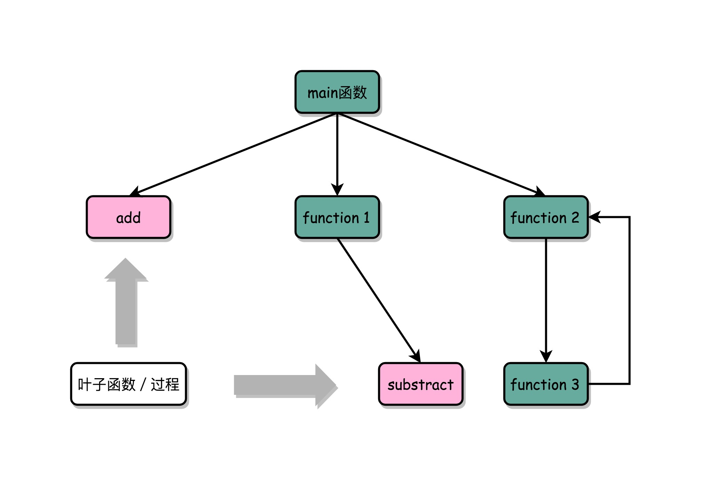

# 函数调用
#### 生成汇编代码
* gcc -g -c function_example.c
* objdump -d -M intel -S func.o

#### 函数压栈
* 每次程序调用函数之前，我们都把调用返回后的地址写在一个乒乓球上，然后塞进这个球桶。这个操作其实就是我们常说的压栈。如果函数执行完了，我们就从球桶里取出最上面的那个乒乓球，很显然，这就是出栈。

#### 函数栈帧
* 整个函数所占用的所有内存空间，就是函数的栈帧（Stack Frame）
* rbp 帧指针
* rsp 栈顶指针

#### 函数内联
* 把一个实际调用的函数产生的指令，直接插入到的位置，来替换对应的函数调用指令
* 编译器进行自动优化的场景， 函数内联（Inline）
* 

#### 函数调用栈
* 初始化栈帧
* 执行过程的计算
* 恢复栈，返回
