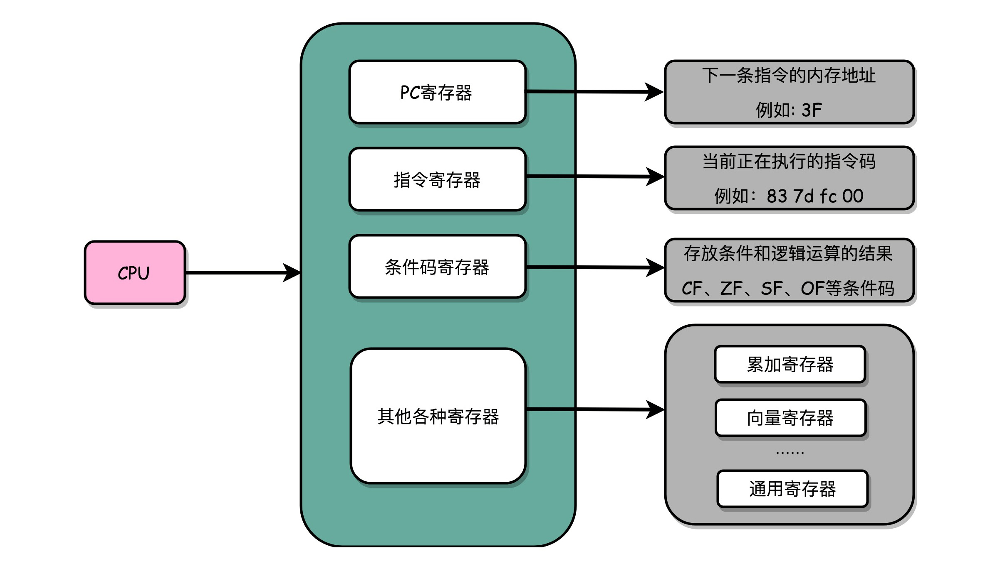

# 指令跳转
#### CPU执行指令原理
* 一个是PC 寄存器（Program Counter Register），我们也叫指令地址寄存器（Instruction Address Register）。顾名思义，它就是用来存放下一条需要执行的计算机指令的内存地址。
* 第二个是指令寄存器（Instruction Register），用来存放当前正在执行的指令。
* 第三个是条件码寄存器（Status Register），用里面的一个一个标记位（Flag），存放 CPU 进行算术或者逻辑计算的结果。

#### 生成汇编代码
*  gcc -g -c test.c
*  objdump -d -M intel -S test.o
*  
