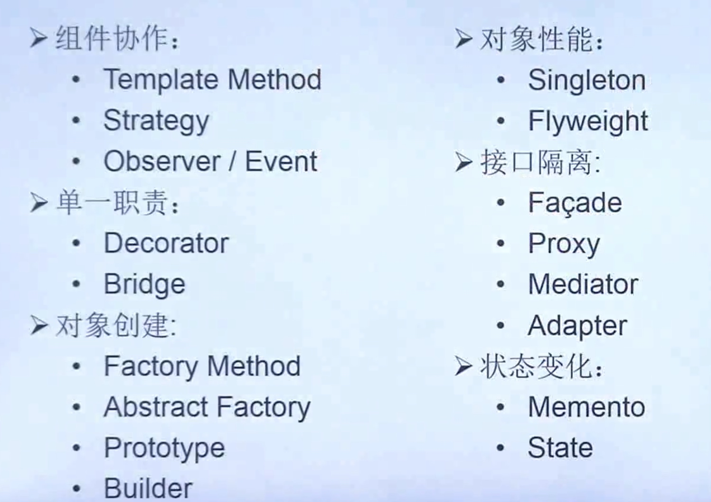
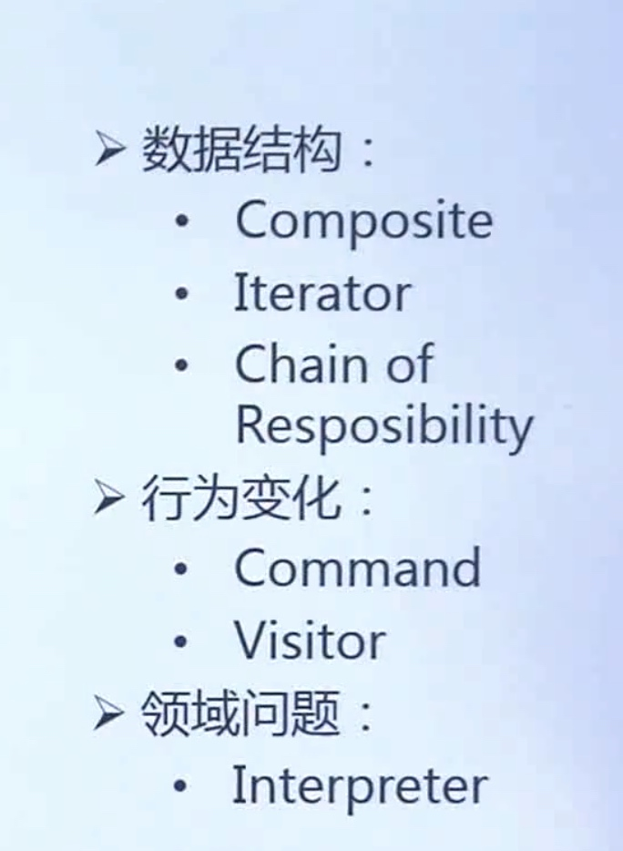
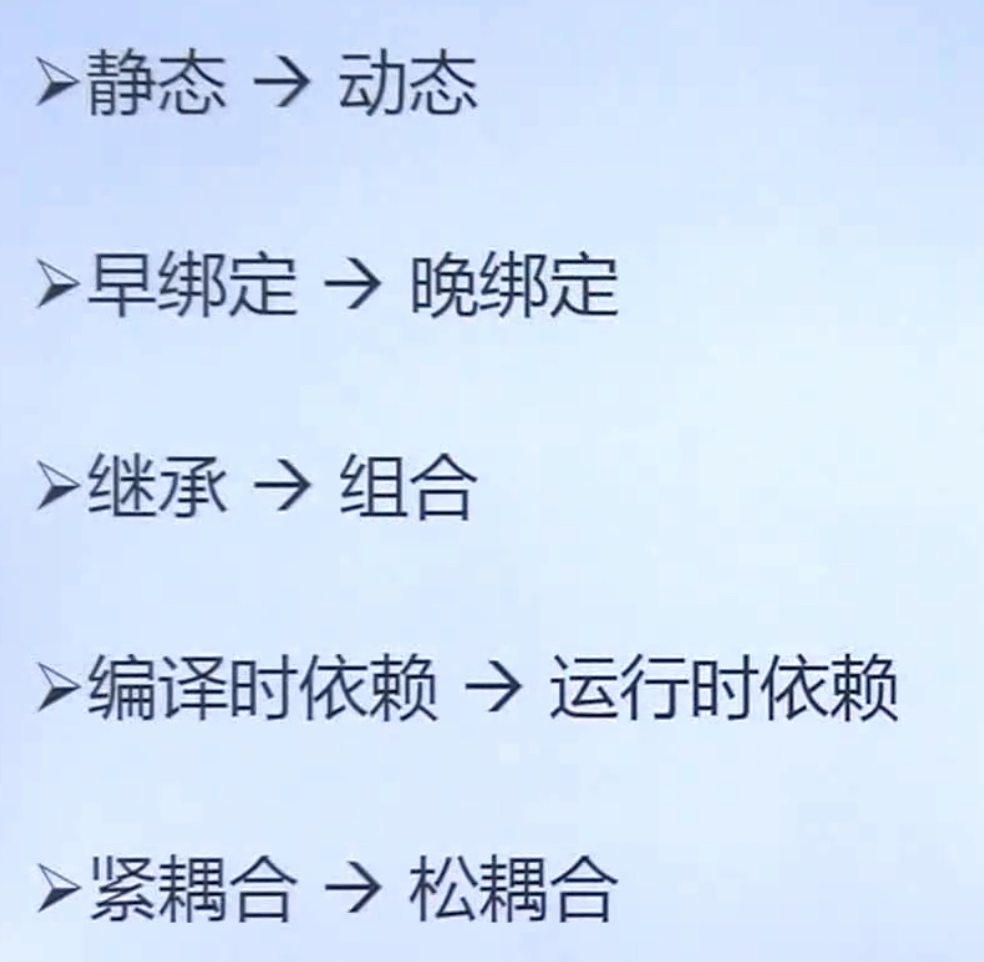

# Template模式

#### 分类
* 创建类
* 结构型
* 行为型
* 
* 
* 需求的频繁变化
* 没有一部到位的设计模式
* 重构 改善既有的模式
* 重构与模式

#### 重构关键技法


#### 组件协作模式
* 典型模式

#### cpp_demo
```c++
class OperateSystem
{
 protected:
  virtual void TriggerInterrupt() = 0;        //触发中断
  virtual void SaveContext() = 0;             //保存现场
  virtual void InterruptSoulation() = 0;       //中断处理
  virtual void ReturnContext() = 0;           //返回现场
 public:
  virtual void HandleInterrupt()
  {
    this->TriggerInterrupt();
    this->SaveContext();
    this->InterruptSoulation();
    this->ReturnContext();
  }
};

class Windows:public OperateSystem
{
 private:
  virtual void TriggerInterrupt()        //触发中断
  {
    std::cout<<"Windows trriger\n";
  }

  virtual void SaveContext()             //保存现场
  {
    std::cout<<"Windows save context\n";
  }

  virtual void InterruptSoulation()       //中断处理
  {
    std::cout<<"Windows interrupt soulation\n";
  }

  virtual void ReturnContext()           //返回现场
  {
    std::cout<<"Windows return context\n";
  }
};

class Linux:public OperateSystem
{
 private:
  virtual void TriggerInterrupt()        //触发中断
  {
    std::cout<<"Linux trriger\n";
  }

  virtual void SaveContext()             //保存现场
  {
    std::cout<<"Linux save context\n";
  }

  virtual void InterruptSoulation()       //中断处理
  {
    std::cout<<"Linux interrupt soulation\n";
  }

  virtual void ReturnContext()           //返回现场
  {
    std::cout<<"Linux return context\n";
  }
};
int main()
{
  Linux *linux = new Linux();
  Windows *window = new Windows();

  linux->HandleInterrupt();
  window->HandleInterrupt();
}
```

#### golang_demo
```go
package Templatemethod

import "fmt"

type Downloader interface {
	Download(uri string)
}

type Template struct {
	Implement
	uri string
}

type Implement interface {
	download()
	save()
}

func newTemplate(impl Implement) *Template {
	return &Template{
		Implement: impl,
	}
}

func (t *Template) Download(uri string) {
	t.uri = uri
	fmt.Print("prepare downloading\n")
	t.Implement.download()
	t.Implement.save()
	fmt.Print("finish downloading\n")
}

func (t *Template) save() {
	fmt.Print("default save\n")
}

type HTTPDownloader struct {
	*Template
}

func NewHTTPDownloader() Downloader {
	downloader := &HTTPDownloader{}
	Template := newTemplate(downloader)
	downloader.Template = Template
	return downloader
}

func (d *HTTPDownloader) download() {
	fmt.Printf("download %s via http\n", d.uri)
}

func (*HTTPDownloader) save() {
	fmt.Printf("http save\n")
}

type FTPDownloader struct {
	*Template
}

func NewFTPDownloader() Downloader {
	downloader := &FTPDownloader{}
	Template := newTemplate(downloader)
	downloader.Template = Template
	return downloader
}

func (d *FTPDownloader) download() {
	fmt.Printf("download %s via ftp\n", d.uri)
}
```