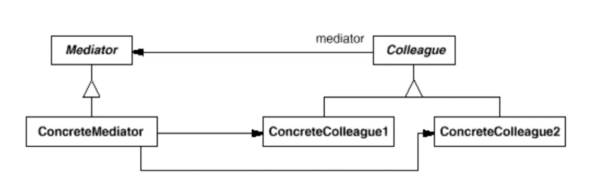
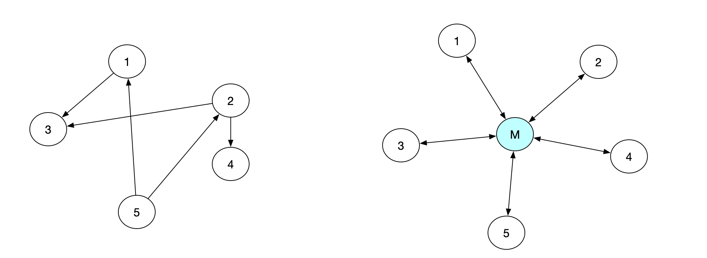

# 中介模式

#### 动机
* 在软件构建过程中，经常会出现多个对象互相关联交互的情况，对象之间常常会维持一种复杂的引用关系，如果遇到一些需求的更改，这种直接的引用关系将面临不断的变化。
* 在这种情況下，我们可使用一个“中介对象”来管理对象间的关联关系，避免相互交互的对象之间的紧耦合引用关系，从而更好地抵御变化。

#### 模式定义
* 用一个中介对象来封装（封装变化）一系列的对象交互。中介者使各对象不需要显式的相互引用（编译时依赖运行时依赖），从而使其耦合松散（管理变化），而且可以独立地改变它们之间的交互
* 编译时依赖改成运行时依赖

#### 结构




#### 要点总结
* 将多个对象间复杂的关联关系解耦，Mediator 模式将多个对象间的控制逻辑进行集中管理，变“多个对象互相关联“为“多个对象和一个中介者关联“，简化了系统的维护，抵御了可能的变化。

* 随着控制逻辑的复杂化，Mediator 具体对象的实现可能相当复杂。这时候可以对 Mediator 对象进行分解处理。

* Facade 模式是解耦系统（单向）的对象关联关系；Mediator 模式是解耦系统内各个对象之间（双向）的关联关系。

#### golang_demo
```go
package mediator

import (
	"fmt"
	"strings"
)

type CDDriver struct {
	Data string
}

func (c *CDDriver) ReadData() {
	c.Data = "music,image"

	fmt.Printf("CDDriver: reading data %s\n", c.Data)
	GetMediatorInstance().changed(c)
}

type CPU struct {
	Video string
	Sound string
}

func (c *CPU) Process(data string) {
	sp := strings.Split(data, ",")
	c.Sound = sp[0]
	c.Video = sp[1]

	fmt.Printf("CPU: split data with Sound %s, Video %s\n", c.Sound, c.Video)
	GetMediatorInstance().changed(c)
}

type VideoCard struct {
	Data string
}

func (v *VideoCard) Display(data string) {
	v.Data = data
	fmt.Printf("VideoCard: display %s\n", v.Data)
	GetMediatorInstance().changed(v)
}

type SoundCard struct {
	Data string
}

func (s *SoundCard) Play(data string) {
	s.Data = data
	fmt.Printf("SoundCard: play %s\n", s.Data)
	GetMediatorInstance().changed(s)
}

type Mediator struct {
	CD    *CDDriver
	CPU   *CPU
	Video *VideoCard
	Sound *SoundCard
}

var mediator *Mediator

func GetMediatorInstance() *Mediator {
	if mediator == nil {
		mediator = &Mediator{}
	}
	return mediator
}

func (m *Mediator) changed(i interface{}) {
	switch inst := i.(type) {
	case *CDDriver:
		m.CPU.Process(inst.Data)
	case *CPU:
		m.Sound.Play(inst.Sound)
		m.Video.Display(inst.Video)
	}
}
```

#### cpp_demo
```C++
//
// Created by 刘超 on 2019-11-21.
//

#include <iostream>
#include <list>

using namespace std;

class Mediator;

class Colleage {
public:
    virtual ~Colleage();

    virtual void Aciton() = 0;

    virtual void SetState(const string &sdt) = 0;

    virtual string GetState() = 0;

protected:
    Colleage() {}

    Colleage(Mediator *mdt) { _mdt = mdt; }

    Mediator *_mdt;
};

class ConcreteColleageA : public Colleage {
public:
    ConcreteColleageA() {}

    ConcreteColleageA(Mediator *mdt) : Colleage(mdt) {}

    ~ConcreteColleageA();

    void Aciton() {
        _mdt->DoActionFromAtoB();
        cout << "State of ConcreteColleague A " << " " << GetState() << endl;
    }

    void SetState(const string &sdt) { _sdt = sdt; }

    string GetState() { return _sdt; }

private:
    string _sdt;
};

class ConcreteColleageB : public Colleage {
public:
    ConcreteColleageB() {}

    ConcreteColleageB(Mediator *mdt) : Colleage(mdt) {}

    ~ConcreteColleageB();

    void Aciton() {
        _mdt->DoActionFromAtoB();
        cout << "State of ConcreteColleague A " << " " << GetState() << endl;
    }

    void SetState(const string &sdt) {_sdt = sdt;}

    string GetState() {return  _sdt;}

private:
    string _sdt;
};

class Mediator {
public:
    virtual ~Mediator() {}

    virtual void DoActionFromAtoB() = 0;

    virtual void DoActionFromBtoA() = 0;

protected:
    Mediator() {}
};

class ConcreteMediator : public Mediator {
public:
    ConcreteMediator();

    ConcreteMediator(Colleage *clgA, Colleage *clgB) {
        _clgA = clgA;
        _clgB = clgB;
    }

    ~ConcreteMediator();

    void SetConcreteColleageA(Colleage *clgA) {
        _clgA = clgA;
    }

    void SetConcreteColleageB(Colleage *clgB) {
        _clgB = clgB;
    }

    Colleage *GetConcreteColleageA() {
        return _clgA;
    }

    Colleage *GetConcreteColleageB() {
        return _clgB;
    }

    void IntroColleage(Colleage *clgA, Colleage *clgB) {
        _clgB = clgB;
        _clgA = clgA;
    }

    void DoActionFromAtoB() {
        _clgB->SetState(_clgA->GetState());
    }

    void DoActionFromBtoA() {
        _clgA->SetState(_clgB->GetState());
    }

private:
    Colleage *_clgA;
    Colleage *_clgB;
};

int main(int argc, char* argv[]) {
    ConcreteMediator* m = new ConcreteMediator();
    ConcreteColleageA* c1 = new ConcreteColleageA(m);
    ConcreteColleageB* c2 = new ConcreteColleageB(m);
    m->IntroColleage(c1, c2);
    c1->SetState("old");
    c2->SetState("old");
    c1->Aciton();
    c2->Aciton();
    cout << endl;

    c1->SetState("new");
    c1->Aciton();
    c2->Aciton();
    cout << endl;

    c2->SetState("old");
    c2->Aciton();
    c1->Aciton();
    return 0;
}
```