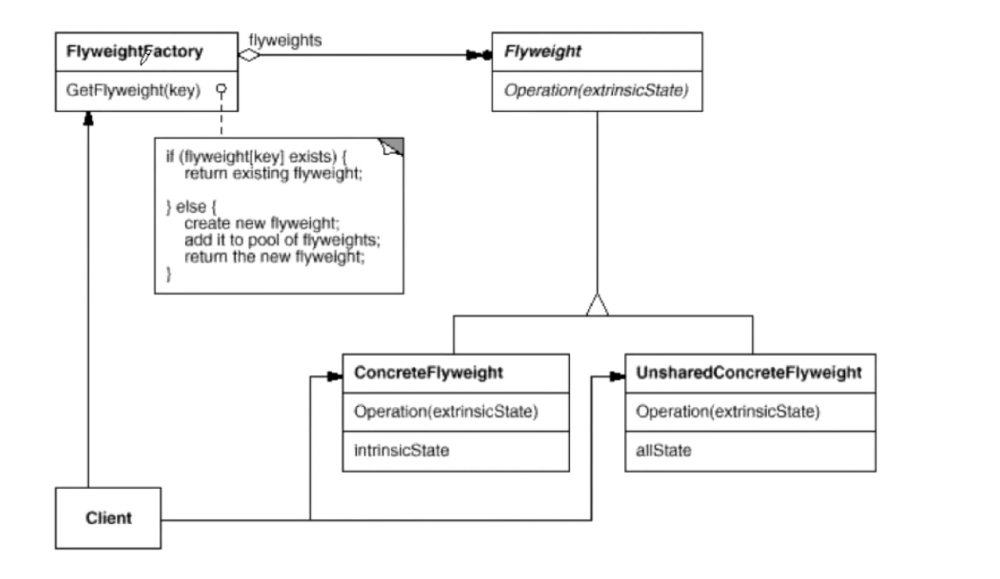

# 享元模式

#### 动机
* 在软件系统采用纯粹对象方案的问题在于大量细粒度的对象会很快充斥在系统中，从而带来很高的运行时代价一一主要指内存需求方面的代价。
* 如何在避免大量细粒度对象问题的同时，让外部客户程序仍然能够透明地使用面向对象的方式来进行操作？

#### 结构
* 

#### 要点总结
* 面向对象很好地解决了抽象性的问题，但是作为一个运行在机器中的程序实体，我们需要考虑对象的代价问题。Flyweight 主要解决面向对象的代价问题，一般不触及面向对象的抽象性问题。

* Flyweight 采用对象共享的做法来降低系统中对象的个数，从而降低细粒度对象给系统带来的内存压力。在具体实现方面，要注意对象状态的处理。

* 对象的数量太大从而导致对象内存开销加大ー一什么样的数量才算大？这需要我们仔细的根据具体应用情况进行评估，而不能凭空臆断。