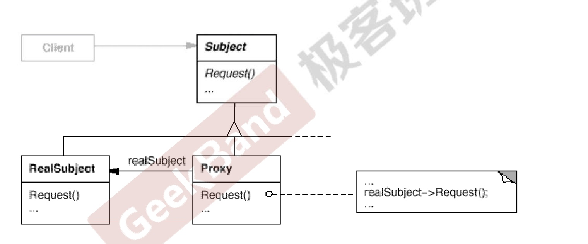
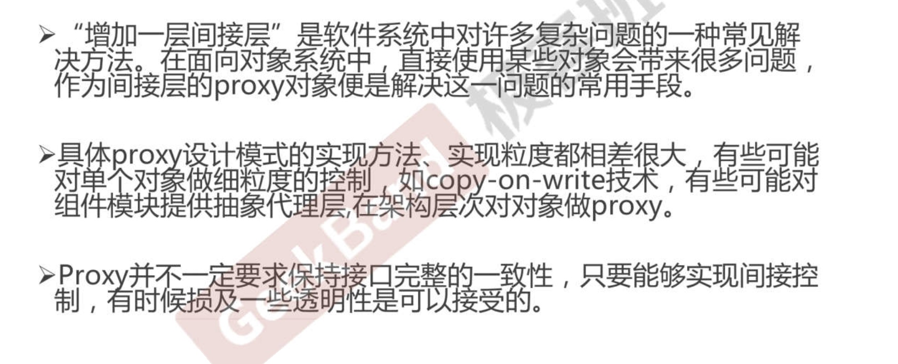

# 代理模式

#### 动机
* 在面向对象系统中，有些对象由于某种原因（比如对象创建的开消很大，或者某些操作需要安全控制，或者需要进程外的访问等）直接访问会给使用者、或者系统结构带来很多麻烦。
* 如何在不失去透明操作对象的同时来管理/控制这些对象特有的复杂性？增加一层间接层是软件开发中常见的解決方式。

#### 结构


#### 要点总结
* 

#### cpp_demo
```C++
#include <iostream>

class ITelco {
public:
    virtual ~ITelco() {}

    virtual  void Recharge(int money) = 0;
};

class CMCC : public ITelco {
public:
    void Recharge(int money) override  {
        std::cout << "Recharge " << money << std::endl;
    }
};

class Proxy : public ITelco {
public:
    Proxy() : m_pcMCC(nullptr) {}

    void  Recharge(int money) override {
       if (money >= 50) {
           if (m_pcMCC == nullptr)
               m_pcMCC = new CMCC();
           m_pcMCC->Recharge(money);
       } else {
           std::cout << "Sorry, too little money " << std::endl;
       }
    }

public:
    CMCC* m_pcMCC;
};

int main() {
    Proxy* proxy = new Proxy();
    proxy->Recharge(20);
    proxy->Recharge(100);
}
```

#### golang_demo
```go
import "fmt"

tyecharge(money int) {
	fmt.Println("CMCC Recharge money ", money)
}

type ProxySub struct {
	cmcc *ClientAPP
}

func (p *ProxySub) Recharge(money int) {
	if money >= 50 {
		if p.cmcc == nil {pe Subject1 interface {
		Recharge(money int)
		}

			type ClientAPP struct{}

			func (c *ClientAPP) R
			p.cmcc = &ClientAPP{}
		}
		p.cmcc.Recharge(money)
	} else {
		fmt.Println("Sorry too littel money")
	}
}
func TestProxySub(t *testing.T) {
	var proxy Subject1
	proxy = &ProxySub{}
	proxy.Recharge(30)
	proxy.Recharge(100)
}
```