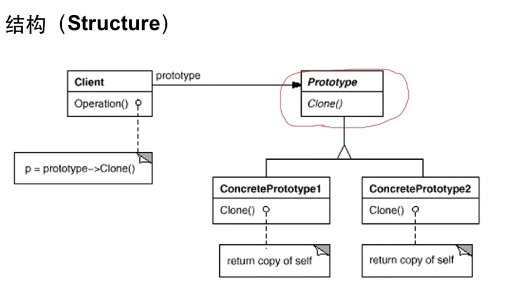

# 原型模式

#### 模式定义
* 使用原型实例指定创建对象的种类，然后通过拷贝这些原型来创建新的对象。

#### 结构


#### 动机
* 在软件系统中，经常面临着“某些结构复杂的对象“的创建工作；由于需求的变化，这些对象经常面临着剧烈的变化，但是它们却拥有七较稳定一致的接口。
* 如何应对这种变化？如何向“客户程序（使用这些对象的程序）“隔离出“这些易变对象”，从而使得“依赖这些易变对象的客户程序”不随着需求改变而改变？

#### 要点总结
* Prototype 模式同样用于隔离类对象的使用者和具体类型（易变类）之间的耦合关系，它同样要求这些“易变类”拥有“稳定的接口“”。
* Prototype 模式对于“如何创建易变类的实体对象”“采用“原型克隆”的方法来做，它使得我们可以非常灵活地动态创建“拥有某些稳定接口“的新对象一一所需工作仅仅是注册一个新类的对象（即原型然后在任何需要的地方 Clone。
* Prototype 模式中的 Clone 方法可以利用某些框架中的序列化来实现深拷贝。

#### cpp_demo
```C++
#include <iostream>

using namespace std;

class Monkey {
 public:
  Monkey() {}

  virtual Monkey* Clone() = 0;
  virtual void Play() = 0;
};

class Goku : public Monkey {
 public:
  Goku(const string& name) : _name(name) {}
  Goku(const Goku& other) {_name = other._name;}
  ~Goku() {}

  Monkey* Clone() {
    return new Goku(*this);
  }

  void Play() {std::cout << " Goku Playing" << std::endl;}
  string _name;
};

int main() {
  Monkey* m = new Goku("QitianDasheng");
  Monkey* m1 = m->Clone();
  Monkey* m2 = m->Clone();
  Monkey* m3 = m->Clone();
  m1->Play();
  m2->Play();
  m3->Play();
}
```

### golang_demo
```go
package prototype

import "fmt"

type Monkey interface {
        Clone() Monkey
        Play()
}

type Goku struct{}

func (g *Goku) Clone() Monkey {
        return &Goku{}
}

func (g *Goku) Play() {
        fmt.Println("Goku Play")
}
func TestPrototype(t *testing.T) {
        var m Monkey = &Goku{}
        m1 := m.Clone()
        m2 := m.Clone()
        m3 := m.Clone()
        m1.Play()
        m2.Play()
        m3.Play()
}
```