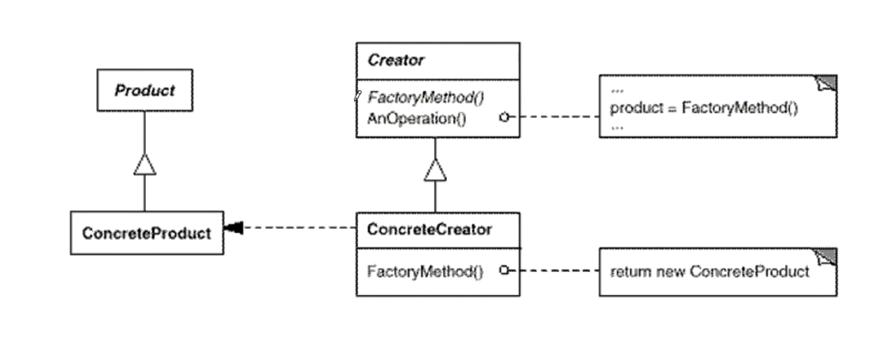

# 工厂方法

#### 典型模式
* 通过“对象创建”模式绕开 new，来避免对象创建（new）过程中所导致的紧耦合（依赖具体类），从而支持对象创建的稳定。它是接口抽象之后的第一步工作。

#### 典型模式
* Factory Method
* Abstract Factory
* Prototype
* Builder

#### 定义
* 定义ー个用于创建对象的接口，让子类决定实例化哪一个类 Factory Method 使得一个类的实例化延迟（目的：解耦，手段：虚函数）到子类。

#### 结构图


#### 总结
* Factory Method 模式用于隔离类对象的使用者和具体类型之间的耦合关系。面对一个经常变化的具体类型，紧耦合关系（new）会导致软件的脆弱。
* Factory Methodi 模式通过面向对象的手法，将所要创建的具体对象工作延迟到子类，从而实现一种扩展（而非更改）的策略，较好地解决了这种紧耦合关系。
* Factory Method 模式解决“单个对象”的需求变化。缺点在于要求创 建方法/参数相同。

#### cpp_demo
```C++
class Video {
 public:
  virtual void produce() = 0;
};

class VideoFactory {
 public:
  virtual Video* getVideo() = 0;
};

class FEVideo : public Video {
 public:
  void produce() {
    std::cout << " FE video " << std::endl;
  }
};

class FEVideoFactory : public VideoFactory {
 public:
  Video* getVideo() {
    return new FEVideo();
  }
};

class JavaVideo : public Video {
 public:
  void produce() {
    std::cout << " Java video " << std::endl;
  }
};
class JavaVideoFactory : public VideoFactory {
 public:
  Video* getVideo() {
    return new JavaVideo();
  }
};

class PythonVideo : public Video {
 public:
  void produce() {
    std::cout << " Python video " << std::endl;
  }
};

class PythonVideoFactory : public VideoFactory {
 public:
  Video* getVideo() {
    return new PythonVideo();
  }
};

int main() {
  VideoFactory* f1 = new PythonVideoFactory();
  VideoFactory* f2 = new JavaVideoFactory();
  VideoFactory* f3 = new FEVideoFactory();
  Video* v1 = f1->getVideo();
  Video* v2 = f2->getVideo();
  Video* v3 = f3->getVideo();
  v1->produce();
  v2->produce();
  v3->produce();
}
```

#### golang_demo
```go
import "fmt"

type ICar interface {
        Name()
}

type Car struct {
}

func (c *Car) Name() {
        fmt.Println("Base Car struct ")
}

type Factory interface {
        CreateCar() *Car
}

type BenzCar struct {
        *Car
}

func (bc *BenzCar) Name() {
        fmt.Println("BenzCar Create")
}

type BenzFactory struct{}

func (b *BenzFactory) CreateCar() ICar {
        return &BenzCar{
                Car: &Car{},
        }
}
type BmwCar struct {
        *Car
}

func (bc *BmwCar) Name() {
        fmt.Println("BmwCar Create")
}

type BmwFactory struct{}

func (b *BmwFactory) CreateCar() ICar {
        return &BmwCar{
                Car: &Car{},
        }
}

type AudiCar struct {
        *Car
}

func (bc *AudiCar) Name() {
        fmt.Println("AudiCar Create")
}

type AudiFactory struct{}

func (b *AudiFactory) CreateCar() ICar {
        return &AudiCar{
                Car: &Car{},
        }
}
package factorymethod

import "testing"

func TestCar(t *testing.T) {
        f1 := &AudiFactory{}
        f2 := &BenzFactory{}
        f3 := &BmwFactory{}
        c1 := f1.CreateCar()
        c2 := f2.CreateCar()
        c3 := f3.CreateCar()
        c1.Name()
        c2.Name()
        c3.Name()
}
```